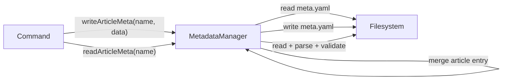

# Multi-Article Metadata

> Feature spec for code-forge implementation planning.
> Source: extracted from docs/multi-article/tech-design.md §8
> Created: 2026-03-24

| Field | Value |
|-------|-------|
| Component | multi-article-metadata |
| Priority | P0 |
| SRS Refs | — |
| Tech Design | §8.1 — multi-article-metadata |
| Depends On | filename-parser |
| Blocks | pipeline-engine-refactor |

## Purpose

Manages the centralized `meta.yaml` file at project root. Replaces the old per-directory `meta.yaml` + `receipt.yaml` with a single multi-article indexed structure. Handles read/write of per-article metadata, publishing receipts (merged in), and per-article locking.

## Scope

**Included:**
- New `ProjectMetaSchema` (Zod) with `articles` map and `_locks` map
- Read/write individual article metadata within the project-level meta.yaml
- List all articles and their statuses
- Per-article locking (replaces per-directory `.publish.lock`)
- Publishing receipt merged into article's `platforms` field

**Excluded:**
- File movement between stages (PipelineEngine's job)
- Filename parsing (delegates to filename-parser)
- Platform API interactions

## Core Responsibilities

1. **Schema definition** — Zod schemas for `ArticleMeta`, `PlatformPublishStatus`, `ProjectMeta`
2. **Article CRUD** — read, write, list, delete article metadata entries
3. **Locking** — per-article process lock with stale detection
4. **Receipt management** — publish results written into `articles.{name}.platforms.{platform}`

## Interfaces

### Inputs
- **articleName** (string) — key in the articles map
- **meta** (Partial<ArticleMeta>) — metadata to merge
- **platformId** (string) — for publish result updates

### Outputs
- **ArticleMeta | null** — article metadata
- **ArticleMeta[]** — list of all articles
- **boolean** — lock acquisition result

### Dependencies
- **filename-parser** — for `PLATFORM_IDS` constant (validation)
- **js-yaml** — YAML serialization
- **fs-extra** — file read/write
- **zod** — schema validation

## Data Flow



## Key Behaviors

### Zod Schemas

```typescript
export const PlatformPublishStatusSchema = z.object({
  status: z.enum(['pending', 'success', 'failed']),
  url: z.string().url().optional(),
  error: z.string().optional(),
  published_at: z.string().optional(),
});

export const ArticleMetaSchema = z.object({
  status: z.enum(['inbox', 'drafted', 'master', 'adapted', 'scheduled', 'published', 'failed']),
  platforms: z.record(z.string(), PlatformPublishStatusSchema).optional(),
  schedule: z.string().optional(),
  adapted_platforms: z.array(z.string()).optional(),
  template: z.string().optional(),
  notes: z.string().optional(),
  error: z.string().optional(),
  created_at: z.string().optional(),
  updated_at: z.string().optional(),
});

export const LockInfoSchema = z.object({
  pid: z.number(),
  started_at: z.string(),
  hostname: z.string(),
});

export const ProjectMetaSchema = z.object({
  articles: z.record(z.string(), ArticleMetaSchema).default({}),
  _locks: z.record(z.string(), LockInfoSchema).optional(),
});

export type ArticleMeta = z.infer<typeof ArticleMetaSchema>;
export type ProjectMeta = z.infer<typeof ProjectMetaSchema>;
```

### readProjectMeta(): Promise<ProjectMeta>

1. Read `{projectDir}/meta.yaml`
2. If file doesn't exist, return `{ articles: {} }`
3. Parse YAML, validate with `ProjectMetaSchema.safeParse()`
4. If validation fails, throw `MetadataParseError`
5. Return validated data

### readArticleMeta(articleName: string): Promise<ArticleMeta | null>

1. `const meta = await readProjectMeta()`
2. Return `meta.articles[articleName] ?? null`

### writeArticleMeta(articleName: string, data: Partial<ArticleMeta>): Promise<void>

1. `const meta = await readProjectMeta()`
2. `const existing = meta.articles[articleName] ?? {}`
3. `meta.articles[articleName] = { ...existing, ...data, updated_at: new Date().toISOString() }`
4. If `!existing.created_at && !data.created_at`, set `created_at` to now
5. Write meta.yaml back: `yaml.dump(meta)`

### listArticles(): Promise<Array<{ name: string; meta: ArticleMeta }>>

1. `const meta = await readProjectMeta()`
2. Return `Object.entries(meta.articles).map(([name, m]) => ({ name, meta: m }))`

### deleteArticleMeta(articleName: string): Promise<void>

1. `const meta = await readProjectMeta()`
2. `delete meta.articles[articleName]`
3. Write meta.yaml back

### updatePlatformStatus(articleName: string, platform: string, status: PlatformPublishStatus): Promise<void>

1. `const meta = await readProjectMeta()`
2. `const article = meta.articles[articleName]`
3. If not exists, throw
4. `article.platforms = article.platforms ?? {}`
5. `article.platforms[platform] = { ...article.platforms[platform], ...status }`
6. Write back

### lockArticle(articleName: string): Promise<boolean>

1. `const meta = await readProjectMeta()`
2. `const locks = meta._locks ?? {}`
3. If `locks[articleName]` exists and PID is alive → return `false`
4. `locks[articleName] = { pid: process.pid, started_at: now, hostname: os.hostname() }`
5. `meta._locks = locks`
6. Write back, return `true`

### unlockArticle(articleName: string): Promise<void>

1. `const meta = await readProjectMeta()`
2. `delete meta._locks?.[articleName]`
3. Write back

### isArticleLocked(articleName: string): Promise<boolean>

1. `const meta = await readProjectMeta()`
2. `const lock = meta._locks?.[articleName]`
3. If no lock → return `false`
4. If PID alive → return `true`
5. Stale lock → clean up, return `false`

## Constraints

- **Single meta.yaml file**: All article metadata in one file at project root
- **Atomic-ish writes**: Read-modify-write pattern; no true file locking between processes for different articles
- **_locks prefix**: Reserved key, cannot be used as article name
- **updated_at auto-set**: Every write sets `updated_at` automatically

## Acceptance Criteria

| AC-ID | Criterion | Verification Method |
|-------|-----------|---------------------|
| AC-005 | Write meta for 2 articles, read back independently | Unit test |
| AC-008 | Publish results in `articles.{name}.platforms.{platform}` | Unit test: updatePlatformStatus() |
| AC-MM-001 | `readProjectMeta()` returns `{ articles: {} }` for missing file | Unit test |
| AC-MM-002 | `lockArticle()` returns false when PID alive | Unit test with mocked process.kill |
| AC-MM-003 | Stale lock (dead PID) is cleaned up automatically | Unit test |
| AC-MM-004 | `writeArticleMeta()` preserves other articles' data | Unit test: write A, write B, verify A unchanged |

## Error Handling

- Missing meta.yaml: return default empty state (not an error)
- Malformed YAML: throw `MetadataParseError` with file path and details
- Schema validation failure: throw `MetadataParseError`
- Article not found in meta: return null (read) or create entry (write)

## File Structure

```
src/
├── core/
│   └── metadata.ts          # Refactored MetadataManager
└── types/
    ├── pipeline.ts           # Updated types (ArticleMeta, ProjectMeta)
    └── schemas.ts            # Updated Zod schemas
```

## Test Module

**Test file**: `src/core/metadata.test.ts`

**Test scope**:
- **Unit**: `readProjectMeta()`, `readArticleMeta()`, `writeArticleMeta()`, `listArticles()`, `lockArticle()`, `unlockArticle()`, `updatePlatformStatus()`
- **Integration**: Read/write actual YAML files in temp directory
- **Fixtures / Mocks**: Temp directory for meta.yaml; mock `process.kill` for lock tests
