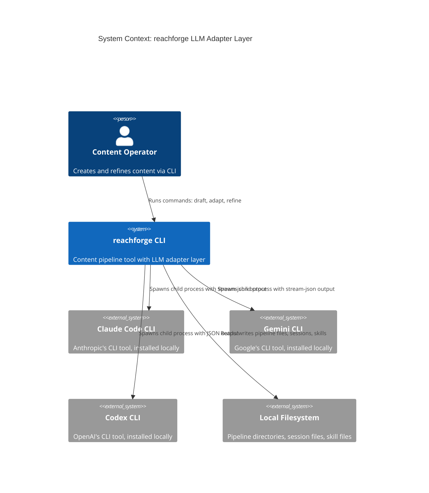
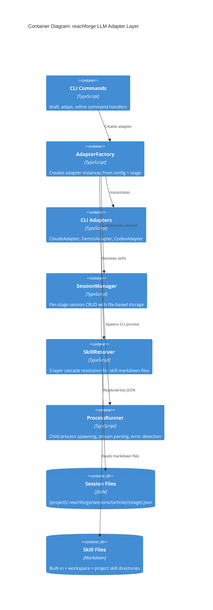
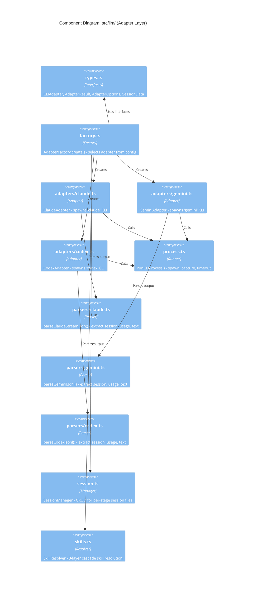
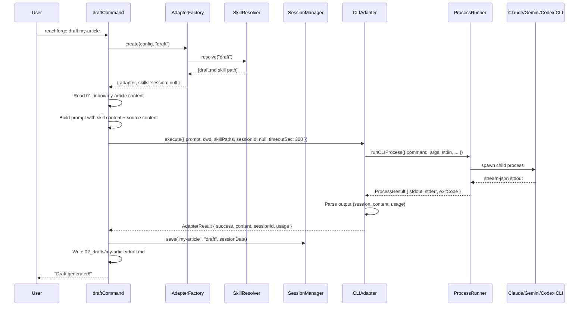
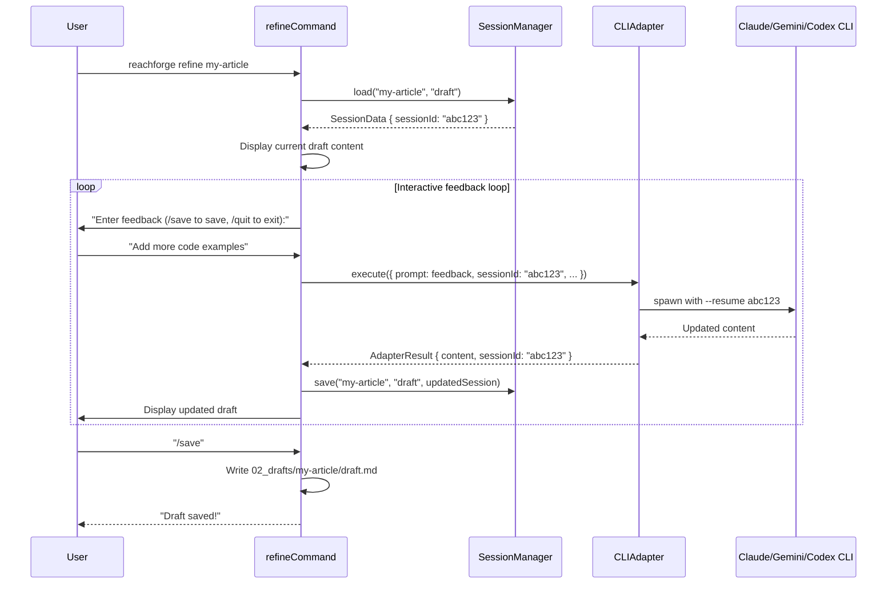

# Technical Design Document: LLM Adapter Layer for reachforge

| Field            | Value                                                  |
|------------------|--------------------------------------------------------|
| **Document**     | LLM Adapter Layer Tech Design v1.0                     |
| **Author**       | aipartnerup Engineering                                |
| **Date**         | 2026-03-17                                             |
| **Status**       | Draft                                                  |
| **Version**      | 1.0                                                    |
| **PRD Reference**| [reachforge PRD v1.0](../reachforge/prd.md)                   |
| **SRS Reference**| [reachforge SRS v1.0](../reachforge/srs.md)                   |

---

## 1. Executive Summary

This document describes the design of the LLM Adapter Layer for reachforge, a multi-CLI adapter system that replaces the current Gemini SDK-only provider with child-process-based adapters for Claude Code, Gemini CLI, and Codex CLI. The adapter layer adds session resumption for multi-turn conversations (the `reachforge refine` command), a three-layer skill cascade for injecting stage-specific and platform-specific prompts, and a unified interface that decouples pipeline commands from any specific LLM tooling.

### 1.1 Problem Statement

The current `src/llm/` module has a single `GeminiProvider` that calls the `@google/generative-ai` SDK directly. This creates three problems:

1. **Single-provider lock-in.** Users cannot choose their preferred AI CLI (Claude, Gemini, Codex). The LLMFactory only instantiates GeminiProvider.
2. **No session continuity.** Each `reachforge draft` or `reachforge adapt` call is stateless. There is no way to refine a draft iteratively across multiple invocations, which is the primary user workflow for content improvement.
3. **No skill injection.** Prompts are hardcoded strings in `types.ts` (`PLATFORM_PROMPTS`, `DEFAULT_DRAFT_PROMPT`). Users cannot customize prompts per-project or per-workspace, and the system cannot provide rich, stage-specific instructions to the LLM.

### 1.2 Goals

| ID   | Goal                                                                 | SRS Requirement      |
|------|----------------------------------------------------------------------|----------------------|
| G-01 | Support Claude Code, Gemini CLI, and Codex CLI as adapter backends   | FR-DRAFT-002 (extended) |
| G-02 | Enable per-stage session persistence and resumption                  | New (supports `reachforge refine`) |
| G-03 | Implement three-layer skill cascade (built-in > workspace > project) | New (supports FEAT-014 direction) |
| G-04 | Add `reachforge refine <article>` interactive multi-turn command         | New (US-003 enhanced) |
| G-05 | Maintain backward compatibility with existing `draft` and `adapt` commands | FR-DRAFT-001 through FR-DRAFT-007, FR-ADAPT-001 through FR-ADAPT-007 |
| G-06 | Replace the GeminiProvider SDK approach with CLI-spawning adapters   | Design decision Q1   |

### 1.3 Non-Goals

- API-based providers (direct SDK calls). Phase 1 is CLI-only; the interface supports future API providers but none are implemented.
- MCP server changes. The MCP tools layer will be updated separately to use the new adapter interface.
- New platform support. This design does not add new publishing platforms.
- Multi-model routing (e.g., using Claude for draft, Gemini for adapt in the same command invocation). Users configure one adapter per stage via config, but automatic routing is out of scope.

### 1.4 Scope

| In Scope                                            | Out of Scope                               |
|-----------------------------------------------------|--------------------------------------------|
| CLI adapter interface and 3 implementations         | API-based adapter implementations          |
| Child process spawning, stream-json parsing         | Real-time streaming to user terminal       |
| Session manager (create, read, update, cleanup)     | Session migration between adapters          |
| Skill resolver (3-layer cascade)                    | Skill authoring tools or generators         |
| `reachforge refine` interactive command                 | Web-based refinement UI                     |
| Built-in skill files for draft and adapt stages     | Platform-specific skill creation beyond MVP |
| Config changes for adapter selection                | GUI config editor                           |

---

## 2. Architecture

### 2.1 Current Architecture (Before)

```
reachforge CLI Commands
  |
  +-- draftCommand() --> LLMFactory.create(config) --> GeminiProvider.generate()
  |                                                        |
  +-- adaptCommand() --> LLMFactory.create(config) --> GeminiProvider.adapt()
                                                           |
                                                     @google/generative-ai SDK
                                                           |
                                                     Gemini API (HTTPS)
```

Problems: Single provider, no sessions, hardcoded prompts, no skill injection.

### 2.2 Target Architecture (After)

```
reachforge CLI Commands
  |
  +-- draftCommand() ----+
  |                      |
  +-- adaptCommand() ----+---> AdapterFactory.create(config, stage)
  |                      |           |
  +-- refineCommand() ---+           +--> SkillResolver.resolve(stage, platform?)
                                     |           |
                                     |           +--> Built-in skills (skills/stages/*)
                                     |           +--> Workspace skills ({workspace}/skills/*)
                                     |           +--> Project skills ({project}/skills/*)
                                     |
                                     +--> SessionManager.load(article, stage)
                                     |           |
                                     |           +--> {project}/.reachforge/sessions/{article}/{stage}.json
                                     |
                                     +--> CLIAdapter (one of:)
                                              |
                                              +--> ClaudeAdapter  --> child_process.spawn("claude")
                                              +--> GeminiAdapter  --> child_process.spawn("gemini")
                                              +--> CodexAdapter   --> child_process.spawn("codex")
```

### 2.3 C4 Context Diagram



### 2.4 C4 Container Diagram



### 2.5 C4 Component Diagram



---

## 3. Alternative Solutions

### 3.1 Solution A: CLI Adapter with Child Process Spawning (Selected)

Each LLM backend is accessed by spawning its CLI tool as a child process. The adapter constructs command-line arguments, passes the prompt via stdin (Claude, Codex) or positional argument (Gemini), and parses the structured JSON output from stdout.

**How it works:**
1. `AdapterFactory` reads config to determine which CLI tool to use (claude/gemini/codex).
2. The specific adapter constructs CLI arguments including `--output-format stream-json`, session resume flags, and skill injection mechanisms.
3. `ProcessRunner` spawns the child process, captures stdout/stderr, applies timeout.
4. Adapter-specific parsers extract the session ID, generated text, token usage, and errors from the structured output.

**Advantages:**
- Leverages the full power of each CLI tool (tool use, file access, reasoning).
- Session management is handled by the CLI tool natively; reachforge just stores the session ID.
- Skills are injected via the CLI's own mechanisms (`--add-dir` for Claude, `~/.gemini/skills/` for Gemini, `~/.codex/skills/` for Codex).
- No API keys needed for subscription-based CLI logins (Claude Pro, Gemini Advanced, ChatGPT Plus).
- Proven pattern: paperclip project uses this exact approach in production.

**Disadvantages:**
- Requires CLI tools to be installed locally and authenticated.
- Process spawning has overhead (~1-3 seconds startup) vs direct SDK calls.
- Output parsing is fragile; CLI output format changes could break adapters.
- CLI tools may update their argument syntax without notice.

### 3.2 Solution B: Direct SDK/API Integration

Each LLM backend is accessed via its official SDK or REST API. This is the current approach (GeminiProvider uses `@google/generative-ai`).

**How it works:**
1. `AdapterFactory` reads config and API key.
2. The adapter constructs an SDK client, builds the prompt including skill content inline, and calls the generation method.
3. SDK returns a structured response object with content and token usage.
4. Session management would require maintaining conversation history in local files and sending the full history with each request.

**Advantages:**
- No external CLI dependency; works as long as API keys are valid.
- Faster response initiation (no process spawn overhead).
- Well-typed SDK responses; no stream parsing needed.
- Independent of CLI tool installation and authentication state.

**Disadvantages:**
- Requires managing API keys for each provider (cost, security).
- Session management must be built from scratch (store and replay message history).
- No tool use / file access / reasoning capabilities that CLI tools provide.
- Each SDK has different interfaces; more adapter code needed.
- Skill injection requires inlining full skill text into prompts (less effective than CLI-native skill mechanisms).
- Cannot leverage subscription billing (must use API billing).

### 3.3 Solution C: Hybrid Approach (CLI Primary, SDK Fallback)

Use CLI adapters as the primary path, but fall back to SDK adapters when the CLI tool is not installed or not authenticated.

**How it works:**
1. `AdapterFactory` checks if the configured CLI tool is available (via `which` / `where`).
2. If available, use CLI adapter (Solution A).
3. If not available, fall back to SDK adapter (Solution B) with the corresponding API key.

**Advantages:**
- Best user experience: works regardless of CLI tool installation state.
- Users with CLI tools get the full-featured experience; others get a functional fallback.

**Disadvantages:**
- Double the adapter code (CLI + SDK for each provider).
- Double the testing surface.
- Confusing behavior: different features available depending on which path is active (CLI has sessions, SDK does not).
- Higher maintenance burden: must track both CLI argument changes AND SDK API changes.

### 3.4 Comparison Matrix

| Criterion                    | Weight | A: CLI Spawn | B: SDK/API | C: Hybrid |
|------------------------------|--------|-------------|-----------|----------|
| Session resumption support   | 5      | 5 (native)  | 2 (manual)| 4 (CLI only) |
| Skill injection quality      | 4      | 5 (native)  | 3 (inline)| 4 (CLI only) |
| No external dependency       | 3      | 1 (requires CLI) | 5 (SDK only) | 3 (graceful fallback) |
| Implementation complexity    | 4      | 4 (moderate)| 3 (high)  | 1 (very high) |
| Maintenance burden           | 3      | 3 (CLI changes) | 3 (SDK changes) | 1 (both) |
| Subscription billing support | 3      | 5 (native)  | 1 (API only) | 3 (CLI only) |
| Tool use / reasoning         | 3      | 5 (full)    | 1 (none)  | 3 (CLI only) |
| Startup latency              | 2      | 3 (1-3s)    | 5 (<1s)   | 4 (varies) |
| Production-proven pattern    | 3      | 5 (paperclip)| 4 (current)| 2 (untested) |
| **Weighted Total**           |        | **128**     | **89**    | **82**   |

### 3.5 Decision

**Solution A (CLI Adapter with Child Process Spawning)** is selected. The weighted analysis shows it scores highest due to native session support, native skill injection, subscription billing support, and a production-proven pattern from the paperclip project. The interface is designed with an abstract `CLIAdapter` type that could support future API providers, but Phase 1 implements CLI-only.

---

## 4. Detailed Design

### 4.1 Core Interface: `CLIAdapter`

```typescript
// src/llm/types.ts

export interface CLIAdapter {
  readonly name: string;        // "claude" | "gemini" | "codex"
  readonly command: string;     // CLI command name (e.g., "claude", "gemini", "codex")

  /**
   * Execute a prompt and return the result.
   * Handles: skill injection, session resume, child process spawning, output parsing.
   */
  execute(options: AdapterExecuteOptions): Promise<AdapterResult>;

  /**
   * Check if the CLI tool is installed and authenticated.
   * Spawns a minimal "hello" probe to verify.
   */
  probe(): Promise<AdapterProbeResult>;
}

export interface AdapterExecuteOptions {
  /** The user prompt to send to the LLM. Non-empty string, max 500,000 chars. */
  prompt: string;

  /** Working directory for the child process. Must be absolute path. */
  cwd: string;

  /** Resolved skill file paths to inject. May be empty array. */
  skillPaths: string[];

  /** Session ID to resume, or null for new session. */
  sessionId: string | null;

  /** Timeout in seconds. Range: 10-3600. Default: 300 (5 minutes). */
  timeoutSec: number;

  /** Additional CLI arguments. Default: []. */
  extraArgs: string[];
}

export interface AdapterResult {
  /** Whether the execution succeeded (exit code 0, non-empty content). */
  success: boolean;

  /** The LLM-generated text content. Empty string on failure. */
  content: string;

  /** Session ID for resumption. Null if adapter doesn't support sessions. */
  sessionId: string | null;

  /** Token usage statistics. */
  usage: TokenUsage;

  /** Cost in USD, if reported by the CLI. Null if unavailable. */
  costUsd: number | null;

  /** Model identifier used (e.g., "claude-sonnet-4-20250514"). */
  model: string;

  /** Error message if success is false. Null on success. */
  errorMessage: string | null;

  /** Structured error code for programmatic handling. */
  errorCode: AdapterErrorCode | null;

  /** Child process exit code. */
  exitCode: number | null;

  /** Whether the process timed out. */
  timedOut: boolean;
}

export type AdapterErrorCode =
  | "auth_required"    // CLI tool requires login
  | "command_not_found" // CLI tool not installed
  | "timeout"          // Process exceeded timeout
  | "parse_error"      // Could not parse CLI output
  | "session_expired"  // Session ID no longer valid
  | "unknown";         // Unclassified error

export interface TokenUsage {
  inputTokens: number;     // Range: 0 - 10,000,000
  outputTokens: number;    // Range: 0 - 10,000,000
  cachedTokens: number;    // Range: 0 - 10,000,000 (0 if unavailable)
}

export interface AdapterProbeResult {
  available: boolean;
  authenticated: boolean;
  version: string | null;
  errorMessage: string | null;
}
```

### 4.2 Parameter Validation

Every parameter entering the adapter layer is validated before use.

#### 4.2.1 `AdapterExecuteOptions` Validation

| Parameter    | Type     | Required | Validation Rule                                | Boundary Values                     | Error on Violation |
|-------------|----------|----------|------------------------------------------------|-------------------------------------|--------------------|
| `prompt`     | string   | Yes      | Non-empty, length <= 500,000                   | "" (rejected), 1 char (ok), 500,000 chars (ok), 500,001 (rejected) | `AdapterValidationError("prompt must be 1-500000 characters")` |
| `cwd`        | string   | Yes      | Non-empty, absolute path, directory exists      | Relative path (rejected), "/nonexistent" (rejected) | `AdapterValidationError("cwd must be an absolute path to an existing directory")` |
| `skillPaths` | string[] | Yes      | Each path absolute and file exists; may be empty | [] (ok), ["/valid.md"] (ok), ["/missing.md"] (warning logged, path skipped) | Warning logged, invalid paths filtered out |
| `sessionId`  | string or null | Yes | If string: non-empty, alphanumeric + hyphens, length <= 200 | null (ok, new session), "" (rejected), valid UUID (ok) | `AdapterValidationError("sessionId must be null or 1-200 alphanumeric/hyphen characters")` |
| `timeoutSec` | number   | Yes      | Integer, range 10-3600                          | 9 (rejected), 10 (ok), 3600 (ok), 3601 (rejected) | `AdapterValidationError("timeoutSec must be 10-3600")` |
| `extraArgs`  | string[] | Yes      | Each element is non-empty string; may be empty  | [] (ok), ["--model", "x"] (ok)      | Invalid elements filtered out |

#### 4.2.2 `SessionData` Validation

| Parameter    | Type   | Required | Validation Rule                                     | Boundary Values                     |
|-------------|--------|----------|-----------------------------------------------------|-------------------------------------|
| `sessionId`  | string | Yes      | Non-empty, length 1-200, alphanumeric + hyphens      | "" (rejected), valid UUID (ok)      |
| `adapter`    | string | Yes      | One of: "claude", "gemini", "codex"                   | "claude" (ok), "gpt4" (rejected)    |
| `stage`      | string | Yes      | One of: "draft", "adapt-{platform}"                   | "draft" (ok), "adapt-x" (ok), "invalid" (rejected) |
| `cwd`        | string | Yes      | Non-empty, absolute path                               | Relative path (rejected)            |
| `createdAt`  | string | Yes      | ISO 8601 datetime                                      | "2026-03-17T10:00:00Z" (ok), "invalid" (rejected) |
| `lastUsedAt` | string | Yes      | ISO 8601 datetime, >= createdAt                        | Same as createdAt (ok)              |

#### 4.2.3 Skill File Validation

| Parameter      | Type   | Required | Validation Rule                                  | Boundary Values                    |
|---------------|--------|----------|--------------------------------------------------|------------------------------------|
| `skillName`    | string | Yes      | Non-empty, alphanumeric + hyphens + dots, <= 100  | "draft.md" (ok), "" (rejected)     |
| `skillPath`    | string | Yes      | Absolute path, file exists, .md extension          | "/valid/skill.md" (ok), "relative.md" (rejected) |
| `skillContent` | string | N/A      | Read from file, max 100,000 chars                  | Empty file (warning), 100KB (ok)   |

### 4.3 Adapter Implementations

#### 4.3.1 ClaudeAdapter

**Spawn Configuration:**
```
Command: claude
Args: [
  "--print", "-",
  "--output-format", "stream-json",
  "--verbose",
  "--dangerously-skip-permissions",  // reachforge controls all file operations
  {sessionId ? ["--resume", sessionId] : []},
  {skillDir ? ["--add-dir", skillDir] : []},
  ...extraArgs
]
Stdin: prompt
Env: { ...process.env } (with CLAUDECODE nesting vars stripped)
```

**Skill Injection:** Claude uses `--add-dir <tempdir>` where `<tempdir>/.claude/skills/` contains symlinks to resolved skill directories. A temporary directory is created, skill symlinks are established, and the directory is cleaned up after execution.

**Session Resume:** `--resume <sessionId>` flag. If session is stale (unknown session error), retry without resume flag and clear the stored session.

**Output Parsing (stream-json):**
- Each line of stdout is a JSON object.
- `type: "system", subtype: "init"` => extract `session_id`, `model`.
- `type: "assistant"` => extract text content from `message.content[].text`.
- `type: "result"` => extract `session_id`, `usage` (input_tokens, output_tokens, cache_read_input_tokens), `total_cost_usd`, `result` (summary text).

**Auth Detection:** Regex pattern `/not\s+logged\s+in|please\s+log\s+in|login\s+required|unauthorized/i` on stderr and stdout combined.

**Error Detection:**
- Exit code non-zero + auth regex match => `errorCode: "auth_required"`.
- Timeout => `errorCode: "timeout"`.
- Unknown session error (regex `/no conversation found with session id|unknown session/i`) => retry without session, `errorCode: "session_expired"`.

#### 4.3.2 GeminiAdapter

**Spawn Configuration:**
```
Command: gemini
Args: [
  "--output-format", "stream-json",
  "--approval-mode", "yolo",
  "--sandbox=none",
  {sessionId ? ["--resume", sessionId] : []},
  ...extraArgs,
  prompt  // positional argument (last)
]
Stdin: (none - prompt is positional)
Env: { ...process.env }
```

**Skill Injection:** Gemini reads skills from `~/.gemini/skills/`. SkillResolver creates symlinks in `~/.gemini/skills/` pointing to the resolved skill directories. Skills persist across invocations (unlike Claude's temp dir approach).

**Session Resume:** `--resume <sessionId>` flag. Same stale-session retry logic as Claude.

**Output Parsing (stream-json / JSONL):**
- `type: "assistant"` => extract text from `message.content[].text` or `message.text`.
- `type: "result"` => extract `session_id`, usage metadata, `cost_usd`, result text.
- `type: "text"` => extract `part.text`.
- `type: "step_finish"` => accumulate usage from `usageMetadata`.

**Auth Detection:** Regex `/not\s+authenticated|api[_ ]?key\s+(?:required|missing|invalid)|unauthorized/i`.

#### 4.3.3 CodexAdapter

**Spawn Configuration:**
```
Command: codex
Args: [
  "exec", "--json",
  "--dangerously-bypass-approvals-and-sandbox",
  ...extraArgs,
  {sessionId ? ["resume", sessionId, "-"] : ["-"]}
]
Stdin: prompt
Env: { ...process.env }
```

**Skill Injection:** Codex reads skills from `~/.codex/skills/`. Same symlink approach as Gemini.

**Session Resume:** `resume <sessionId> -` as positional arguments to `codex exec`. The `-` indicates stdin prompt follows.

**Output Parsing (JSONL):**
- `type: "thread.started"` => extract `thread_id` as session ID.
- `type: "item.completed"` where `item.type === "agent_message"` => extract `item.text`.
- `type: "turn.completed"` => extract usage (input_tokens, output_tokens, cached_input_tokens).
- `type: "error"` or `type: "turn.failed"` => extract error message.

**Auth Detection:** Codex typically errors with a non-zero exit code when OPENAI_API_KEY is missing. No specific auth regex needed; the error message itself is descriptive.

### 4.4 ProcessRunner

A shared utility for spawning child processes, adapted from the paperclip `runChildProcess` pattern but simplified for reachforge's needs.

```typescript
// src/llm/process.ts

export interface ProcessOptions {
  command: string;
  args: string[];
  cwd: string;
  env: Record<string, string>;
  stdin?: string;
  timeoutSec: number;
  onStdout?: (chunk: string) => void;
  onStderr?: (chunk: string) => void;
}

export interface ProcessResult {
  exitCode: number | null;
  signal: string | null;
  timedOut: boolean;
  stdout: string;
  stderr: string;
}

export async function runCLIProcess(options: ProcessOptions): Promise<ProcessResult>;
```

**Implementation details:**
1. Strip Claude Code nesting-guard environment variables (`CLAUDECODE`, `CLAUDE_CODE_ENTRYPOINT`, `CLAUDE_CODE_SESSION`, `CLAUDE_CODE_PARENT_SESSION`) from the spawned environment to prevent "cannot be launched inside another session" errors.
2. Ensure PATH includes `/usr/local/bin:/opt/homebrew/bin` on macOS and `/usr/local/bin` on Linux.
3. Use `shell: false` for security.
4. Cap stdout/stderr capture at 4 MB to prevent memory issues.
5. On timeout: send SIGTERM, wait 20 seconds grace period, then SIGKILL.
6. Resolve command path before spawning to provide clear "command not found" errors.

### 4.5 SessionManager

```typescript
// src/llm/session.ts

export interface SessionData {
  sessionId: string;
  adapter: "claude" | "gemini" | "codex";
  stage: string;        // "draft" | "adapt-x" | "adapt-devto" | etc.
  cwd: string;
  createdAt: string;    // ISO 8601
  lastUsedAt: string;   // ISO 8601
}

export class SessionManager {
  constructor(private readonly projectDir: string) {}

  /**
   * Load session for a given article and stage.
   * Returns null if no session exists or if the session file is corrupted.
   *
   * Path: {projectDir}/.reachforge/sessions/{article}/{stage}.json
   * Where stage is "draft" or "adapt-{platform}".
   */
  async load(article: string, stage: string): Promise<SessionData | null>;

  /**
   * Save or update session data.
   * Creates parent directories if they don't exist.
   * Writes atomically (write to .tmp then rename).
   */
  async save(article: string, stage: string, data: SessionData): Promise<void>;

  /**
   * Delete a session file.
   * No-op if session doesn't exist.
   */
  async delete(article: string, stage: string): Promise<void>;

  /**
   * Delete all sessions for an article.
   * Removes the entire {article}/ directory under sessions/.
   */
  async deleteAll(article: string): Promise<void>;

  /**
   * List all sessions for an article.
   * Returns array of {stage, data} pairs.
   */
  async list(article: string): Promise<Array<{ stage: string; data: SessionData }>>;
}
```

**File Layout:**
```
{projectDir}/
  .reachforge/
    sessions/
      my-article/
        draft.json          <-- long-lived, survives multiple refine rounds
        adapt-x.json        <-- independent per platform
        adapt-devto.json
        adapt-wechat.json
```

**Session Lifecycle:**
1. `reachforge draft my-article` => creates `draft.json` with the session ID returned by the adapter.
2. `reachforge refine my-article` => loads `draft.json`, resumes session, updates `lastUsedAt`.
3. `reachforge refine my-article` (again) => same session, another round.
4. `reachforge adapt my-article --platforms x,devto` => creates `adapt-x.json` and `adapt-devto.json` independently.
5. User can use different adapters for draft vs adapt (e.g., Claude for draft, Gemini for adapt).

**Cross-adapter validation:** When loading a session, the SessionManager checks if `data.adapter` matches the currently configured adapter. If mismatched, the session is not resumed (a new session starts), and the old session file is archived with a `.bak` suffix.

### 4.6 SkillResolver

```typescript
// src/llm/skills.ts

export interface ResolvedSkill {
  name: string;
  path: string;
  source: "built-in" | "workspace" | "project";
}

export class SkillResolver {
  constructor(
    private readonly builtInDir: string,     // {cliRoot}/skills/
    private readonly workspaceDir: string,   // {workspace}/skills/
    private readonly projectDir: string,     // {project}/skills/
  ) {}

  /**
   * Resolve skills for a given stage and optional platform.
   * Returns deduplicated list where project > workspace > built-in.
   *
   * Resolution order for "reachforge draft":
   *   1. Look for: stages/draft.md
   *   2. Check: {project}/skills/stages/draft.md (highest priority)
   *   3. Check: {workspace}/skills/stages/draft.md
   *   4. Check: {builtIn}/skills/stages/draft.md (lowest priority)
   *   5. Return the first match found.
   *
   * Resolution order for "reachforge adapt --platform x":
   *   1. Resolve stages/adapt.md (same cascade as above)
   *   2. Resolve platforms/x.md (same cascade)
   *   3. Return both resolved skills.
   */
  async resolve(stage: string, platform?: string): Promise<ResolvedSkill[]>;

  /**
   * List all available skills across all three layers.
   * For debugging/diagnostics.
   */
  async listAll(): Promise<ResolvedSkill[]>;
}
```

**Skill Directory Structure:**
```
skills/
  stages/
    draft.md        <-- Instructions for draft generation
    adapt.md        <-- Instructions for platform adaptation
  platforms/
    x.md            <-- X/Twitter-specific formatting rules
    devto.md        <-- Dev.to-specific rules (frontmatter, etc.)
    wechat.md       <-- WeChat formatting rules
    zhihu.md        <-- Zhihu formatting rules
    hashnode.md     <-- Hashnode formatting rules
```

**Cascade Resolution Algorithm:**
```
function resolveSkill(relativePath: string): ResolvedSkill | null {
  // Layer 3 (highest priority): project
  candidate = path.join(projectDir, "skills", relativePath);
  if (exists(candidate)) return { path: candidate, source: "project" };

  // Layer 2: workspace
  candidate = path.join(workspaceDir, "skills", relativePath);
  if (exists(candidate)) return { path: candidate, source: "workspace" };

  // Layer 1 (lowest priority): built-in
  candidate = path.join(builtInDir, relativePath);
  if (exists(candidate)) return { path: candidate, source: "built-in" };

  return null;
}
```

**Injection by Adapter:**

| Adapter | Mechanism | Details |
|---------|-----------|---------|
| Claude  | `--add-dir <tmpdir>` | Create temp dir with `.claude/skills/` containing symlinks to resolved skill files. Cleaned up after execution. |
| Gemini  | `~/.gemini/skills/` symlinks | Create symlinks in the Gemini skills home directory. Symlinks persist. |
| Codex   | `~/.codex/skills/` symlinks | Create symlinks in the Codex skills home directory. Symlinks persist. |

For Claude, skills are additionally prepended to the stdin prompt as system context, since `--add-dir` makes skills available but does not guarantee they are read for every invocation.

For Gemini and Codex, the skill content is prepended to the prompt text, since these CLIs read skills from their home directories but may not automatically include them in non-interactive mode.

### 4.7 AdapterFactory

```typescript
// src/llm/factory.ts

export class AdapterFactory {
  /**
   * Create an adapter for the given stage.
   * Reads adapter name from config: REACHFORGE_LLM_ADAPTER env var > config file > default "claude".
   *
   * @param config - ConfigManager with loaded settings
   * @param stage - Pipeline stage ("draft" | "adapt")
   * @param platform - Target platform for adapt stage (optional)
   * @returns Configured CLIAdapter instance
   * @throws AdapterNotFoundError if adapter name is unknown
   * @throws AdapterNotInstalledError if CLI tool is not in PATH
   */
  static async create(
    config: ConfigManager,
    stage: string,
    platform?: string,
  ): Promise<{
    adapter: CLIAdapter;
    skills: ResolvedSkill[];
    session: SessionData | null;
  }>;
}
```

**Logic Steps:**
1. Read adapter name: `process.env.REACHFORGE_LLM_ADAPTER ?? config.getLLMAdapter() ?? "claude"`.
2. Validate adapter name is one of: `"claude"`, `"gemini"`, `"codex"`.
3. If invalid: throw `AdapterNotFoundError("Unknown adapter: {name}. Supported: claude, gemini, codex")`.
4. Resolve command path using `which`/`where` equivalent.
5. If not found: throw `AdapterNotInstalledError("{name} CLI is not installed or not in PATH")`.
6. Instantiate adapter: `new ClaudeAdapter(command)`, `new GeminiAdapter(command)`, or `new CodexAdapter(command)`.
7. Create `SkillResolver` with built-in, workspace, and project skill directories.
8. Resolve skills for the given stage and platform.
9. Return `{ adapter, skills, session: null }`. Session loading is deferred to the command layer.

### 4.8 Configuration Changes

New configuration keys added to the 4-layer config system:

| Key                    | Env Variable           | Config Key       | Default   | Description |
|------------------------|------------------------|------------------|-----------|-------------|
| LLM Adapter            | `REACHFORGE_LLM_ADAPTER`  | `llm_adapter`    | `"claude"`| Which CLI adapter to use |
| Adapter Timeout        | `REACHFORGE_LLM_TIMEOUT`  | `llm_timeout`    | `300`     | Timeout in seconds (10-3600) |
| Draft Adapter Override | `REACHFORGE_DRAFT_ADAPTER` | `draft_adapter`  | (inherits)| Override adapter for draft stage only |
| Adapt Adapter Override | `REACHFORGE_ADAPT_ADAPTER` | `adapt_adapter`  | (inherits)| Override adapter for adapt stage only |

Stage-specific adapter overrides allow using Claude for drafting (better creative writing) and Gemini for adaptation (faster, lower cost), or any other combination.

### 4.9 Backward Compatibility

The existing `LLMProvider` interface (`generate()` and `adapt()`) is replaced by the new `CLIAdapter` interface (`execute()`). The migration path:

1. **`draftCommand`**: Currently calls `llm.generate(content)`. Will be updated to call `adapter.execute({ prompt: buildDraftPrompt(content, skills), ... })`.
2. **`adaptCommand`**: Currently calls `llm.adapt(content, { platform })`. Will be updated to call `adapter.execute({ prompt: buildAdaptPrompt(content, platform, skills), ... })` for each platform.
3. **`LLMFactory`**: Replaced by `AdapterFactory`. The old factory class and `GeminiProvider` are removed.
4. **`@google/generative-ai` dependency**: Removed from `package.json`. All LLM access goes through CLI spawning.

The `LLMResult` type is replaced by `AdapterResult`, which is a superset (adds sessionId, costUsd, errorCode, timedOut).

### 4.10 Refine Command

```typescript
// src/commands/refine.ts

export async function refineCommand(
  engine: PipelineEngine,
  config: ConfigManager,
  article: string,
): Promise<void>;
```

**Flow:**
1. Validate article exists in `02_drafts` or `03_master`.
2. Load `draft.json` session via SessionManager.
3. Create adapter via AdapterFactory with stage "draft".
4. Enter interactive loop:
   a. Display current draft content (or last refine output).
   b. Prompt user for feedback (readline from stdin).
   c. If user types `/save`: write content to `draft.md`, exit.
   d. If user types `/quit`: exit without saving.
   e. Otherwise: call `adapter.execute()` with user feedback as prompt, resuming session.
   f. Display new draft content.
   g. Update session with new sessionId and lastUsedAt.
   h. Loop back to (b).
5. On exit: save session data.

This is detailed further in the `refine-command.md` feature spec.

---

## 5. Data Flow

### 5.1 Draft Generation Data Flow



### 5.2 Refine Data Flow



---

## 6. Error Handling

### 6.1 Error Taxonomy

| Error Condition               | Error Class              | Error Code          | User Message                                                    | Recovery Action |
|-------------------------------|--------------------------|---------------------|-----------------------------------------------------------------|-----------------|
| CLI tool not installed        | `AdapterNotInstalledError` | `command_not_found` | "{adapter} CLI is not installed. Install it from {url}."        | User installs CLI |
| CLI tool not authenticated    | `AdapterAuthError`       | `auth_required`     | "{adapter} requires authentication. Run '{command} login'."     | User runs login |
| Process timeout               | `AdapterTimeoutError`    | `timeout`           | "LLM generation timed out after {n} seconds."                  | User retries or increases timeout |
| Session expired/invalid       | (handled internally)     | `session_expired`   | (auto-retry without session; warning logged)                    | Automatic retry |
| Empty response from CLI       | `AdapterEmptyResponseError` | `parse_error`    | "{adapter} returned an empty response. Try again."              | User retries |
| Invalid adapter name in config| `AdapterNotFoundError`   | N/A                 | "Unknown LLM adapter: {name}. Supported: claude, gemini, codex" | User fixes config |
| Skill file not readable       | (warning logged)         | N/A                 | "Warning: Could not read skill file {path}: {reason}"           | Continues without skill |
| Session file corrupted        | (warning logged)         | N/A                 | "Warning: Session file corrupted, starting fresh session"       | New session created |
| Process spawn failure (ENOENT)| `AdapterNotInstalledError` | `command_not_found` | "Failed to start {command}. Verify it is installed and in PATH." | User fixes PATH |
| Prompt too long               | `AdapterValidationError` | N/A                 | "Prompt exceeds maximum length of 500,000 characters."          | User shortens content |

### 6.2 Session Expired Handling

When a CLI tool reports an unknown/expired session:

1. Log warning: `"Session {sessionId} is no longer available; starting fresh session."`
2. Retry the execution with `sessionId: null`.
3. If retry succeeds: save the new session ID, delete the old session file.
4. If retry fails: propagate the error from the retry attempt.

Detection patterns per adapter:

| Adapter | Detection Pattern |
|---------|-------------------|
| Claude  | `/no conversation found with session id\|unknown session\|session .* not found/i` on parsed result |
| Gemini  | `/unknown\s+session\|session\s+.*\s+not\s+found\|cannot\s+resume\|failed\s+to\s+resume/i` on stdout+stderr |
| Codex   | `/unknown (session\|thread)\|session .* not found\|thread .* not found/i` on stdout+stderr |

---

## 7. Testing Strategy

### 7.1 Unit Tests

| Test File                        | Coverage Target                      | Key Scenarios |
|----------------------------------|--------------------------------------|---------------|
| `llm/__tests__/factory.test.ts`  | AdapterFactory.create()              | Valid adapter names, invalid names, missing CLI, stage-specific overrides |
| `llm/__tests__/session.test.ts`  | SessionManager CRUD                  | Save/load/delete, corrupted JSON, cross-adapter mismatch, concurrent access |
| `llm/__tests__/skills.test.ts`   | SkillResolver.resolve()              | 3-layer cascade, missing layers, platform skills, deduplication |
| `llm/__tests__/process.test.ts`  | runCLIProcess()                      | Timeout, stdin delivery, env stripping, stdout capture, large output |
| `llm/__tests__/parsers/*.test.ts`| Stream-json/JSONL parsing            | Valid output, partial output, empty output, auth errors, session extraction |
| `llm/__tests__/adapters/*.test.ts`| Adapter execute() + probe()         | Argument construction, session resume, skill injection, error mapping |

### 7.2 Integration Tests

| Test                                | Setup                               | Verification |
|-------------------------------------|--------------------------------------|-------------|
| Draft with each adapter             | Mock CLI binary that echoes prompt   | Output file created, session saved |
| Refine loop with session resume     | Mock CLI binary with session support | Session persists across 3 calls |
| Skill cascade override              | Create project-level skill           | Project skill used over built-in |
| Adapter fallback on missing session | First call returns session error     | Automatic retry succeeds |
| Timeout handling                    | Mock CLI binary that sleeps forever  | Timeout error returned within tolerance |

### 7.3 Mock Strategy

For unit tests, mock the child process spawning layer (`runCLIProcess`). Provide fixture files with recorded CLI output (stream-json/JSONL) for parser tests. For integration tests, create minimal shell scripts that simulate CLI behavior (echo back prompt, return session ID, simulate auth errors).

---

## 8. File Structure

```
src/llm/
  types.ts              # CLIAdapter, AdapterResult, AdapterExecuteOptions, SessionData, TokenUsage
  factory.ts            # AdapterFactory - creates adapter + resolves skills + loads session
  process.ts            # runCLIProcess() - child process spawning utility
  session.ts            # SessionManager - per-stage session file CRUD
  skills.ts             # SkillResolver - 3-layer skill cascade resolution
  adapters/
    claude.ts           # ClaudeAdapter implementation
    gemini.ts           # GeminiAdapter implementation
    codex.ts            # CodexAdapter implementation
  parsers/
    claude.ts           # parseClaudeStreamJson()
    gemini.ts           # parseGeminiJsonl()
    codex.ts            # parseCodexJsonl()
    utils.ts            # Shared parsing utilities (firstNonEmptyLine, etc.)
  index.ts              # Public exports

src/commands/
  refine.ts             # Interactive multi-turn refinement command (new)
  draft.ts              # Updated to use CLIAdapter instead of LLMProvider
  adapt.ts              # Updated to use CLIAdapter instead of LLMProvider

skills/                 # Built-in skills (bundled with CLI)
  stages/
    draft.md            # Draft generation instructions
    adapt.md            # Platform adaptation instructions
  platforms/
    x.md                # X/Twitter formatting rules
    devto.md            # Dev.to formatting rules
    wechat.md           # WeChat formatting rules
    zhihu.md            # Zhihu formatting rules
    hashnode.md         # Hashnode formatting rules
```

---

## 9. Migration Plan

### 9.1 Phase 1: Core Adapter Infrastructure (Week 1-2)

1. Create `src/llm/types.ts` with new interfaces (`CLIAdapter`, `AdapterResult`, etc.).
2. Implement `src/llm/process.ts` (ProcessRunner).
3. Implement `src/llm/parsers/` (Claude, Gemini, Codex parsers) ported from paperclip.
4. Implement `src/llm/session.ts` (SessionManager).
5. Implement `src/llm/skills.ts` (SkillResolver).
6. Write unit tests for all above.

### 9.2 Phase 2: Adapter Implementations (Week 2-3)

1. Implement `src/llm/adapters/claude.ts`.
2. Implement `src/llm/adapters/gemini.ts`.
3. Implement `src/llm/adapters/codex.ts`.
4. Implement `src/llm/factory.ts` (AdapterFactory).
5. Write integration tests with mock CLI binaries.

### 9.3 Phase 3: Command Integration (Week 3-4)

1. Update `src/commands/draft.ts` to use AdapterFactory.
2. Update `src/commands/adapt.ts` to use AdapterFactory.
3. Implement `src/commands/refine.ts`.
4. Create built-in skill files in `skills/`.
5. Update `src/core/config.ts` with new config keys.
6. Remove `src/llm/gemini.ts` and `@google/generative-ai` dependency.

### 9.4 Phase 4: Polish and Documentation (Week 4)

1. End-to-end testing with real Claude, Gemini, and Codex CLIs.
2. Error message refinement.
3. Update `--help` text for all commands.
4. Update MCP tools to use new adapter interface.

---

## 10. SRS Traceability

| SRS Requirement | Component              | How Addressed |
|-----------------|------------------------|---------------|
| FR-DRAFT-001    | draftCommand (updated) | Reads from 01_inbox, unchanged |
| FR-DRAFT-002    | CLIAdapter.execute()   | Replaces direct Gemini SDK call with CLI spawn; supports Claude/Gemini/Codex |
| FR-DRAFT-003    | draftCommand (updated) | Writes draft.md, unchanged |
| FR-DRAFT-004    | draftCommand (updated) | Writes meta.yaml, unchanged |
| FR-DRAFT-005    | AdapterFactory.create()| Throws AdapterNotInstalledError if CLI not found; AdapterAuthError if not authenticated |
| FR-DRAFT-006    | draftCommand (updated) | Source validation unchanged |
| FR-DRAFT-007    | draftCommand (updated) | Progress indication unchanged |
| FR-ADAPT-001    | adaptCommand (updated) | Reads from 03_master, unchanged |
| FR-ADAPT-002    | CLIAdapter.execute() + SkillResolver | Platform-specific skills replace hardcoded prompts |
| FR-ADAPT-003    | adaptCommand (updated) | Writes platform versions, unchanged |
| FR-ADAPT-004    | adaptCommand (updated) | Updates meta.yaml, unchanged |
| FR-ADAPT-005    | adaptCommand (updated) | --force flag behavior unchanged |
| FR-ADAPT-006    | skills/platforms/x.md  | X formatting rules in skill file instead of hardcoded string |
| FR-ADAPT-007    | adaptCommand (updated) | --platforms flag behavior unchanged |
| NFR-PERF-002    | draftCommand, adaptCommand | Progress indication displayed before CLI spawn |
| NFR-SEC-001     | ConfigManager (updated)| New adapter config follows same 4-layer pattern |
| NFR-REL-002     | SessionManager         | Atomic writes via tmp+rename; idempotent session updates |
| NFR-MAINT-001   | File structure          | Each adapter under 200 lines; parsers in separate files |

---

## 11. Open Questions and Follow-up Plan

| # | Question | Owner | Target Date | Fallback if Unresolved |
|---|----------|-------|-------------|------------------------|
| 1 | Should skills be prepended to the prompt text or injected via CLI-native mechanisms only? | Engineering | 2026-03-24 | Prepend to prompt (simpler, works for all adapters) |
| 2 | What is the maximum session age before automatic cleanup? | Product | 2026-03-24 | 30 days, configurable via `REACHFORGE_SESSION_TTL_DAYS` |
| 3 | Should `reachforge refine` support adapt-stage sessions (refining platform-specific content)? | Product | 2026-03-31 | Phase 1: draft-only. Phase 2: adapt support. |
| 4 | How should the system handle concurrent refine sessions (two terminals, same article)? | Engineering | 2026-03-24 | File locking via `.lock` file; second process waits or fails with message |

---

*This document should be reviewed before implementation begins. Next review target: 2026-03-24.*
