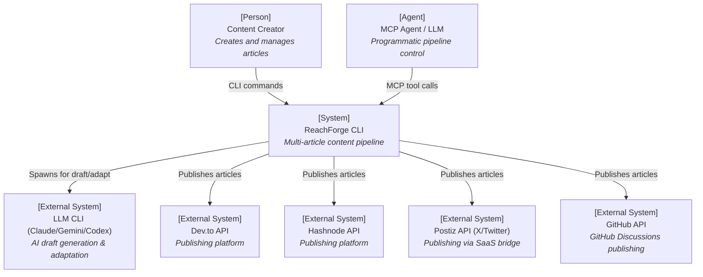
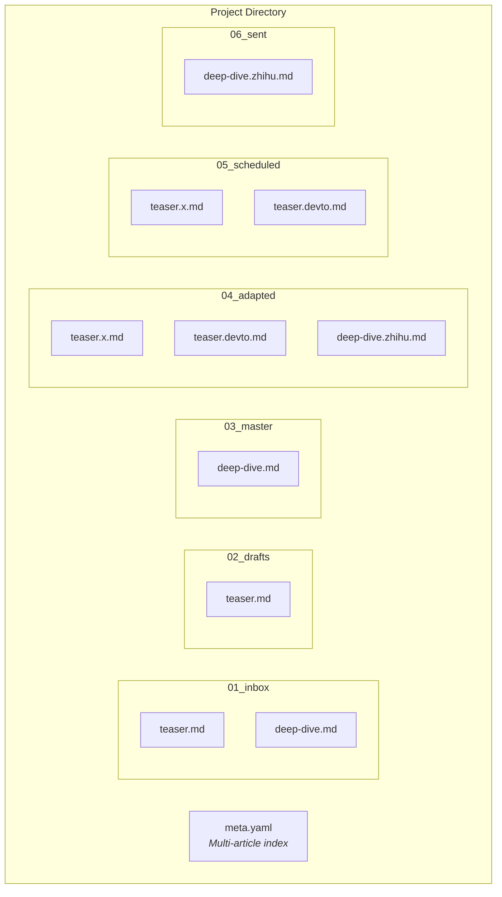
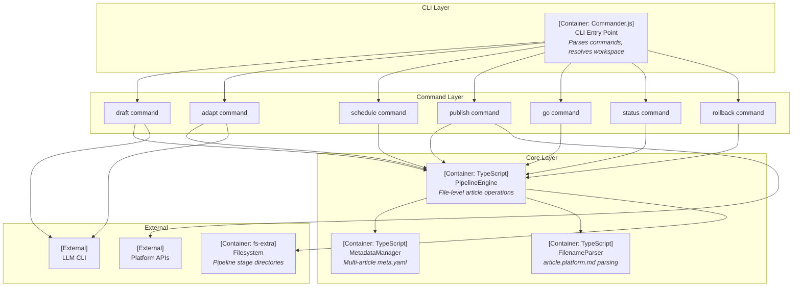
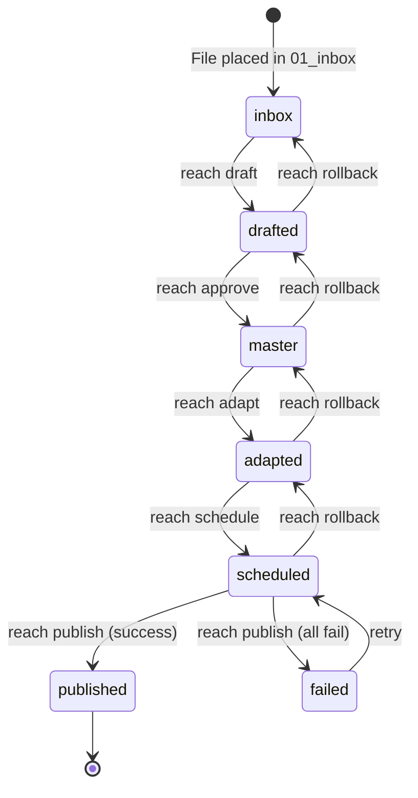
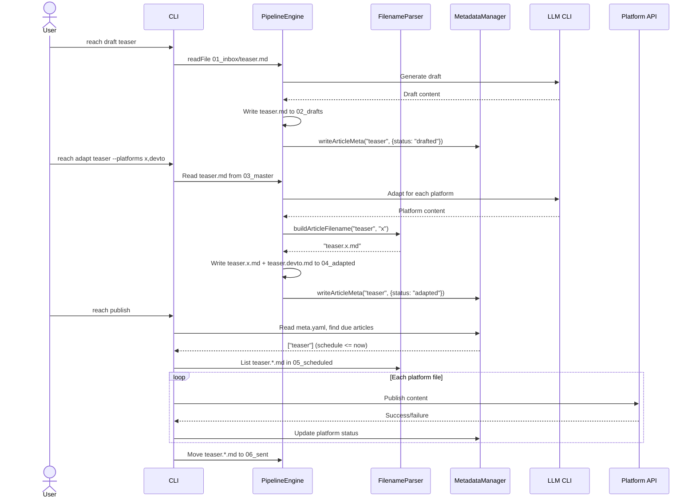

# Technical Design Document: Multi-Article Support

---

## 1. Document Information

| Field | Value |
|-------|-------|
| **Document Title** | Technical Design: Multi-Article Support for ReachForge Projects |
| **Version** | 0.1 |
| **Author** | ReachForge Team |
| **Date** | 2026-03-24 |
| **Status** | Draft |
| **Related PRD** | N/A |
| **Related SRS** | N/A |

---

## 2. Revision History

| Version | Date | Author | Description |
|---------|------|--------|-------------|
| 0.1 | 2026-03-24 | ReachForge Team | Initial draft |

---

## 3. Overview

### 3.1 Background

ReachForge is a CLI-based content pipeline that transforms raw ideas into multi-platform published content through a 6-stage directory-based pipeline (01_inbox → 06_sent). The current architecture enforces a **one-article-per-project** model: each project directory contains exactly one article that flows through the pipeline as a subdirectory at each stage.

In practice, users think of a "project" as a campaign or topic (e.g., "product launch", "tech blog series") that naturally contains multiple articles. Each article may target different platforms (X, Dev.to, Zhihu) and be scheduled at different times. The current 1:1 mapping forces users to create separate projects for each article, losing the logical grouping and shared configuration that a campaign provides.

### 3.2 Goals

- **G1**: Allow a single project to contain multiple articles, each independently progressing through the 6-stage pipeline
- **G2**: Each article can target a different set of platforms and be scheduled at a different time
- **G3**: Maintain the flat-file, no-database philosophy — all state remains in the filesystem and YAML
- **G4**: CLI commands operate on individual articles within a project, with article name as an optional parameter (AI auto-generates slug when omitted)

### 3.3 Non-Goals

- Database or external state store — all metadata stays in YAML files
- Backward compatibility with old single-article project structure (project is early stage, direct cutover)
- Campaign-level orchestration (e.g., "publish all articles in sequence") — can be added later
- Cross-project article references or dependencies

### 3.4 Scope

**Included:**
- Refactor pipeline stages from directory-per-article to flat-file-per-article
- New multi-article `meta.yaml` schema at project root
- Update all CLI commands to accept article name parameter
- Update MCP tool schemas to include article parameter
- Merge receipt into meta.yaml (eliminate separate receipt.yaml)
- Move scheduling from directory-name timestamps to meta.yaml fields

**Excluded:**
- Workspace-level changes (workspace resolution logic unchanged)
- New platform providers
- LLM adapter changes
- Asset management changes (assets remain project-level shared)

### 3.5 User Scenarios

| # | Persona | Type | Goal | Steps | Success Condition |
|---|---------|------|------|-------|-------------------|
| US-01 | Content Creator | Human | Publish a product launch campaign with 3 articles to different platforms | 1. `reach new product-launch`<br>2. Place 3 raw files in 01_inbox: teaser.md, deep-dive.md, chinese-ver.md<br>3. `reach draft teaser` then `reach draft deep-dive` then `reach draft chinese-ver`<br>4. `reach approve teaser` (repeat for others)<br>5. `reach adapt teaser --platforms x,devto`<br>6. `reach adapt chinese-ver --platforms zhihu,wechat`<br>7. `reach schedule teaser 2026-03-25T09:00`<br>8. `reach schedule chinese-ver 2026-03-28`<br>9. `reach publish` | All 3 articles reach 06_sent with correct per-platform receipts in meta.yaml; `reach status` shows each article's individual progress |
| US-02 | Busy Creator | Human | Quick-publish a single idea with auto-generated name | 1. `reach go "write about apcore framework"`<br>2. Pipeline auto-generates slug, runs full pipeline | Article published to all configured platforms; slug auto-derived from prompt (e.g., "write-about-apcore-framework"); meta.yaml updated with published status |
| US-03 | MCP Agent | Agent | Create and schedule content programmatically | 1. Agent calls `reach.draft` with `{ source: "announcement" }`<br>2. Agent calls `reach.approve` with `{ article: "announcement" }`<br>3. Agent calls `reach.adapt` with `{ article: "announcement", platforms: "devto,github" }`<br>4. Agent calls `reach.schedule` with `{ article: "announcement", date: "2026-04-01" }` | Each MCP tool returns JSON with article name and stage; meta.yaml reflects correct per-article status; agent can read status via `reach.status` |

### 3.6 Acceptance Criteria

| AC-ID | Criterion | Scenario | Verification Method |
|-------|-----------|----------|---------------------|
| AC-001 | Multiple .md files can coexist in each pipeline stage directory | US-01 | Integration test: place 3 files in 01_inbox, draft all 3, verify 3 files in 02_drafts |
| AC-002 | `reach draft <article>` generates draft for only the specified article | US-01 | Unit test: draftCommand("teaser") creates teaser.md in 02_drafts, does not affect deep-dive.md |
| AC-003 | `reach adapt <article> --platforms x,devto` creates `{article}.x.md` and `{article}.devto.md` in 04_adapted | US-01 | Integration test: verify file names match `{article}.{platform}.md` pattern |
| AC-004 | Filename parsing correctly extracts article name and platform from `my.first.post.devto.md` | US-01 | Unit test: `parseArticleFilename("my.first.post.devto.md")` returns `{ article: "my.first.post", platform: "devto" }` |
| AC-005 | meta.yaml at project root contains per-article entries with independent status, platforms, and schedule | US-01 | Unit test: write meta for 2 articles, read back, verify independent status fields |
| AC-006 | `reach schedule <article> <date>` stores schedule in meta.yaml, moves platform files to 05_scheduled | US-01 | Integration test: schedule teaser, verify teaser.x.md and teaser.devto.md in 05_scheduled, meta.yaml schedule field set |
| AC-007 | `reach publish` finds articles due by checking meta.yaml schedule field (not directory name) | US-01 | Integration test: set schedule to past time, run publish, verify articles moved to 06_sent |
| AC-008 | Publishing results are written to meta.yaml `articles.{name}.platforms.{platform}` (no separate receipt.yaml) | US-01 | Integration test: publish, verify meta.yaml contains status/url/error per platform |
| AC-009 | `reach go "prompt"` auto-generates slug from prompt when --name not provided | US-02 | Unit test: `slugify("write about apcore")` returns valid slug; integration test: full go pipeline creates correctly named files |
| AC-010 | `reach go "prompt" --name teaser` uses explicit name | US-02 | Integration test: verify article files are named "teaser.md" not auto-generated |
| AC-011 | `reach status` shows per-article breakdown within each stage | US-01 | Integration test: with 3 articles at different stages, verify status output lists each article with its stage |
| AC-012 | MCP tools accept article parameter and return JSON with article field | US-03 | Unit test: verify tool schemas include article field; integration test: MCP tool calls produce correct JSON output |
| AC-013 | Platform IDs match `[a-z0-9]+` regex (no dots, no special chars) | All | Unit test: validate PLATFORM_IDS constant; reject "dev.to" as invalid platform ID |
| AC-014 | `reach rollback <article>` moves only that article's files back one stage | US-01 | Integration test: rollback teaser from 04_adapted, verify only teaser files moved, deep-dive unaffected |

### 3.7 Success Metrics

| Metric | Baseline | Target | Measurement Method | Timeframe |
|--------|----------|--------|--------------------|-----------|
| Articles per project | 1 (hard limit) | Unlimited | meta.yaml article count | Immediate |
| CLI commands per multi-article workflow | N/A (not possible) | Same as single-article (one command per action per article) | CLI usage | First release |
| All existing tests pass after refactor | 100% | 100% | `vitest run` | Before merge |

---

## 4. System Context



The Content Creator interacts via CLI (`reach draft`, `reach adapt`, etc.). MCP Agents interact via the APCore tool interface. ReachForge delegates AI generation to local LLM CLIs and publishes to platform APIs.

---

## 5. Solution Design

### 5.1 Solution A: Flat-File Per Article (Recommended)

**Description:**

Transform pipeline stage directories from "one subdirectory per article" to "flat files per article". Articles are identified by filename convention:
- Pre-adaptation stages (01-03): `{article}.md`
- Post-adaptation stages (04-06): `{article}.{platform}.md`

A single `meta.yaml` at the project root indexes all articles with their individual status, platform targets, and scheduling.

**Architecture:**



**Pros:**
- Minimal directory nesting — `ls` shows all articles at a glance
- Filename convention is simple and universally understood
- No directory management overhead (create/delete/move dirs)
- Platform ID naturally embedded in filename

**Cons:**
- Article names cannot match platform IDs (edge case: article named "x" would conflict with "x.md" in adapted stage)
- Per-article metadata files (like `.publish.lock`) need a different approach since there's no article subdirectory
- Large projects with many articles x platforms could result in many files in one directory

### 5.2 Solution B: Subdirectory Per Article (Alternative)

**Description:**

Keep one subdirectory per article within each stage, but allow multiple article subdirectories to coexist. Each article directory contains the files for that article at that stage.

```
04_adapted/
├── teaser/
│   ├── x.md
│   └── devto.md
└── deep-dive/
    └── zhihu.md
```

**Pros:**
- No filename parsing needed — article name is the directory name
- Per-article lock files, meta, and assets are naturally scoped
- Zero naming conflicts
- Familiar pattern (current architecture, just multiplied)

**Cons:**
- Two levels of nesting to see all content (`ls -R` or tree required)
- Moving articles between stages requires moving entire directories
- More filesystem operations per pipeline action
- Harder to get a flat overview of all articles x platforms

### 5.3 Comparison Matrix

| Criteria | Solution A: Flat-File (Recommended) | Solution B: Subdirectory |
|----------|-------------------------------------|--------------------------|
| Implementation Complexity | Low — file move is `fs.rename` | Medium — directory copy+delete |
| Cognitive Simplicity | High — `ls` shows everything | Medium — need `tree` or `ls -R` |
| Filename Parsing | Required (lastIndexOf logic) | Not needed |
| Naming Conflicts | Possible if article name = platform ID | None |
| Lock File Strategy | Meta-level lock (in meta.yaml) | Per-directory .publish.lock |
| Scalability (many articles) | Good up to ~100 files per dir | Good (one dir per article) |
| Current Codebase Delta | Large (rewrite file handling) | Medium (extend current pattern) |
| User Request Alignment | High (user specifically requested this) | Lower |

### 5.4 Decision & Rationale

**Solution A (Flat-File)** is chosen because:

1. **User explicitly requested this approach** — the flat-file naming convention (`article.platform.md`) was the user's design preference
2. **Simpler mental model** — one level of nesting, filenames tell the full story
3. **Platform ID in filename** is a natural convention that developers understand intuitively
4. The naming conflict edge case (article name = platform ID) is addressed by validating article names against the platform ID registry

The main trade-off is moving per-article lock files from directory-level to meta.yaml-level, which is acceptable since we're already centralizing metadata.

---

## 6. Architecture Design



---

## 7. Technology Stack & Conventions

### 7.1 Technology Stack Decision

| Layer | Technology | Version | Rationale |
|-------|-----------|---------|-----------|
| Language | TypeScript | 5.3+ | Existing codebase language |
| Runtime | Bun | 1.1+ | Existing runtime, single-binary compilation |
| CLI Framework | Commander.js | 12.x | Existing CLI framework |
| Schema Validation | Zod | 3.22+ | Existing validation library |
| YAML | js-yaml | 4.x | Existing YAML parser |
| File Operations | fs-extra | 11.x | Existing file operations library |
| Testing | Vitest | 4.1+ | Existing test framework |
| Build | Bun build | 1.1+ | Existing build tool |

### 7.2 Naming Conventions

#### Code Naming

| Element | Convention | Example |
|---------|-----------|---------|
| Files / Modules | kebab-case | `pipeline.ts`, `metadata.ts`, `filename-parser.ts` |
| Classes | PascalCase | `PipelineEngine`, `MetadataManager`, `FilenameParser` |
| Interfaces | PascalCase | `ArticleMeta`, `ParsedFilename` |
| Functions | camelCase | `parseArticleFilename`, `moveArticle`, `listArticles` |
| Variables | camelCase | `articleName`, `platformId`, `dueArticles` |
| Constants | UPPER_SNAKE_CASE | `PLATFORM_IDS`, `PLATFORM_ID_REGEX`, `STAGES` |
| Types | PascalCase | `PipelineStage`, `ProjectStatus`, `PlatformId` |
| Test Files | `*.test.ts` | `filename-parser.test.ts` |

#### Platform ID Naming

| Element | Convention | Example |
|---------|-----------|---------|
| Platform IDs | `[a-z0-9]+` (lowercase alphanumeric, no dots, no hyphens) | `x`, `devto`, `hashnode`, `zhihu`, `wechat` |
| Filename separator | Last `.` before `.md` | `teaser.devto.md` |
| Article names | Any chars except cannot be a bare platform ID | `teaser`, `my.first.post`, `deep-dive` |

#### File Naming in Pipeline

| Stage | Pattern | Example |
|-------|---------|---------|
| 01_inbox | `{article}.md` or `{article}/` (directory with content) | `teaser.md` |
| 02_drafts | `{article}.md` | `teaser.md` |
| 03_master | `{article}.md` | `teaser.md` |
| 04_adapted | `{article}.{platform}.md` | `teaser.x.md`, `teaser.devto.md` |
| 05_scheduled | `{article}.{platform}.md` | `teaser.x.md` |
| 06_sent | `{article}.{platform}.md` | `teaser.x.md` |

### 7.3 Parameter Validation & Input Parsing

#### Validation Rules Matrix

| Parameter | Type | Required | Min | Max | Pattern | Default | Error Message |
|-----------|------|----------|-----|-----|---------|---------|---------------|
| article (CLI arg) | string | Conditional | 1 char | 200 chars | `^[a-zA-Z0-9][a-zA-Z0-9._-]*$` | AI-generated slug | "Article name must be 1-200 chars, start with alphanumeric" |
| platform (--platforms) | string | No | 1 char | 20 chars | `^[a-z0-9]+$` | project.yaml or `['x','wechat','zhihu']` | "Platform ID must be lowercase alphanumeric" |
| date (schedule) | string | No | 10 chars | 19 chars | `^\d{4}-\d{2}-\d{2}(T\d{2}:\d{2}(:\d{2})?)?$` | Today (ISO) | "Date must be YYYY-MM-DD or YYYY-MM-DDTHH:MM" |
| prompt (go) | string | Yes | 1 char | 5000 chars | Any | — | "Prompt must be 1-5000 characters" |
| --name (go) | string | No | 1 char | 200 chars | `^[a-zA-Z0-9][a-zA-Z0-9._-]*$` | slugify(prompt) | "Name must be 1-200 chars, start with alphanumeric" |

**Article parameter conditionality:**
- Required for: `draft`, `approve`, `adapt`, `schedule`, `refine`, `rollback`
- Optional for: `go` (auto-generated from prompt if `--name` not provided)
- Not applicable: `publish` (publishes all due), `status`, `analytics`

#### Type Coercion Rules

- String to Boolean: Commander.js handles flags; `--force` = true, absence = false
- String to Date: Accept ISO 8601 subset only; reject "03/25/2026"
- Null vs Missing: Omitted args = `undefined`; distinguished from empty string

#### Input Sanitization

- Path traversal: `sanitizePath()` strips `..`, leading `/`, null bytes (existing)
- Article name: reject names that exactly match a platform ID
- Platform ID: must match `PLATFORM_ID_REGEX = /^[a-z0-9]+$/`

### 7.4 Boundary Values & Edge Cases

#### System Limits

| Resource | Minimum | Maximum | Behavior When Exceeded | Rationale |
|----------|---------|---------|----------------------|-----------|
| Article name length | 1 char | 200 chars | CLI error | Filesystem path limits |
| Articles per project | 0 | No hard limit | Performance degrades past ~500 | Directory listing |
| Platforms per article | 1 | 20 | CLI error | Practical limit |
| meta.yaml file size | 0 bytes | 1MB | Warning logged | YAML parse performance |
| Concurrent publish per article | 1 | — | Lock prevents concurrency | Data integrity |

#### Edge Case Handling

| Scenario | Expected Behavior |
|----------|-------------------|
| Article name matches platform ID (e.g., "x") | Reject: "Article name 'x' conflicts with platform ID" |
| Article name contains dots (e.g., "my.first.post") | Allowed — parser uses last dot before .md |
| Two articles at different stages | Allowed — meta.yaml tracks per-article status independently |
| `reach publish` with no articles due | Exit cleanly: "No content due for publishing" |
| Partial publish failure | Succeeded platforms → 06_sent; failed stay in 05_scheduled; meta.yaml records both |
| `reach go` without `--name`, non-ASCII prompt | `slugify()` falls back to hash-based slug (e.g., `go-a1b2c3`) |
| meta.yaml concurrent write (two processes) | Last-write-wins for different articles; same-article ops serialized by lock |

### 7.5 Business Logic Rules

#### State Machine



**Per-article state is tracked independently.** Article A can be `published` while B is `drafted`.

| From | To | Trigger | Guard | Side Effects |
|------|-----|---------|-------|-------------|
| inbox | drafted | `reach draft <article>` | File exists in 01_inbox | Create .md in 02_drafts; update meta.yaml |
| drafted | master | `reach approve <article>` | File exists in 02_drafts | Move file to 03_master; update meta.yaml |
| master | adapted | `reach adapt <article>` | File exists in 03_master | Create `{article}.{platform}.md` in 04_adapted; update meta.yaml |
| adapted | scheduled | `reach schedule <article> [date]` | Platform files in 04_adapted | Move files to 05_scheduled; set schedule in meta.yaml |
| scheduled | published | `reach publish` | schedule <= now | Publish to APIs; record results in meta.yaml; move to 06_sent |
| scheduled | failed | `reach publish` | All platforms fail | Update meta.yaml status; files stay in 05_scheduled |
| any | previous | `reach rollback <article>` | Article exists | Move files back; update meta.yaml |

#### Filename Parsing Rules

| Rule | Description | Example |
|------|-------------|---------|
| FP-001 | Adapted stages: remove `.md`, split at last `.`, check if right part is valid platform ID | `teaser.devto.md` → `{article: "teaser", platform: "devto"}` |
| FP-002 | Article names with dots: last `.` is always the separator | `my.post.x.md` → `{article: "my.post", platform: "x"}` |
| FP-003 | Pre-adaptation stages: strip `.md`, no platform | `teaser.md` → `{article: "teaser", platform: null}` |
| FP-004 | Platform ID validation | Must match `^[a-z0-9]+$` and exist in PLATFORM_IDS |

#### Scheduling Rules

| Rule | Description |
|------|-------------|
| SCH-001 | Schedule time from `meta.yaml → articles.{name}.schedule` (not filename) |
| SCH-002 | Due when `schedule <= now` (ISO string comparison) |
| SCH-003 | No date given → defaults to today (immediate on next publish) |
| SCH-004 | `reach publish` publishes ALL due articles across the project |

### 7.6 Error Handling Strategy

| Error Category | Exit Code | Error Class | User Message |
|---------------|-----------|-------------|-------------|
| Article not found | 1 | `ProjectNotFoundError` | `Article "{name}" not found in {stage}` |
| Invalid article name | 1 | `ReachforgeError` | `Article name must be 1-200 chars, start with alphanumeric` |
| Name conflicts with platform ID | 1 | `ReachforgeError` | `Article name "{name}" conflicts with platform ID` |
| Invalid platform ID | 1 | `ReachforgeError` | `Unknown platform "{id}". Valid: x, devto, hashnode, ...` |
| meta.yaml parse error | 1 | `MetadataParseError` | `Failed to parse meta.yaml: {details}` |
| Article exists in target stage | 1 | `ReachforgeError` | `Article "{name}" already exists in {stage}` |
| Lock held | 0 | — (skip) | `"{article}" is being published by another process. Skipping.` |
| LLM failure | 1 | `Error` | `Draft generation failed: {details}` |
| Platform API failure | 0 | — (continue) | `{platform}: {error}` (logged in meta.yaml) |
| Invalid date | 1 | `InvalidDateError` | `Invalid date. Use YYYY-MM-DD or YYYY-MM-DDTHH:MM` |

---

## 8. Detailed Design

> Per-component implementation details are in `docs/features/`. This section provides the component overview.

### 8.1 Component Overview

| Component | Responsibility | Public Interface | Dependencies | Feature Spec |
|-----------|---------------|-----------------|--------------|--------------|
| filename-parser | Parse and construct `{article}.{platform}.md` filenames | `parseArticleFilename()`, `buildArticleFilename()`, `isAdaptedStage()` | — | [`docs/features/filename-parser.md`] |
| multi-article-metadata | Multi-article meta.yaml schema and read/write | `readArticleMeta()`, `writeArticleMeta()`, `listArticles()`, `lockArticle()` | filename-parser | [`docs/features/multi-article-metadata.md`] |
| pipeline-engine-refactor | Refactor PipelineEngine for file-level operations | `moveArticle()`, `listArticles()`, `findDueArticles()` | filename-parser, multi-article-metadata | [`docs/features/pipeline-engine-refactor.md`] |
| command-updates | Update all CLI commands for article parameter | All command functions | pipeline-engine-refactor, multi-article-metadata | [`docs/features/command-updates.md`] |
| mcp-tool-updates | Update MCP tool schemas and handlers | `TOOL_METADATA`, tool handlers | command-updates | [`docs/features/mcp-tool-updates.md`] |

### 8.2 Component Interaction

```mermaid
flowchart LR
    subgraph "Commands"
        CMD["CLI Commands<br/><i>draft, adapt, schedule,<br/>publish, go, status</i>"]
    end

    subgraph "Core"
        FP["FilenameParser<br/><i>Parse/build filenames</i>"]
        PE["PipelineEngine<br/><i>Move files between stages</i>"]
        MM["MetadataManager<br/><i>Multi-article meta.yaml</i>"]
    end

    subgraph "MCP"
        MCP["MCP Tools<br/><i>APCore definitions</i>"]
    end

    MCP -->|"delegates to"| CMD
    CMD -->|"moveArticle(), listArticles()"| PE
    CMD -->|"readArticleMeta(), writeArticleMeta()"| MM
    PE -->|"parseArticleFilename()"| FP
    PE -->|"readArticleMeta() for schedule"| MM
    MM -->|"parseArticleFilename() for listing"| FP
```

### 8.3 Core Workflow



---

## 9. CLI & MCP Interface Design

### 9.1 CLI Commands

| Command | Arguments | Options | Description |
|---------|-----------|---------|-------------|
| `reach draft <article>` | article (required) | `--json` | Draft from inbox |
| `reach approve <article>` | article (required) | `--json` | Promote to master |
| `reach adapt <article>` | article (required) | `--platforms`, `--force`, `--json` | Adapt for platforms |
| `reach schedule <article> [date]` | article (required), date (optional) | `--dry-run`, `--json` | Schedule publishing |
| `reach publish` | — | `--dry-run`, `--draft`, `--json` | Publish all due |
| `reach status [article]` | article (optional) | `--all`, `--json` | Dashboard or single-article detail |
| `reach go <prompt>` | prompt (required) | `--name`, `--schedule`, `--dry-run`, `--json` | Full auto-pipeline |
| `reach rollback <article>` | article (required) | `--json` | Back one stage |
| `reach refine <article>` | article (required) | `--feedback`, `--json` | AI refinement |

### 9.2 MCP Tool Changes

| Tool | Changed Parameters |
|------|-------------------|
| `reach.go` | Add `name` (optional) for explicit article name |
| `reach.status` | Add `article` (optional) to filter to one article |
| `reach.rollback` | Rename `project` to `article` |
| Others | No parameter changes (already have `article` or `source`) |

---

## 10. Data Design

### 10.1 meta.yaml Schema (New)

```yaml
# project-root/meta.yaml
articles:
  teaser:
    status: scheduled
    platforms:
      x:
        status: pending
      devto:
        status: pending
    schedule: "2026-03-25T09:00"
    adapted_platforms: [x, devto]
    template: null
    notes: null
    error: null
    created_at: "2026-03-24T10:00:00Z"
    updated_at: "2026-03-24T12:00:00Z"
  deep-dive:
    status: adapted
    platforms:
      zhihu:
        status: pending
    schedule: "2026-03-28"
    adapted_platforms: [zhihu]
    created_at: "2026-03-24T10:30:00Z"
    updated_at: "2026-03-24T11:00:00Z"
_locks:
  teaser:
    pid: 12345
    started_at: "2026-03-25T09:00:00Z"
    hostname: macbook
```

### 10.2 Zod Schema

```typescript
const PlatformPublishStatusSchema = z.object({
  status: z.enum(['pending', 'success', 'failed']),
  url: z.string().url().optional(),
  error: z.string().optional(),
  published_at: z.string().optional(),
});

const ArticleMetaSchema = z.object({
  status: z.enum(['inbox', 'drafted', 'master', 'adapted', 'scheduled', 'published', 'failed']),
  platforms: z.record(z.string(), PlatformPublishStatusSchema).optional(),
  schedule: z.string().optional(),
  adapted_platforms: z.array(z.string()).optional(),
  template: z.string().optional(),
  notes: z.string().optional(),
  error: z.string().optional(),
  created_at: z.string().optional(),
  updated_at: z.string().optional(),
});

const LockInfoSchema = z.object({
  pid: z.number(),
  started_at: z.string(),
  hostname: z.string(),
});

const ProjectMetaSchema = z.object({
  articles: z.record(z.string(), ArticleMetaSchema).default({}),
  _locks: z.record(z.string(), LockInfoSchema).optional(),
});
```

### 10.3 Lock Strategy

Per-article locking via `_locks` map in meta.yaml (prefixed with `_` to distinguish from article names). Stale lock detection: check PID alive via `process.kill(pid, 0)`.

### 10.4 Migration

No migration — backward compatibility not required. `reach new` generates new structure.

---

## 11. Security, Performance, Observability

**Security**: No changes. Local CLI tool; API keys in `.env` (existing).

**Performance**:
- `reach status` < 100ms for 50 articles
- meta.yaml read/write < 10ms (single file, < 50KB typical)
- Parallel LLM adaptation via `Promise.all` (existing)

**Observability**: Console + chalk (existing). JSON output mode (existing).

---

## 12. Testing Strategy

| Test Type | Scope | Target |
|-----------|-------|--------|
| Unit | FilenameParser, MetadataManager, slugify | 100% for parser logic |
| Integration | CLI commands end-to-end | All AC-001 through AC-014 |
| Regression | Unmodified code paths | Maintain current pass rate |

---

## 13. Open Questions

| # | Question | Status |
|---|----------|--------|
| OQ-1 | Should `reach publish --article <name>` be supported to publish only one article? | Open — current design publishes all due; can add later |
| OQ-2 | Auto-generated slug collision: what if slug already exists? | Proposed: append `-2`, `-3` suffix |

---

## 14. Design Inputs

Requirements derived from direct conversation with project owner (standalone mode, no upstream PRD/SRS):

1. One project = multiple articles, each independently progressing through pipeline
2. Flat-file naming: `{article}.{platform}.md` with platform ID as `[a-z0-9]+`
3. Centralized meta.yaml at project root, indexed by article name
4. Receipt merged into meta.yaml — no separate receipt.yaml
5. Scheduling via meta.yaml — not directory name timestamps
6. Article name optional — AI auto-generates slug when omitted
7. No backward compatibility — direct cutover
