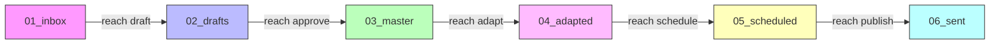
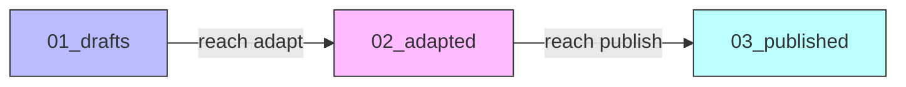
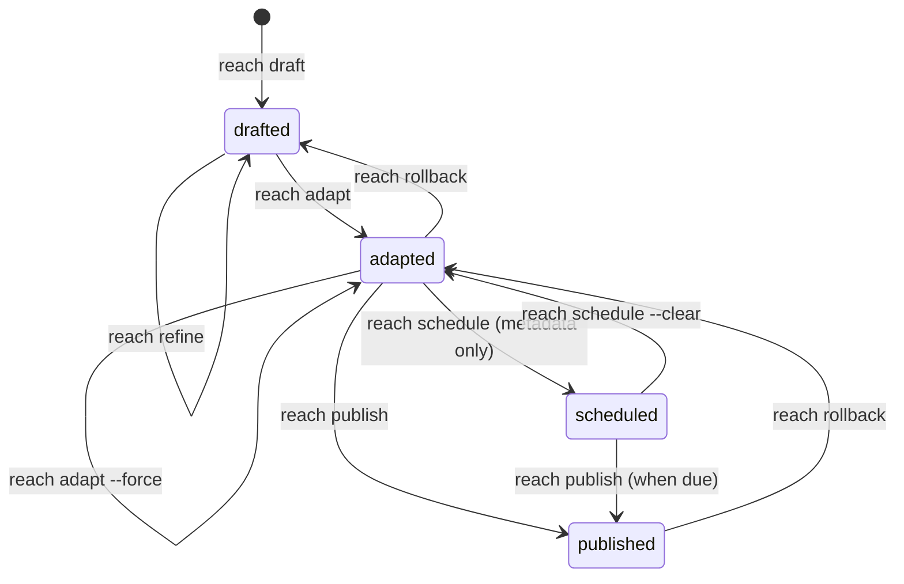

# Technical Design Document: Pipeline Simplification (6-stage to 3-stage)

| Field            | Value                                                  |
|------------------|--------------------------------------------------------|
| **Document**     | ReachForge Pipeline Simplification v1.0                |
| **Author**       | aiperceivable Engineering                              |
| **Date**         | 2026-03-27                                             |
| **Status**       | Implemented                                            |
| **Version**      | 1.0                                                    |
| **PRD Reference**| [ReachForge PRD v1.0](../reachforge/prd.md)            |
| **SRS Reference**| [ReachForge SRS v1.0](../reachforge/srs.md)            |
| **Tech Design**  | [ReachForge Tech Design v1.0](../reachforge/tech-design.md) |

---

## 1. Summary and Motivation

### 1.1 Problem

The current 6-stage pipeline (`01_inbox -> 02_drafts -> 03_master -> 04_adapted -> 05_scheduled -> 06_sent`) introduces unnecessary friction for a single-user CLI tool:

1. **Inbox is redundant.** The `01_inbox` directory serves as a staging area for raw material, but users must manually place files there before running `reach draft`. The draft command could accept input directly (prompt string, file path, or directory).

2. **Master/approve is ceremony without value.** The `03_master` stage exists solely as an "approved" copy of the draft. In practice, the `reach approve` command is a one-line file move with no review gate. Running `reach adapt` could implicitly signal approval.

3. **Scheduled directory is misleading.** The `05_scheduled` stage physically moves files into a separate directory, but scheduling is fundamentally a metadata operation (a date stored in `meta.yaml`). The directory move adds complexity without functional benefit.

These three redundant stages double the pipeline length, increase the number of CLI commands a user must learn, and add unnecessary file I/O operations.

### 1.2 Goals

1. Reduce the pipeline from 6 stages to 3: `01_drafts -> 02_adapted -> 03_published`.
2. Simplify the CLI surface: remove `approve` command, make `schedule` metadata-only.
3. Maintain all existing publishing capabilities (providers, validators, media, MCP).
4. Provide a migration path for existing projects with 6-stage directories.
5. Keep the `assets/` directory and asset management unchanged.

### 1.3 Non-Goals

1. Changing the provider architecture or adding new providers.
2. Modifying the LLM adapter layer.
3. Changing the config hierarchy or credential management.
4. Altering the MCP protocol implementation (only updating tool metadata).

---

## 2. Architecture

### 2.1 Current State (6 stages)



**Status enum:** `inbox | drafted | master | adapted | scheduled | published | failed`

**Commands:** `draft`, `approve`, `refine`, `adapt`, `schedule`, `publish`, `go`, `rollback`, `status`

### 2.2 Target State (3 stages)



**Status enum:** `drafted | adapted | scheduled | published | failed`

- `scheduled` is a virtual status: the article is physically in `02_adapted` but has `schedule` metadata set. It is not a separate directory.

**Commands:** `draft`, `refine`, `adapt`, `schedule`, `publish`, `go`, `rollback`, `status`

- `approve` is removed entirely.

### 2.3 Pipeline Flow Diagram (Target)



### 2.4 Directory Mapping

| Current (6-stage)  | Target (3-stage) | Notes                          |
|--------------------|------------------|--------------------------------|
| `01_inbox/`        | *(removed)*      | Input accepted directly by `draft` |
| `02_drafts/`       | `01_drafts/`     | Renumbered                     |
| `03_master/`       | *(removed)*      | Merged into drafts             |
| `04_adapted/`      | `02_adapted/`    | Renumbered                     |
| `05_scheduled/`    | *(removed)*      | Scheduling is metadata-only    |
| `06_sent/`         | `03_published/`  | Renumbered, renamed            |
| `assets/`          | `assets/`        | Unchanged                      |

### 2.5 File Naming Convention (Unchanged)

- Draft stage: `{article}.md` (e.g., `my-post.md`)
- Adapted stage: `{article}.{platform}.md` (e.g., `my-post.devto.md`)
- Published stage: `{article}.{platform}.md` (archive copy)

---

## 3. Detailed Design

### 3.1 Constants and Types (`src/core/constants.ts`, `src/types/pipeline.ts`)

**Feature spec:** [pipeline-simplification-core.md](../features/pipeline-simplification-core.md)

#### 3.1.1 `PipelineStage` type

```typescript
// BEFORE
export type PipelineStage =
  | '01_inbox' | '02_drafts' | '03_master'
  | '04_adapted' | '05_scheduled' | '06_sent';

// AFTER
export type PipelineStage =
  | '01_drafts' | '02_adapted' | '03_published';
```

#### 3.1.2 `ProjectStatus` type

```typescript
// BEFORE
export type ProjectStatus =
  | 'inbox' | 'drafted' | 'master' | 'adapted' | 'scheduled' | 'published' | 'failed';

// AFTER
export type ProjectStatus =
  | 'drafted' | 'adapted' | 'scheduled' | 'published' | 'failed';
```

Note: `scheduled` remains as a status but has no corresponding directory. An article with status `scheduled` lives in `02_adapted/` and has a `schedule` field in `meta.yaml`.

#### 3.1.3 `STAGES` array

```typescript
// BEFORE
export const STAGES: PipelineStage[] = [
  '01_inbox', '02_drafts', '03_master',
  '04_adapted', '05_scheduled', '06_sent',
];

// AFTER
export const STAGES: PipelineStage[] = [
  '01_drafts', '02_adapted', '03_published',
];
```

#### 3.1.4 `STAGE_STATUS_MAP`

```typescript
// BEFORE
export const STAGE_STATUS_MAP: Record<PipelineStage, ProjectStatus> = {
  '01_inbox': 'inbox',
  '02_drafts': 'drafted',
  '03_master': 'master',
  '04_adapted': 'adapted',
  '05_scheduled': 'scheduled',
  '06_sent': 'published',
};

// AFTER
export const STAGE_STATUS_MAP: Record<PipelineStage, ProjectStatus> = {
  '01_drafts': 'drafted',
  '02_adapted': 'adapted',
  '03_published': 'published',
};
```

#### 3.1.5 Zod Schemas (`src/types/schemas.ts`)

```typescript
// BEFORE
export const ArticleMetaSchema = z.object({
  status: z.enum(['inbox', 'drafted', 'master', 'adapted', 'scheduled', 'published', 'failed']),
  // ...
});

// AFTER
export const ArticleMetaSchema = z.object({
  status: z.enum(['drafted', 'adapted', 'scheduled', 'published', 'failed']),
  // ...
});
```

#### 3.1.6 Filename Parser (`src/core/filename-parser.ts`)

Update `ADAPTED_STAGES` constant:

```typescript
// BEFORE
export const ADAPTED_STAGES: PipelineStage[] = ['04_adapted', '05_scheduled', '06_sent'];

// AFTER
export const ADAPTED_STAGES: PipelineStage[] = ['02_adapted', '03_published'];
```

### 3.2 Pipeline Engine (`src/core/pipeline.ts`)

**Feature spec:** [pipeline-simplification-core.md](../features/pipeline-simplification-core.md)

#### 3.2.1 `initPipeline()`

Creates only 3 directories instead of 6.

#### 3.2.2 `findDueArticles()`

Currently scans `05_scheduled`. Must change to scan `02_adapted` and filter by:
- `meta.status === 'scheduled'` AND `meta.schedule <= now`

```typescript
// AFTER
async findDueArticles(): Promise<string[]> {
  const articles = await this.listArticles('02_adapted');
  if (articles.length === 0) return [];

  const meta = await this.metadata.readProjectMeta();
  const now = new Date();
  const nowIso = now.toISOString();
  const due: string[] = [];

  for (const article of articles) {
    const articleMeta = meta.articles[article];
    if (articleMeta?.status !== 'scheduled') continue;
    if (!articleMeta.schedule || articleMeta.schedule <= nowIso) {
      due.push(article);
    }
  }

  return due;
}
```

#### 3.2.3 `rollbackArticle()`

Logic unchanged (iterate stages in reverse, move to previous stage), but operates on 3 stages instead of 6.

### 3.3 Draft Command (`src/commands/draft.ts`)

**Feature spec:** [draft-command-refactor.md](../features/draft-command-refactor.md)

#### Current behavior
- Reads source material from `01_inbox/{source}.md` or `01_inbox/{source}/` directory.
- Writes draft to `02_drafts/{article}.md`.

#### New behavior
- Accepts three input types via `<input>` argument:
  1. **Prompt string** (no file extension, does not resolve to a file): treated as an inline prompt.
  2. **File path** (resolves to a file on disk): reads file content as source material.
  3. **Directory path** (resolves to a directory on disk): reads first `.md`/`.txt` file as source material (same priority logic as current: `main.md` > `index.md` > alphabetical).
- New option: `--name <slug>` to override the auto-generated article name.
- Writes draft to `01_drafts/{article}.md`.
- No inbox stage involved.

#### Input detection logic

```typescript
async function resolveInput(input: string): Promise<{ content: string; slug: string }> {
  // 1. Check if input is an existing file path
  const resolved = path.resolve(input);
  if (await fs.pathExists(resolved)) {
    const stats = await fs.stat(resolved);
    if (stats.isFile()) {
      const content = await fs.readFile(resolved, 'utf-8');
      const slug = path.basename(resolved, path.extname(resolved));
      return { content, slug: sanitizePath(slug) };
    }
    if (stats.isDirectory()) {
      const content = await readDirectoryContent(resolved);
      const slug = path.basename(resolved);
      return { content, slug: sanitizePath(slug) };
    }
  }

  // 2. Treat as inline prompt
  const slug = slugify(input);
  return { content: input, slug };
}
```

#### CLI signature

```
reach draft <input> [--name <slug>] [--json]
```

### 3.4 Approve Command (Removed)

**The `approve` command is deleted entirely.**

Files affected:
- `src/commands/approve.ts` -- delete file
- `src/cli.ts` or `src/index.ts` -- remove command registration
- `src/help.ts` -- remove from `COMMAND_GROUPS`
- `src/mcp/tools.ts` -- remove `reach.approve` tool definition and schema
- `tests/unit/commands/commands.test.ts` -- remove approve tests

### 3.5 Refine Command (`src/commands/refine.ts`)

Minor change: the `locateArticle()` helper currently checks both `02_drafts` and `03_master`. After refactoring, it only checks `01_drafts`:

```typescript
// BEFORE
async function locateArticle(engine, safeName) {
  // Check 02_drafts, then 03_master
}

// AFTER
async function locateArticle(engine, safeName) {
  const draftPath = engine.getArticlePath('01_drafts', safeName);
  if (await fs.pathExists(draftPath)) {
    return { stage: '01_drafts' as PipelineStage, filename: `${safeName}.md`, filePath: draftPath };
  }
  throw new Error(`Article '${safeName}' not found in 01_drafts`);
}
```

The `saveContent()` helper simplifies: status is always `'drafted'` since there is only one pre-adapt stage.

### 3.6 Adapt Command (`src/commands/adapt.ts`)

**Feature spec:** [adapt-command-refactor.md](../features/adapt-command-refactor.md)

#### Current behavior
- Reads master article from `03_master/{article}.md`.
- Writes platform versions to `04_adapted/{article}.{platform}.md`.

#### New behavior
- Reads draft from `01_drafts/{article}.md`.
- Writes platform versions to `02_adapted/{article}.{platform}.md`.
- Running `reach adapt` implicitly signals the draft is "approved" (no separate approval step).

```typescript
// BEFORE
const masterFile = engine.getArticlePath('03_master', safeName);
if (!await fs.pathExists(masterFile)) {
  throw new Error(`Master article not found at 03_master/${safeName}.md`);
}

// AFTER
const draftFile = engine.getArticlePath('01_drafts', safeName);
if (!await fs.pathExists(draftFile)) {
  throw new Error(`Draft not found at 01_drafts/${safeName}.md. Run 'reach draft' first.`);
}
```

Output stage changes:

```typescript
// BEFORE
const versionPath = engine.getArticlePath('04_adapted', safeName, platform);
await engine.writeArticleFile('04_adapted', safeName, result.content, platform);

// AFTER
const versionPath = engine.getArticlePath('02_adapted', safeName, platform);
await engine.writeArticleFile('02_adapted', safeName, result.content, platform);
```

### 3.7 Schedule Command (`src/commands/schedule.ts`)

**Feature spec:** [schedule-metadata-only.md](../features/schedule-metadata-only.md)

#### Current behavior
- Moves files from `04_adapted/` to `05_scheduled/`.
- Writes `status: 'scheduled'` and `schedule` date to `meta.yaml`.

#### New behavior
- **No file move.** Files remain in `02_adapted/`.
- Writes `status: 'scheduled'` and `schedule` date to `meta.yaml`.
- This is a pure metadata operation.

```typescript
// BEFORE
await engine.moveArticle(safeName, '04_adapted', '05_scheduled');
await engine.metadata.writeArticleMeta(safeName, {
  status: 'scheduled',
  schedule: normalizedDate,
});

// AFTER
// Verify article exists in 02_adapted
const files = await engine.getArticleFiles(safeName, '02_adapted');
if (files.length === 0) {
  throw new ReachforgeError(
    `Article "${safeName}" not found in 02_adapted`,
    'Run reach adapt first',
  );
}
await engine.metadata.writeArticleMeta(safeName, {
  status: 'scheduled',
  schedule: normalizedDate,
});
```

### 3.8 Publish Command (`src/commands/publish.ts`)

**Feature spec:** [publish-command-refactor.md](../features/publish-command-refactor.md)

#### Key changes

1. **Source stage**: Read content from `02_adapted/` instead of `05_scheduled/`.
2. **Archive stage**: Move/copy published articles to `03_published/` instead of `06_sent/`.
3. **Batch publish**: `findDueArticles()` now scans `02_adapted` for articles with `status === 'scheduled'` and due dates.
4. **External file tracking**: Track copies go to `03_published/` instead of `06_sent/`.

All stage references throughout the file change:
- `'05_scheduled'` -> `'02_adapted'`
- `'06_sent'` -> `'03_published'`

The `publishPipelineArticle()` function changes its existence check:

```typescript
// BEFORE
const articles = await engine.listArticles('05_scheduled');

// AFTER
const articles = await engine.listArticles('02_adapted');
```

The `publishAllDue()` function remains largely the same but reads from `02_adapted` and archives to `03_published`.

### 3.9 Go Command (`src/commands/go.ts`)

**Feature spec:** [go-command-simplification.md](../features/go-command-simplification.md)

#### Current flow (6 steps)
1. Create inbox item (`01_inbox`)
2. Draft (`01_inbox` -> `02_drafts`)
3. Approve (`02_drafts` -> `03_master`)
4. Adapt (`03_master` -> `04_adapted`)
5. Schedule (`04_adapted` -> `05_scheduled`)
6. Publish (`05_scheduled` -> `06_sent`)

#### New flow (3 steps)
1. Draft (input -> `01_drafts`)
2. Adapt (`01_drafts` -> `02_adapted`)
3. Publish (`02_adapted` -> `03_published`)

```typescript
// AFTER
const STEPS = [
  'Generating AI draft',
  'Adapting for platforms',
  'Publishing',
] as const;

async function goCommand(engine, prompt, options) {
  // Step 1: Draft (no inbox, direct from prompt)
  step(0);
  await draftCommand(engine, prompt, { name: slug });

  // Step 2: Adapt
  step(1);
  await adaptCommand(engine, slug);

  // Step 3: Schedule (metadata) + Publish
  step(2);
  if (options.schedule) {
    await scheduleCommand(engine, slug, options.schedule);
    // Deferred -- will publish when due
  } else {
    await publishCommand(engine, { article: slug, config: options.config });
  }
}
```

Step counter changes from `[x/6]` to `[x/3]`.

### 3.10 Rollback Command (`src/commands/rollback.ts`)

No logic changes needed -- the command delegates to `engine.rollbackArticle()` which iterates `STAGES` in reverse. Since `STAGES` is now 3 elements, rollback automatically works correctly:
- `03_published` -> `02_adapted`
- `02_adapted` -> `01_drafts`
- `01_drafts` -> error (already in first stage)

### 3.11 Status Command (`src/commands/status.ts`)

Update all references from 6-stage `STAGES` to 3-stage `STAGES`. The command iterates `STAGES` dynamically, so the primary change is cosmetic -- the output shows 3 stages instead of 6.

The article detail view needs to handle the `scheduled` status correctly: show that the article is in `02_adapted` with a scheduled date.

### 3.12 Help Text (`src/help.ts`)

```typescript
// BEFORE
lines.push('Workflow: inbox -> draft -> approve -> refine -> adapt -> schedule -> publish');

// AFTER
lines.push('Workflow: draft -> refine -> adapt -> schedule -> publish');
```

Remove `approve` from `COMMAND_GROUPS`:

```typescript
// BEFORE
{ title: 'Pipeline Steps', commands: ['draft', 'approve', 'refine', 'adapt', 'schedule', 'rollback'] }

// AFTER
{ title: 'Pipeline Steps', commands: ['draft', 'refine', 'adapt', 'schedule', 'rollback'] }
```

### 3.13 MCP Tools (`src/mcp/tools.ts`)

- **Remove**: `reach.approve` tool definition, `ApproveToolSchema`.
- **Update** `reach.draft` description: reference `01_drafts` instead of `01_inbox`/`02_drafts`, describe multi-input support.
- **Update** `reach.adapt` description: reference `01_drafts` instead of `03_master`.
- **Update** `reach.schedule` description: explain metadata-only operation, no file move.
- **Update** `reach.publish` description: reference `02_adapted` instead of `05_scheduled`.
- **Update** `reach.status` description: reference 3 stages.
- **Update** `reach.go` description: reflect 3-step flow.
- **Update** `reach.rollback` description: reference 3-stage pipeline.
- **Add** `name` parameter to `DraftToolSchema`.

### 3.14 CLI Entry Point (`src/cli.ts` or `src/index.ts`)

- Remove the `approve` command registration.
- Update the `draft` command to accept `<input>` instead of `<source>`, add `--name` option.
- Remove `01_inbox` from any initialization logic.

---

## 4. Migration Plan

### 4.1 Automatic Migration

When the pipeline engine detects old directory names, it performs an automatic migration:

```typescript
async migrateLegacyPipeline(): Promise<boolean> {
  const migrations: Array<{ from: string; to: string }> = [
    { from: '02_drafts', to: '01_drafts' },
    { from: '04_adapted', to: '02_adapted' },
    { from: '06_sent', to: '03_published' },
  ];

  let migrated = false;

  for (const { from, to } of migrations) {
    const fromPath = path.join(this.workingDir, from);
    const toPath = path.join(this.workingDir, to);
    if (await fs.pathExists(fromPath) && !await fs.pathExists(toPath)) {
      await fs.move(fromPath, toPath);
      migrated = true;
    }
  }

  // Merge stages that are being removed
  const merges: Array<{ from: string; into: string }> = [
    { from: '01_inbox', into: '01_drafts' },
    { from: '03_master', into: '01_drafts' },
    { from: '05_scheduled', into: '02_adapted' },
  ];

  for (const { from, into } of merges) {
    const fromPath = path.join(this.workingDir, from);
    const intoPath = path.join(this.workingDir, into);
    if (await fs.pathExists(fromPath)) {
      await fs.ensureDir(intoPath);
      const files = await fs.readdir(fromPath);
      for (const file of files) {
        const src = path.join(fromPath, file);
        const dst = path.join(intoPath, file);
        if (!await fs.pathExists(dst)) {
          await fs.move(src, dst);
        }
      }
      // Remove empty legacy directory
      const remaining = await fs.readdir(fromPath);
      if (remaining.length === 0) {
        await fs.remove(fromPath);
      }
    }
  }

  // Update metadata statuses
  if (migrated) {
    const meta = await this.metadata.readProjectMeta();
    for (const [name, article] of Object.entries(meta.articles)) {
      if (article.status === 'inbox') {
        meta.articles[name].status = 'drafted';
      } else if (article.status === 'master') {
        meta.articles[name].status = 'drafted';
      }
    }
    // Re-save meta
  }

  return migrated;
}
```

### 4.2 Migration Trigger

The migration runs automatically at the start of `initPipeline()`. It is idempotent -- running it on an already-migrated project is a no-op.

### 4.3 Migration Logging

When migration occurs, the engine logs:
```
[reach] Migrated project from 6-stage to 3-stage pipeline.
```

### 4.4 Backward Compatibility

- Old `meta.yaml` entries with `status: 'inbox'` or `status: 'master'` are silently upgraded to `status: 'drafted'`.
- The Zod schema validation uses `.transform()` or `.preprocess()` to map legacy status values.
- Old directory names are renamed during migration; no dual-directory support is maintained long-term.

---

## 5. API / Interface Changes

### 5.1 CLI Commands (Before / After)

| Command | Before | After |
|---------|--------|-------|
| `reach draft <source>` | Source must exist in `01_inbox/` | `reach draft <input> [--name slug]` -- input is prompt, file path, or directory |
| `reach approve <article>` | Moves `02_drafts` -> `03_master` | **Removed** |
| `reach refine <article>` | Checks `02_drafts` and `03_master` | Checks `01_drafts` only |
| `reach adapt <article>` | Reads from `03_master`, writes to `04_adapted` | Reads from `01_drafts`, writes to `02_adapted` |
| `reach schedule <article> <date>` | Moves files from `04_adapted` to `05_scheduled` | Metadata-only (no file move), verifies article in `02_adapted` |
| `reach publish [article]` | Reads from `05_scheduled`, archives to `06_sent` | Reads from `02_adapted`, archives to `03_published` |
| `reach go <prompt>` | 6 steps (inbox, draft, approve, adapt, schedule, publish) | 3 steps (draft, adapt, publish) |
| `reach rollback <article>` | Rolls back across 6 stages | Rolls back across 3 stages |
| `reach status` | Shows 6 pipeline stages | Shows 3 pipeline stages |

### 5.2 MCP Tool Changes

| Tool | Change |
|------|--------|
| `reach.draft` | Input schema adds `name` field; `source` description updated |
| `reach.approve` | **Removed** |
| `reach.adapt` | Description references `01_drafts` instead of `03_master` |
| `reach.schedule` | Description updated to metadata-only |
| `reach.publish` | Description references `02_adapted` instead of `05_scheduled` |
| `reach.go` | Description reflects 3-step flow |
| `reach.status` | Description references 3 stages |
| `reach.rollback` | Description references 3-stage pipeline |

### 5.3 JSON Output Changes

All JSON output that includes stage names will reflect the new 3-stage names. The `jsonVersion` field in the JSON envelope should be bumped.

---

## 6. Rollback Plan

### 6.1 Version Tagging

Before starting implementation, create a Git tag: `pre-pipeline-simplification`.

### 6.2 Feature Branch

All changes are developed on a `feat/pipeline-simplification` branch. The branch is merged only after all tests pass.

### 6.3 Reverting

If the simplification proves problematic:
1. Revert to the tagged commit.
2. Run a "reverse migration" script that renames directories back:
   - `01_drafts` -> `02_drafts`
   - `02_adapted` -> `04_adapted`
   - `03_published` -> `06_sent`
3. Recreate the removed directories: `01_inbox`, `03_master`, `05_scheduled`.

### 6.4 Data Safety

The migration is non-destructive: files are moved (not deleted), and metadata is updated in-place. No content is lost during migration.

---

## 7. Testing Strategy

### 7.1 Test Categories

| Category | Scope | Count (estimated) |
|----------|-------|-------------------|
| Unit: Constants & Types | Verify new stage names, status enum, stage map | ~10 |
| Unit: Pipeline Engine | `initPipeline`, `moveArticle`, `findDueArticles`, `rollbackArticle` | ~25 |
| Unit: Draft Command | Multi-input detection (prompt/file/dir), `--name` option | ~15 |
| Unit: Adapt Command | Reads from `01_drafts`, writes to `02_adapted` | ~10 |
| Unit: Schedule Command | Metadata-only, no file move, validation | ~10 |
| Unit: Publish Command | Reads from `02_adapted`, archives to `03_published`, batch due | ~20 |
| Unit: Go Command | 3-step flow, slug generation, error at each step | ~10 |
| Unit: Rollback | 3-stage rollback | ~5 |
| Unit: Status | 3-stage display | ~5 |
| Unit: MCP Tools | Updated schemas and descriptions | ~10 |
| Unit: Schemas | Zod validation with new status values | ~5 |
| Unit: Filename Parser | Updated `ADAPTED_STAGES` | ~5 |
| Integration: E2E | Full pipeline flow: draft -> adapt -> publish | ~10 |
| Integration: Migration | 6-stage to 3-stage migration | ~10 |

### 7.2 Migration Tests

Tests for the migration path deserve special attention:

1. **Clean project**: No legacy directories, `initPipeline` creates 3 new directories.
2. **Legacy 6-stage project**: All 6 directories exist with content. Migration renames and merges correctly.
3. **Partially migrated project**: Mix of old and new directory names. Migration handles gracefully.
4. **Metadata migration**: `status: 'inbox'` -> `'drafted'`, `status: 'master'` -> `'drafted'`.
5. **Idempotent migration**: Running migration twice produces the same result.
6. **Content preservation**: No files are lost during migration.
7. **Collision handling**: Files with the same name in merged directories (e.g., same article in `01_inbox` and `02_drafts`) are handled safely.

### 7.3 Existing Test Modifications

Every test file that references old stage names (`01_inbox`, `02_drafts`, `03_master`, etc.) must be updated. Key test files:

- `tests/unit/core/pipeline.test.ts`
- `tests/unit/commands/commands.test.ts`
- `tests/unit/commands/go.test.ts`
- `tests/unit/commands/refine.test.ts`
- `tests/unit/commands/status.test.ts`
- `tests/unit/commands/json-commands.test.ts`
- `tests/unit/types/schemas.test.ts`
- `tests/unit/mcp/tools.test.ts`
- `tests/integration/e2e-pipeline.test.ts`

---

## 8. Implementation Order

The implementation should proceed in this order to minimize broken intermediate states:

1. **Phase 1: Core types and constants** -- Update `PipelineStage`, `ProjectStatus`, `STAGES`, `STAGE_STATUS_MAP`, Zod schemas, filename parser. All tests will break at this point.

2. **Phase 2: Pipeline engine** -- Update `PipelineEngine` methods, add migration logic. Fix pipeline tests.

3. **Phase 3: Commands** -- Update all commands (draft, refine, adapt, schedule, publish, go, rollback, status). Delete approve command. Fix command tests.

4. **Phase 4: CLI and MCP** -- Update CLI registration, help text, MCP tool definitions. Fix remaining tests.

5. **Phase 5: Integration tests** -- Update E2E tests, add migration tests.

6. **Phase 6: Documentation** -- Update `CLAUDE.md`, `README.md` if present, and upstream docs.

---

## 9. Files Changed Summary

| File | Action | Feature Spec |
|------|--------|-------------|
| `src/types/pipeline.ts` | Modify | [core](../features/pipeline-simplification-core.md) |
| `src/types/schemas.ts` | Modify | [core](../features/pipeline-simplification-core.md) |
| `src/core/constants.ts` | Modify | [core](../features/pipeline-simplification-core.md) |
| `src/core/pipeline.ts` | Modify | [core](../features/pipeline-simplification-core.md) |
| `src/core/metadata.ts` | Minor update | [core](../features/pipeline-simplification-core.md) |
| `src/core/filename-parser.ts` | Modify | [core](../features/pipeline-simplification-core.md) |
| `src/commands/draft.ts` | Major rewrite | [draft](../features/draft-command-refactor.md) |
| `src/commands/approve.ts` | **Delete** | -- |
| `src/commands/refine.ts` | Modify | [core](../features/pipeline-simplification-core.md) |
| `src/commands/adapt.ts` | Modify | [adapt](../features/adapt-command-refactor.md) |
| `src/commands/schedule.ts` | Major rewrite | [schedule](../features/schedule-metadata-only.md) |
| `src/commands/publish.ts` | Modify | [publish](../features/publish-command-refactor.md) |
| `src/commands/go.ts` | Major rewrite | [go](../features/go-command-simplification.md) |
| `src/commands/rollback.ts` | Minor (stage references only) | -- |
| `src/commands/status.ts` | Minor (stage references only) | -- |
| `src/help.ts` | Modify | -- |
| `src/mcp/tools.ts` | Modify | -- |
| `src/cli.ts` / `src/index.ts` | Modify | -- |
| `CLAUDE.md` | Modify | -- |
| All test files | Modify | -- |

---

## 10. Risk Assessment

| Risk | Severity | Mitigation |
|------|----------|------------|
| Migration corrupts user data | High | Non-destructive moves; pre-migration backup warning; idempotent migration |
| Existing scripts/integrations break | Medium | Clear migration guide; version tag; JSON output backward compatibility |
| `scheduled` as virtual status causes confusion | Low | Clear documentation; `reach status` shows schedule date prominently |
| MCP clients break on removed `approve` tool | Medium | Version bump in MCP tool metadata; removal is clean (tool simply disappears) |
| Watcher daemon references old stages | Medium | Update watcher to scan `02_adapted` for scheduled articles |

---

## Appendix A: Feature Spec Index

1. [Pipeline Simplification Core](../features/pipeline-simplification-core.md) -- constants, types, pipeline engine, filename parser
2. [Draft Command Refactor](../features/draft-command-refactor.md) -- multi-input support, `--name` option
3. [Adapt Command Refactor](../features/adapt-command-refactor.md) -- reads from drafts directly
4. [Schedule Metadata Only](../features/schedule-metadata-only.md) -- no directory move
5. [Publish Command Refactor](../features/publish-command-refactor.md) -- reads from adapted stage
6. [Go Command Simplification](../features/go-command-simplification.md) -- 3-step flow
