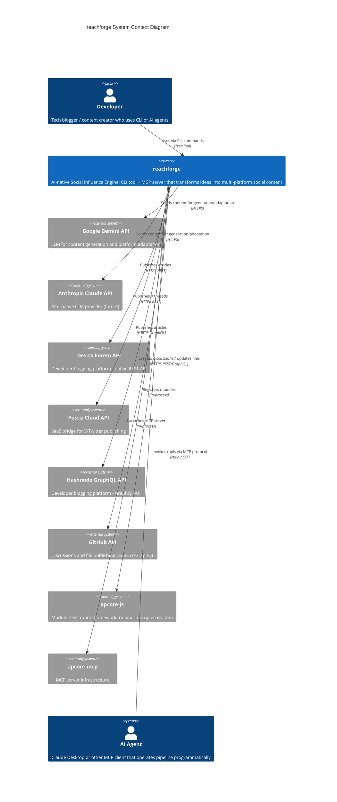
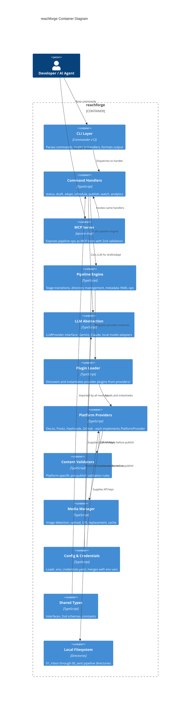
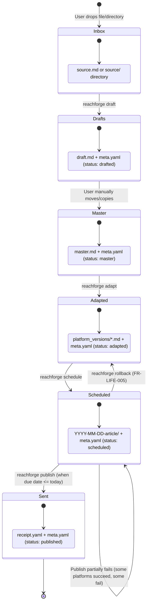

# Technical Design Document: reachforge

| Field            | Value                                              |
|------------------|----------------------------------------------------|
| **Document**     | reachforge Technical Design v1.0                       |
| **Author**       | aipartnerup Engineering                            |
| **Date**         | 2026-03-14                                         |
| **Status**       | Draft                                              |
| **Version**      | 1.0                                                |
| **PRD Reference**| [reachforge PRD v1.0](prd.md)                         |
| **SRS Reference**| [reachforge SRS v1.0](srs.md)                         |
| **Decomposition**| [reachforge Decomposition](decomposition.md)           |

---

## 1. Context & Goals

### 1.1 Background

reachforge is currently a single-file monolith (`src/index.ts`, 290 lines) that implements a six-stage file-based content pipeline. All logic resides in one `ReachforgeLogic` object with five methods, CLI wiring via Commander, APCore module registration, and MCP server launch via apcore-mcp. Publishing is mocked with random URLs. There is no test suite, no modular architecture, and no real platform integration.

The PRD targets v0.2 (MVP) with real publishing to Dev.to and X via Postiz, plus a provider plugin architecture that enables future platform expansion. The SRS formalizes 67 functional requirements and 16 non-functional requirements across 16 features. This design document specifies **how** to build the system described by those requirements: the module boundaries, interfaces, data flows, error handling, and migration path from the current monolith to a plugin-based architecture.

### 1.2 Goals

1. **Define a plugin-based architecture** that decomposes the monolith into `core/`, `providers/`, `llm/`, `commands/`, `mcp/`, `validators/`, `types/`, and `utils/` modules, where no single file exceeds 300 lines (NFR-MAINT-001).
2. **Specify the PlatformProvider interface** so that new providers (Dev.to, Postiz, Hashnode, GitHub, community-contributed) can be added without modifying core pipeline code (FR-PLUG-001 through FR-PLUG-004).
3. **Define the LLMProvider abstraction** to decouple content generation from Google Gemini, supporting future Claude and local model backends (PRD Risk: Gemini API changes).
4. **Design the data flow** through the six-stage pipeline with precise YAML schemas, stage transition logic, and error handling at every boundary.
5. **Specify CLI and MCP tool contracts** with exact parameter types, validation rules, and return types so that both human users and AI agents can operate the pipeline.
6. **Provide a migration plan** from the current `src/index.ts` monolith to the modular architecture, preserving backward compatibility throughout.

### 1.3 Non-Goals

1. **Web UI or desktop app**: reachforge remains CLI-only and MCP-server-only. The VS Code extension (FEAT-015, P2) is out of scope for this design.
2. **Multi-user or hosted deployment**: No authentication, no user accounts, no cloud backend.
3. **Real-time collaborative editing**: Content pipeline is single-user, file-based.
4. **Template system implementation details**: FEAT-014 (P2) is acknowledged but deferred to a future design iteration. Note: the `LLMProvider` interface includes `template` and `templateVars` fields in `GenerateOptions`/`AdaptOptions` as forward-compatible extension points; these fields are ignored until FEAT-014 is designed.
5. **Analytics dashboard implementation**: FEAT-013 (P2) is acknowledged but deferred.

### 1.4 Requirements Addressed

This design addresses all P0 and P1 requirements from the SRS:

- **Pipeline Core**: FR-PIPE-001 through FR-PIPE-004
- **CLI Dashboard**: FR-DASH-001 through FR-DASH-004
- **Project Lifecycle**: FR-LIFE-001 through FR-LIFE-005
- **AI Draft**: FR-DRAFT-001 through FR-DRAFT-007
- **AI Adapter**: FR-ADAPT-001 through FR-ADAPT-007
- **Dev.to Provider**: FR-PUB-001 through FR-PUB-005
- **Postiz Provider**: FR-PUB-006 through FR-PUB-009
- **Hashnode/GitHub**: FR-PROV-001 through FR-PROV-003
- **Media Manager**: FR-MEDIA-001 through FR-MEDIA-004
- **Watcher Mode**: FR-WATCH-001 through FR-WATCH-006
- **MCP Server**: FR-MCP-001 through FR-MCP-005
- **Plugin Architecture**: FR-PLUG-001 through FR-PLUG-004
- **Content Validation**: FR-VALID-001 through FR-VALID-004
- **NFRs**: NFR-PERF-001 through NFR-PERF-004, NFR-SEC-001 through NFR-SEC-003, NFR-COMPAT-001 through NFR-COMPAT-003, NFR-REL-001, NFR-REL-002, NFR-MAINT-001, NFR-MAINT-002

---

## 2. Design Overview

### 2.1 High-Level Architecture

reachforge uses a **plugin-based architecture** with a core pipeline engine that delegates platform-specific behavior to provider plugins and LLM-specific behavior to LLM provider plugins. The core owns the state machine (six-stage pipeline), YAML operations, and orchestration. Providers are independent modules that implement a standard interface and are discovered at runtime via filesystem convention.

Key architectural decisions:

1. **Core + Plugin Loader**: The core pipeline engine loads providers dynamically from the `providers/` directory. Each provider is a self-contained module exporting a class that implements the `PlatformProvider` interface.
2. **LLM Abstraction Layer**: An `LLMProvider` interface abstracts all AI operations. The Gemini implementation ships as the default; Claude and local model implementations can be swapped in via configuration.
3. **Command-Handler Separation**: CLI commands in `commands/` are thin wrappers that parse arguments, call core pipeline methods, and format output. Business logic lives in `core/`.
4. **Shared Type System**: All interfaces, types, and Zod schemas live in `types/` and are imported by every other module.

### 2.2 C4 Context Diagram



### 2.3 C4 Container Diagram



---

## 3. Target Directory Structure

```
src/
  index.ts                     — Entry point: CLI setup, APCore registration, command wiring
  core/
    pipeline.ts                — Pipeline engine: stage transitions, directory management
    metadata.ts                — YAML read/write/update operations for meta.yaml and receipt.yaml
    config.ts                  — Configuration loading: .env, credentials.yaml, env var merging
    constants.ts               — Stage names, stage order, default values
  providers/
    types.ts                   — PlatformProvider interface, PublishOptions, PublishResult, ValidationResult
    loader.ts                  — Plugin discovery: scan providers/, instantiate, register
    devto.ts                   — Dev.to Forem API provider
    postiz.ts                  — Postiz Cloud API provider (X/Twitter bridge)
    hashnode.ts                — Hashnode GraphQL API provider
    github.ts                  — GitHub Discussions/file provider
  llm/
    types.ts                   — LLMProvider interface, GenerateOptions, AdaptOptions
    factory.ts                 — LLM provider factory: instantiate by config name
    gemini.ts                  — Google Gemini implementation
    claude.ts                  — Anthropic Claude implementation (stub for future)
    local.ts                   — Local model implementation (stub for future)
  commands/
    status.ts                  — Status/dashboard command handler
    draft.ts                   — Draft generation command handler
    adapt.ts                   — Platform adaptation command handler
    schedule.ts                — Schedule command handler
    publish.ts                 — Publish command handler
    watch.ts                   — Watcher daemon command handler
    mcp.ts                     — MCP server launch command handler
    analytics.ts               — Analytics command handler (P2)
  mcp/
    tools.ts                   — MCP tool definitions with Zod schemas
    server.ts                  — MCP server setup and lifecycle
  validators/
    base.ts                    — Base validation runner, aggregation
    x.ts                       — X/Twitter thread validation (280 char limit, thread format)
    devto.ts                   — Dev.to frontmatter and content validation
    hashnode.ts                — Hashnode content validation
    github.ts                  — GitHub content validation
  types/
    index.ts                   — Re-exports all types
    pipeline.ts                — Pipeline stage types, ProjectMeta, StageTransition
    schemas.ts                 — Zod schemas for meta.yaml, receipt.yaml, credentials, CLI params
    errors.ts                  — Error class hierarchy
  utils/
    fs.ts                      — Filesystem helpers: atomic move, directory listing, path sanitization
    http.ts                    — HTTP client with retry logic, exponential backoff
    logger.ts                  — Structured logging for CLI output and file logging
    media.ts                   — Media detection, upload, URL replacement, cache management
```

---

## 4. Detailed Design

### 4.1 Module Architecture

#### 4.1.1 Core Module (`core/`)

The core module owns the pipeline state machine and all filesystem operations. It has zero knowledge of specific platforms or LLM providers. It operates through interfaces that providers and LLM adapters implement.

**`core/pipeline.ts`** — Pipeline Engine

The pipeline engine manages stage transitions, directory creation, project discovery, and the publish orchestration loop.

```typescript
// core/pipeline.ts

import { PipelineStage, ProjectMeta, StageTransition, PublishResult } from '../types/pipeline';
import { PlatformProvider } from '../providers/types';
import { MetadataManager } from './metadata';
import { STAGES, STAGE_ORDER } from './constants';

export class PipelineEngine {
  private metadataManager: MetadataManager;
  private workingDir: string;

  constructor(workingDir: string) {
    this.workingDir = workingDir;
    this.metadataManager = new MetadataManager(workingDir);
  }

  /**
   * Ensures all six pipeline directories exist.
   * FR-PIPE-001: Creates directories on any command invocation.
   * Idempotent — does not overwrite existing directories (NFR-REL-002).
   */
  async initPipeline(): Promise<void>;

  /**
   * Lists all projects in a given stage, excluding hidden files and root YAML files.
   * FR-DASH-001, FR-DASH-002: Used by status command.
   * Returns: Array of project names (directory names).
   */
  async listProjects(stage: PipelineStage): Promise<string[]>;

  /**
   * Moves a project from one stage to another.
   * FR-PIPE-004: Atomic filesystem move.
   * @param project - Project directory name
   * @param fromStage - Source stage
   * @param toStage - Target stage
   * @param newName - Optional new directory name (e.g., date-prefixed for scheduling)
   * @throws ProjectExistsError if target already exists
   * @throws ProjectNotFoundError if source does not exist
   */
  async moveProject(
    project: string,
    fromStage: PipelineStage,
    toStage: PipelineStage,
    newName?: string
  ): Promise<StageTransition>;

  /**
   * Finds all due items in 05_scheduled.
   * A project is due when its date prefix (YYYY-MM-DD) is <= today.
   * FR-WATCH-001: Used by publish and watcher.
   * Returns: Array of project names with date prefix <= current date.
   */
  async findDueProjects(): Promise<string[]>;

  /**
   * Orchestrates publishing for a single project across all configured providers.
   * FR-PUB-001 through FR-PUB-009: Runs validation, then publish, per provider.
   * NFR-PERF-003: Runs providers concurrently via Promise.allSettled.
   * NFR-REL-001: On total failure, project stays in 05_scheduled.
   * @param project - Project directory name in 05_scheduled
   * @param providers - Map of platform name to provider instance
   * @param options - Publish options (publishLive flag, etc.)
   * Returns: Array of per-platform results.
   */
  async publishProject(
    project: string,
    providers: Map<string, PlatformProvider>,
    options: PublishOptions
  ): Promise<PublishResult[]>;
}
```

**`core/metadata.ts`** — YAML Metadata Operations

```typescript
// core/metadata.ts

import { ProjectMeta, ReceiptData, UploadCache } from '../types/pipeline';

export class MetadataManager {
  private workingDir: string;

  constructor(workingDir: string) {
    this.workingDir = workingDir;
  }

  /**
   * Reads meta.yaml from a project directory.
   * FR-PIPE-003: Returns parsed ProjectMeta or null if not found.
   * Validates against MetaSchema (Zod).
   */
  async readMeta(stage: string, project: string): Promise<ProjectMeta | null>;

  /**
   * Writes or updates meta.yaml in a project directory.
   * FR-PIPE-003, FR-LIFE-004: Merges partial updates into existing meta.
   * Sets updated_at to current ISO 8601 timestamp.
   */
  async writeMeta(stage: string, project: string, meta: Partial<ProjectMeta>): Promise<void>;

  /**
   * Reads receipt.yaml from a project directory.
   */
  async readReceipt(stage: string, project: string): Promise<ReceiptData | null>;

  /**
   * Writes receipt.yaml to a project directory.
   * FR-PUB-003, FR-PUB-008: Called after publish completes.
   */
  async writeReceipt(stage: string, project: string, receipt: ReceiptData): Promise<void>;

  /**
   * Reads .upload_cache.yaml from a project directory.
   * FR-MEDIA-004: Used by media manager to skip re-uploads.
   */
  async readUploadCache(stage: string, project: string): Promise<UploadCache | null>;

  /**
   * Updates .upload_cache.yaml with new upload entries.
   * FR-MEDIA-004: Merges new entries with existing cache.
   */
  async writeUploadCache(
    stage: string,
    project: string,
    cache: UploadCache
  ): Promise<void>;
}
```

**`core/config.ts`** — Configuration Loading

```typescript
// core/config.ts

import { CredentialsConfig, ReachforgeConfig } from '../types/pipeline';

export class ConfigManager {
  /**
   * Loads configuration from multiple sources with precedence:
   * 1. Environment variables (highest priority)
   * 2. .env file (via dotenv)
   * 3. credentials.yaml (lowest priority)
   * FR-PLUG-003: Provider config loaded here.
   * NFR-SEC-001: Keys loaded only from .env or credentials.yaml.
   */
  static async load(workingDir: string): Promise<ReachforgeConfig>;

  /**
   * Returns the API key for a specific service.
   * Environment variable names: GEMINI_API_KEY, DEVTO_API_KEY, POSTIZ_API_KEY,
   *   HASHNODE_API_KEY, GITHUB_TOKEN
   * credentials.yaml keys: gemini_api_key, devto_api_key, postiz_api_key,
   *   hashnode_api_key, github_token
   */
  getApiKey(service: string): string | undefined;

  /**
   * Returns the configured LLM provider name.
   * Default: 'gemini'. Configurable via REACHFORGE_LLM_PROVIDER env var.
   */
  getLLMProvider(): string;
}
```

**`core/constants.ts`** — Constants

```typescript
// core/constants.ts

export const STAGES = [
  '01_inbox',
  '02_drafts',
  '03_master',
  '04_adapted',
  '05_scheduled',
  '06_sent',
] as const;

export type PipelineStage = typeof STAGES[number];

export const STAGE_ORDER: Record<PipelineStage, number> = {
  '01_inbox': 0,
  '02_drafts': 1,
  '03_master': 2,
  '04_adapted': 3,
  '05_scheduled': 4,
  '06_sent': 5,
};

export const DATE_REGEX = /^\d{4}-(0[1-9]|1[0-2])-(0[1-9]|[12]\d|3[01])$/;

export const PROJECT_NAME_REGEX = /^[a-zA-Z0-9_-]+$/;

export const DEFAULT_WATCH_INTERVAL_MINUTES = 60;

export const MAX_RETRY_ATTEMPTS = 3;

export const RETRY_BASE_DELAY_MS = 1000;

export const MAX_CONCURRENT_PUBLISHES = 10;
```

#### 4.1.2 Provider Module (`providers/`)

Each platform provider is an independent module that implements the `PlatformProvider` interface. Providers are discovered by the plugin loader at startup.

**Plugin Loader Mechanism**

The plugin loader scans `src/providers/` for TypeScript files that are not `types.ts` or `loader.ts`. Each qualifying file must export a `default` class implementing `PlatformProvider`. The loader instantiates each provider with its configuration (API key, endpoint URL) and registers it in a provider registry keyed by platform identifier.

```typescript
// providers/loader.ts

import { PlatformProvider, ProviderManifest } from './types';
import { ConfigManager } from '../core/config';

export class ProviderLoader {
  private providers: Map<string, PlatformProvider> = new Map();

  /**
   * Discovers and loads all provider modules from the providers/ directory.
   * FR-PLUG-002: Scans for files matching <platform>.ts pattern.
   * Skips types.ts and loader.ts.
   *
   * Logic:
   * 1. Read directory listing of providers/
   * 2. Filter to .ts files excluding types.ts, loader.ts
   * 3. For each file:
   *    a. Dynamic import the module
   *    b. Verify it exports a default class with PlatformProvider methods
   *    c. Instantiate with config from ConfigManager
   *    d. Call provider.manifest() to get platform ID and metadata
   *    e. Register in providers map by platform ID
   * 4. Log loaded providers
   *
   * @throws ProviderLoadError if a provider file exists but fails to conform to interface
   */
  async discoverProviders(config: ConfigManager): Promise<void>;

  /**
   * Returns a provider instance by platform identifier.
   * Returns undefined if the platform has no loaded provider.
   */
  getProvider(platform: string): PlatformProvider | undefined;

  /**
   * Returns all loaded provider manifests for introspection.
   */
  listProviders(): ProviderManifest[];

  /**
   * Returns providers configured for a specific project based on meta.yaml.
   * FR-PROV-003: Filters by adapted_platforms field.
   */
  getProvidersForProject(platforms: string[]): Map<string, PlatformProvider>;
}
```

#### 4.1.3 LLM Module (`llm/`)

The LLM module abstracts all AI interactions behind a common interface, supporting provider switching via configuration.

```typescript
// llm/factory.ts

import { LLMProvider } from './types';
import { ConfigManager } from '../core/config';

export class LLMFactory {
  /**
   * Creates an LLM provider instance based on configuration.
   * Reads REACHFORGE_LLM_PROVIDER env var (default: 'gemini').
   *
   * Supported values:
   * - 'gemini' -> GeminiProvider (requires GEMINI_API_KEY)
   * - 'claude' -> ClaudeProvider (requires ANTHROPIC_API_KEY)
   * - 'local'  -> LocalProvider (requires REACHFORGE_LOCAL_LLM_URL)
   *
   * @throws ConfigError if the required API key for the chosen provider is missing
   */
  static create(config: ConfigManager): LLMProvider;
}
```

#### 4.1.4 Command Handlers (`commands/`)

Each CLI command has a corresponding handler module. Handlers are thin: they parse CLI arguments, call core/llm/provider methods, and format output for the terminal using chalk. Error handling wraps all operations in try/catch with user-facing error messages written to stderr.

**Rollback Command Handler** (`commands/rollback.ts`):

Implements FR-LIFE-005. Moves a project backward one pipeline stage.

```
rollback(project: string) {
  1. Scan all stages (06_sent → 01_inbox) to find the project
  2. If project found in 01_inbox: throw Error("Cannot rollback: project is already in the first stage.")
  3. Determine previousStage = STAGES[currentStageIndex - 1]
  4. Compute targetName:
     - If currentStage is 05_scheduled: strip YYYY-MM-DD- prefix from directory name
     - Otherwise: use current directory name as-is
  5. Call PipelineEngine.moveProject(project, currentStage, previousStage, targetName)
  6. Update meta.yaml: set status to previous stage value, remove publish_date if rolling back from scheduled
  7. Display: "Rolled back '{project}' from {currentStage} to {previousStage}"
}
```

CLI syntax: `reachforge rollback <project>` — project name is matched against all stages.

#### 4.1.5 MCP Module (`mcp/`)

The MCP module defines tool specifications with Zod schemas and wires them to the same command handlers used by the CLI. This ensures parity between CLI and MCP interfaces.

#### 4.1.6 Validators Module (`validators/`)

Each platform has a validator module that checks content against platform-specific constraints before publishing. The base validator runner aggregates results across platforms.

### 4.2 Component Design

#### 4.2.1 Pipeline Engine — Stage Transition Logic

```
moveProject(project, fromStage, toStage, newName?) {
  1. Compute sourcePath = workingDir / fromStage / project
  2. Compute targetName = newName ?? project
  3. Compute targetPath = workingDir / toStage / targetName
  4. Verify sourcePath exists — throw ProjectNotFoundError if not
  5. Verify targetPath does NOT exist — throw ProjectExistsError if it does
  6. Execute fs.move(sourcePath, targetPath) — atomic on same filesystem
  7. Update meta.yaml in targetPath:
     - Set status to stage-appropriate value (drafted/master/adapted/scheduled/published)
     - Set updated_at to current ISO 8601 datetime
     - If toStage is 05_scheduled, set publish_date from newName prefix
  8. Return StageTransition { from: fromStage, to: toStage, project: targetName }
}
```

#### 4.2.2 Publish Orchestration Logic

```
publishProject(project, providers, options) {
  1. Read meta.yaml from 05_scheduled/project
  2. Read platform_versions/ directory listing
  3. For each platform file:
     a. Identify the matching provider from providers map
     b. If no provider loaded, record as skipped and continue
     c. Read platform content from platform_versions/<platform>.md
     d. Run media manager: detect local images, upload, replace URLs
     e. Run validator: provider.validate(processedContent)
     f. If validation fails: record failure in results, continue to next platform
     g. If validation passes: call provider.publish(processedContent, options)
     h. Record result (success with URL, or failure with error)
  4. Wait for all concurrent provider calls via Promise.allSettled
  5. Build receipt from results
  6. Write receipt.yaml
  7. If ANY platform succeeded:
     a. Move project to 06_sent
     b. Update meta.yaml status to "published"
  8. If ALL platforms failed:
     a. Leave project in 05_scheduled
     b. Update meta.yaml status to "failed", error to summary message
  9. Return array of PublishResult
}
```

#### 4.2.3 Dev.to Provider Implementation

```typescript
// providers/devto.ts

import { PlatformProvider, PublishOptions, PublishResult, ValidationResult, ProviderManifest } from './types';
import { HttpClient } from '../utils/http';

export default class DevtoProvider implements PlatformProvider {
  private apiKey: string;
  private baseUrl: string = 'https://dev.to/api';
  private http: HttpClient;

  constructor(apiKey: string) {
    this.apiKey = apiKey;
    this.http = new HttpClient({
      baseUrl: this.baseUrl,
      headers: { 'api-key': this.apiKey, 'Content-Type': 'application/json' },
      retryConfig: { maxAttempts: 3, baseDelayMs: 1000, retryOnStatus: [429] },
      noRetryOnStatus: [401, 403],
    });
  }

  manifest(): ProviderManifest {
    return {
      id: 'devto',
      name: 'Dev.to',
      type: 'native',
      platforms: ['devto'],
      requiredCredentials: ['devto_api_key'],
      supportedFeatures: ['articles', 'draft-mode', 'tags', 'series'],
    };
  }

  /**
   * FR-VALID-002: Validates Dev.to article has required frontmatter.
   * Checks:
   * 1. Content is non-empty
   * 2. Frontmatter contains 'title' field (parsed from YAML frontmatter block)
   * 3. Title length is between 1 and 128 characters
   */
  async validate(content: string): Promise<ValidationResult> {
    const errors: string[] = [];

    if (!content || content.trim().length === 0) {
      errors.push('Dev.to article content is empty.');
      return { valid: false, errors };
    }

    const frontmatterMatch = content.match(/^---\n([\s\S]*?)\n---/);
    if (!frontmatterMatch) {
      errors.push('Dev.to article missing required frontmatter block (---...---).');
      return { valid: false, errors };
    }

    const frontmatter = yaml.load(frontmatterMatch[1]) as Record<string, unknown>;
    if (!frontmatter.title || String(frontmatter.title).trim().length === 0) {
      errors.push('Dev.to article missing required frontmatter field: title.');
    } else if (String(frontmatter.title).length > 128) {
      errors.push(
        `Dev.to article title exceeds 128 character limit (found: ${String(frontmatter.title).length}).`
      );
    }

    return { valid: errors.length === 0, errors };
  }

  /**
   * FR-PUB-002: Publishes article to Dev.to via POST /api/articles.
   * FR-PUB-004: Sets published=false by default (draft mode).
   * FR-PUB-005: Retries on HTTP 429 with exponential backoff (handled by HttpClient).
   *
   * Logic:
   * 1. Parse frontmatter to extract title, tags, series
   * 2. Extract body_markdown (everything after frontmatter)
   * 3. Build request body: { article: { title, body_markdown, published, tags, series } }
   * 4. POST to /api/articles
   * 5. On 201: extract url from response, return success
   * 6. On 401/403: throw AuthenticationError (no retry)
   * 7. On 429: HttpClient handles retry with backoff
   * 8. On other errors: throw PlatformApiError with status and message
   */
  async publish(content: string, options: PublishOptions): Promise<PublishResult> {
    const { title, tags, series, bodyMarkdown } = this.parseFrontmatter(content);

    const response = await this.http.post('/articles', {
      article: {
        title,
        body_markdown: bodyMarkdown,
        published: options.publishLive ?? false,
        tags: tags ?? [],
        series: series ?? undefined,
      },
    });

    return {
      platform: 'devto',
      status: 'success',
      url: response.data.url,
      platformId: String(response.data.id),
    };
  }

  formatContent(content: string): string {
    return content; // Dev.to accepts standard Markdown — no transformation needed
  }

  private parseFrontmatter(content: string): {
    title: string;
    tags?: string[];
    series?: string;
    bodyMarkdown: string;
  } {
    // Extract YAML frontmatter and body, return structured data
  }
}
```

#### 4.2.4 Postiz Provider Implementation

```typescript
// providers/postiz.ts

export default class PostizProvider implements PlatformProvider {
  private apiKey: string;
  private baseUrl: string = 'https://api.postiz.com';
  private http: HttpClient;

  constructor(apiKey: string) {
    this.apiKey = apiKey;
    this.http = new HttpClient({
      baseUrl: this.baseUrl,
      headers: {
        'Authorization': `Bearer ${this.apiKey}`,
        'Content-Type': 'application/json',
      },
      retryConfig: { maxAttempts: 3, baseDelayMs: 1000, retryOnStatus: [429, 500, 502, 503] },
    });
  }

  manifest(): ProviderManifest {
    return {
      id: 'x',
      name: 'X (via Postiz)',
      type: 'saas-bridge',
      platforms: ['x'],
      requiredCredentials: ['postiz_api_key'],
      supportedFeatures: ['threads', 'single-post'],
    };
  }

  /**
   * FR-VALID-001: Validates X thread segments are each <= 280 characters.
   * Thread segments are delimited by "---" or numbered markers (1/, 2/, etc.).
   *
   * Logic:
   * 1. Split content by thread delimiters (---, or /^\d+\//)
   * 2. For each segment:
   *    a. Trim whitespace
   *    b. Check character count <= 280
   *    c. If over limit, record error with segment index and actual count
   * 3. Return validation result
   */
  async validate(content: string): Promise<ValidationResult> {
    const errors: string[] = [];
    const segments = this.parseThreadSegments(content);

    if (segments.length === 0) {
      errors.push('X content is empty — no thread segments found.');
      return { valid: false, errors };
    }

    segments.forEach((segment, index) => {
      const trimmed = segment.trim();
      if (trimmed.length > 280) {
        errors.push(
          `X post segment ${index + 1} exceeds 280 character limit (found: ${trimmed.length}).`
        );
      }
    });

    return { valid: errors.length === 0, errors };
  }

  /**
   * FR-PUB-007: Sends X thread to Postiz API.
   * FR-PUB-009: Retries on transient failures.
   *
   * Logic:
   * 1. Parse content into thread segments
   * 2. Build Postiz request body with thread array
   * 3. POST to Postiz post creation endpoint
   * 4. Extract X post URL from response
   * 5. Return success result with URL
   */
  async publish(content: string, options: PublishOptions): Promise<PublishResult> {
    const segments = this.parseThreadSegments(content);

    // Note: Postiz API uses 'twitter' as the platform identifier in its request body
    const response = await this.http.post('/posts', {
      platform: 'twitter',  // external Postiz API convention, not our internal identifier
      content: segments,
      type: segments.length > 1 ? 'thread' : 'single',
    });

    return {
      platform: 'x',
      status: 'success',
      url: response.data.postUrl,
      platformId: String(response.data.id),
    };
  }

  formatContent(content: string): string {
    return content; // Content already adapted by LLM for X format
  }

  private parseThreadSegments(content: string): string[] {
    // Split by "---" delimiter or numbered markers (1/, 2/)
    // Trim each segment, filter empty segments
    const rawSegments = content.split(/\n---\n|\n\d+\/\s*/);
    return rawSegments.map(s => s.trim()).filter(s => s.length > 0);
  }
}
```

#### 4.2.5 Hashnode Provider Implementation

```typescript
// providers/hashnode.ts

export default class HashnodeProvider implements PlatformProvider {
  private apiKey: string;
  private publicationId: string;
  private baseUrl: string = 'https://gql.hashnode.com';
  private http: HttpClient;

  constructor(apiKey: string, publicationId: string) {
    this.apiKey = apiKey;
    this.publicationId = publicationId;
    this.http = new HttpClient({
      baseUrl: this.baseUrl,
      headers: {
        'Authorization': this.apiKey,
        'Content-Type': 'application/json',
      },
      retryConfig: { maxAttempts: 3, baseDelayMs: 1000, retryOnStatus: [429, 500, 502, 503] },
    });
  }

  manifest(): ProviderManifest {
    return {
      id: 'hashnode',
      name: 'Hashnode',
      type: 'native',
      platforms: ['hashnode'],
      requiredCredentials: ['hashnode_api_key'],
      supportedFeatures: ['articles', 'tags'],
    };
  }

  async validate(content: string): Promise<ValidationResult> {
    const errors: string[] = [];
    if (!content || content.trim().length === 0) {
      errors.push('Hashnode article content is empty.');
    }
    // Hashnode requires a title — extract from first H1 or frontmatter
    const titleMatch = content.match(/^#\s+(.+)$/m) || content.match(/^---\n[\s\S]*?title:\s*(.+)\n/);
    if (!titleMatch) {
      errors.push('Hashnode article missing title (no H1 heading or frontmatter title found).');
    }
    return { valid: errors.length === 0, errors };
  }

  async publish(content: string, options: PublishOptions): Promise<PublishResult> {
    const title = this.extractTitle(content);
    const bodyMarkdown = this.extractBody(content);

    const mutation = `
      mutation CreateStory($input: CreateStoryInput!) {
        createPublicationStory(publicationId: "${this.publicationId}", input: $input) {
          post { slug, publication { domain } }
        }
      }
    `;

    const response = await this.http.post('/', {
      query: mutation,
      variables: {
        input: {
          title,
          contentMarkdown: bodyMarkdown,
          isPartOfPublication: { publicationId: this.publicationId },
          tags: [],
        },
      },
    });

    const post = response.data.data.createPublicationStory.post;
    const url = `https://${post.publication.domain}/${post.slug}`;

    return { platform: 'hashnode', status: 'success', url, platformId: post.slug };
  }

  formatContent(content: string): string {
    return content;
  }

  private extractTitle(content: string): string { /* ... */ }
  private extractBody(content: string): string { /* ... */ }
}
```

#### 4.2.6 GitHub Provider Implementation

```typescript
// providers/github.ts

export default class GitHubProvider implements PlatformProvider {
  private token: string;
  private owner: string;
  private repo: string;
  private discussionCategory: string;
  private http: HttpClient;

  constructor(token: string, config: { owner: string; repo: string; category: string }) {
    this.token = token;
    this.owner = config.owner;
    this.repo = config.repo;
    this.discussionCategory = config.category;
    this.http = new HttpClient({
      baseUrl: 'https://api.github.com',
      headers: {
        'Authorization': `Bearer ${this.token}`,
        'Content-Type': 'application/json',
        'Accept': 'application/vnd.github+json',
      },
      retryConfig: { maxAttempts: 3, baseDelayMs: 1000, retryOnStatus: [429, 500, 502, 503] },
    });
  }

  manifest(): ProviderManifest {
    return {
      id: 'github',
      name: 'GitHub Discussions',
      type: 'native',
      platforms: ['github'],
      requiredCredentials: ['github_token'],
      supportedFeatures: ['discussions', 'file-update'],
    };
  }

  async validate(content: string): Promise<ValidationResult> {
    const errors: string[] = [];
    if (!content || content.trim().length === 0) {
      errors.push('GitHub discussion content is empty.');
    }
    const titleMatch = content.match(/^#\s+(.+)$/m);
    if (!titleMatch) {
      errors.push('GitHub discussion missing title (no H1 heading found).');
    }
    return { valid: errors.length === 0, errors };
  }

  async publish(content: string, options: PublishOptions): Promise<PublishResult> {
    const title = this.extractTitle(content);
    const body = this.extractBody(content);

    // Use GraphQL API to create discussion
    const mutation = `
      mutation CreateDiscussion($input: CreateDiscussionInput!) {
        createDiscussion(input: $input) {
          discussion { url, id }
        }
      }
    `;

    // First, resolve repository and category IDs
    const repoInfo = await this.resolveRepoAndCategory();

    const response = await this.http.post('https://api.github.com/graphql', {
      query: mutation,
      variables: {
        input: {
          repositoryId: repoInfo.repoId,
          categoryId: repoInfo.categoryId,
          title,
          body,
        },
      },
    });

    const discussion = response.data.data.createDiscussion.discussion;
    return { platform: 'github', status: 'success', url: discussion.url, platformId: discussion.id };
  }

  formatContent(content: string): string {
    return content;
  }

  private extractTitle(content: string): string { /* ... */ }
  private extractBody(content: string): string { /* ... */ }
  private async resolveRepoAndCategory(): Promise<{ repoId: string; categoryId: string }> { /* ... */ }
}
```

#### 4.2.7 LLM Provider — Gemini Implementation

```typescript
// llm/gemini.ts

import { GoogleGenerativeAI } from '@google/generative-ai';
import { LLMProvider, GenerateOptions, AdaptOptions, LLMResult } from './types';

export class GeminiProvider implements LLMProvider {
  private client: GoogleGenerativeAI;
  private modelName: string;

  constructor(apiKey: string, modelName: string = 'gemini-pro') {
    this.client = new GoogleGenerativeAI(apiKey);
    this.modelName = modelName;
  }

  get name(): string { return 'gemini'; }

  /**
   * FR-DRAFT-002: Generates long-form article from source content.
   *
   * Logic:
   * 1. Build prompt: system instruction + user content
   * 2. Get generative model instance
   * 3. Call generateContent with the prompt
   * 4. Extract text from response
   * 5. Return LLMResult with content and token usage metadata
   *
   * @throws LLMApiError on Gemini API failure
   * @throws LLMApiKeyError if API key is invalid (401)
   */
  async generate(content: string, options: GenerateOptions): Promise<LLMResult> {
    const model = this.client.getGenerativeModel({ model: this.modelName });
    const prompt = this.buildDraftPrompt(content, options);

    const result = await model.generateContent(prompt);
    const response = await result.response;
    const text = response.text();

    return {
      content: text,
      model: this.modelName,
      provider: 'gemini',
      tokenUsage: {
        prompt: response.usageMetadata?.promptTokenCount ?? 0,
        completion: response.usageMetadata?.candidatesTokenCount ?? 0,
      },
    };
  }

  /**
   * FR-ADAPT-002: Adapts master content for a specific platform.
   *
   * Logic:
   * 1. Build platform-specific adaptation prompt
   * 2. Call Gemini with platform prompt + content
   * 3. Return adapted content
   */
  async adapt(content: string, options: AdaptOptions): Promise<LLMResult> {
    const model = this.client.getGenerativeModel({ model: this.modelName });
    const prompt = this.buildAdaptPrompt(content, options);

    const result = await model.generateContent(prompt);
    const response = await result.response;
    const text = response.text();

    return {
      content: text,
      model: this.modelName,
      provider: 'gemini',
      tokenUsage: {
        prompt: response.usageMetadata?.promptTokenCount ?? 0,
        completion: response.usageMetadata?.candidatesTokenCount ?? 0,
      },
    };
  }

  private buildDraftPrompt(content: string, options: GenerateOptions): string {
    return `You are an expert content strategist. Expand the following idea into a comprehensive, high-quality long-form article. Output in Markdown format.\n\nIDEA: ${content}`;
  }

  private buildAdaptPrompt(content: string, options: AdaptOptions): string {
    const platformPrompts: Record<string, string> = {
      x: 'Rewrite this into a high-engagement Twitter/X thread. Each tweet must be under 280 characters. Separate tweets with "---" on its own line.',
      devto: 'Rewrite this as a Dev.to article with YAML frontmatter (title, tags, series). Use Markdown formatting optimized for Dev.to rendering.',
      wechat: 'Rewrite this into a formal, structured WeChat Official Account article. Use Chinese formatting conventions if appropriate.',
      zhihu: 'Rewrite this into a deep-dive, professional Zhihu answer. Provide expert analysis and structured argumentation.',
      hashnode: 'Rewrite this as a Hashnode blog post. Start with an H1 title. Use Markdown formatting.',
      github: 'Rewrite this as a GitHub Discussion post. Start with an H1 title. Use GitHub-flavored Markdown.',
    };

    const platformPrompt = platformPrompts[options.platform] ??
      `Rewrite this content for the ${options.platform} platform.`;

    return `${platformPrompt}\n\nCONTENT:\n${content}`;
  }
}
```

#### 4.2.8 HTTP Client with Retry Logic

```typescript
// utils/http.ts

export interface RetryConfig {
  maxAttempts: number;       // Default: 3
  baseDelayMs: number;       // Default: 1000
  retryOnStatus: number[];   // Status codes that trigger retry (e.g., [429, 500, 502, 503])
}

export interface HttpClientConfig {
  baseUrl: string;
  headers: Record<string, string>;
  retryConfig: RetryConfig;
  noRetryOnStatus?: number[];  // Status codes that should never be retried (e.g., [401, 403])
  timeoutMs?: number;          // Request timeout, default 30000
}

export class HttpClient {
  private config: HttpClientConfig;

  constructor(config: HttpClientConfig) {
    this.config = config;
  }

  /**
   * Sends a POST request with retry logic.
   * FR-PUB-005, FR-PUB-009: Exponential backoff on retryable status codes.
   *
   * Retry logic:
   * 1. Attempt the request
   * 2. If response status is in noRetryOnStatus: throw immediately (no retry)
   * 3. If response status is in retryOnStatus and attempts < maxAttempts:
   *    a. Wait baseDelayMs * 2^(attempt-1) milliseconds
   *    b. Retry the request
   * 4. If max attempts exhausted: throw HttpRetryExhaustedError with all attempt details
   * 5. If response status is not in either list and >= 400: throw HttpError
   * 6. Return parsed JSON response on 2xx
   *
   * Backoff schedule with baseDelayMs=1000:
   * - Attempt 1 failure: wait 1000ms
   * - Attempt 2 failure: wait 2000ms
   * - Attempt 3 failure: throw (no more retries)
   */
  async post(path: string, body: unknown): Promise<HttpResponse>;

  async get(path: string): Promise<HttpResponse>;
}

export interface HttpResponse {
  status: number;
  data: any;
  headers: Record<string, string>;
}
```

### 4.3 Key Interfaces

#### 4.3.1 PlatformProvider Interface

```typescript
// providers/types.ts

export interface PlatformProvider {
  /**
   * Returns metadata about this provider: ID, name, type, required credentials.
   */
  manifest(): ProviderManifest;

  /**
   * Validates content against platform-specific rules before publishing.
   * FR-PLUG-004: Called before publish(); if invalid, publish is skipped.
   * @param content - The platform-adapted markdown content
   * @returns ValidationResult with valid boolean and error messages
   */
  validate(content: string): Promise<ValidationResult>;

  /**
   * Publishes content to the target platform.
   * @param content - The platform-adapted, media-processed markdown content
   * @param options - Publish options (publishLive, scheduling, etc.)
   * @returns PublishResult with platform, status, url, and platformId
   * @throws PlatformApiError on unrecoverable API failure
   * @throws AuthenticationError on 401/403
   */
  publish(content: string, options: PublishOptions): Promise<PublishResult>;

  /**
   * Applies platform-specific content formatting transformations.
   * Called after LLM adaptation but before validation/publishing.
   * @param content - Raw adapted content
   * @returns Formatted content ready for validation
   */
  formatContent(content: string): string;
}

export interface ProviderManifest {
  id: string;                         // Unique platform identifier (e.g., 'devto', 'x', 'hashnode')
  name: string;                       // Human-readable name (e.g., 'Dev.to')
  type: 'native' | 'saas-bridge';    // Direct API or via third-party SaaS
  platforms: string[];                // Platform IDs this provider publishes to
  requiredCredentials: string[];      // Credential keys needed (e.g., ['devto_api_key'])
  supportedFeatures: string[];        // Feature tags (e.g., ['articles', 'draft-mode', 'tags'])
}

export interface PublishOptions {
  publishLive: boolean;    // If true, publish immediately visible; if false, publish as draft
  dryRun?: boolean;        // If true, validate but do not actually publish
  metadata?: Record<string, unknown>; // Additional platform-specific options
}

export interface PublishResult {
  platform: string;        // Platform identifier
  status: 'success' | 'failed';
  url?: string;            // Published content URL (present on success)
  platformId?: string;     // Platform-specific ID for the published content
  error?: string;          // Error message (present on failure)
}

export interface ValidationResult {
  valid: boolean;
  errors: string[];        // Empty array when valid is true
}
```

#### 4.3.2 LLMProvider Interface

```typescript
// llm/types.ts

export interface LLMProvider {
  /** Provider name identifier (e.g., 'gemini', 'claude', 'local') */
  readonly name: string;

  /**
   * Generates long-form content from a source idea.
   * FR-DRAFT-002: Used by the draft command.
   * @param content - Source material (raw idea text)
   * @param options - Generation options (temperature, maxTokens, template)
   * @returns LLMResult with generated content and metadata
   */
  generate(content: string, options: GenerateOptions): Promise<LLMResult>;

  /**
   * Adapts master content for a specific platform.
   * FR-ADAPT-002: Used by the adapt command.
   * @param content - Master article content
   * @param options - Adaptation options (target platform, tone, template)
   * @returns LLMResult with adapted content and metadata
   */
  adapt(content: string, options: AdaptOptions): Promise<LLMResult>;
}

export interface GenerateOptions {
  temperature?: number;    // 0.0-1.0, default 0.7
  maxTokens?: number;      // Maximum output tokens, default 4096
  template?: string;       // Template name for custom prompts
  templateVars?: Record<string, string>; // Template variable substitutions
}

export interface AdaptOptions {
  platform: string;        // Target platform identifier (e.g., 'x', 'devto')
  temperature?: number;    // 0.0-1.0, default 0.7
  maxTokens?: number;      // Maximum output tokens
  template?: string;       // Template name for custom prompts
  templateVars?: Record<string, string>;
}

export interface LLMResult {
  content: string;         // Generated/adapted text
  model: string;           // Model identifier used
  provider: string;        // Provider name
  tokenUsage: {
    prompt: number;        // Input tokens consumed
    completion: number;    // Output tokens generated
  };
}
```

#### 4.3.3 ContentPipeline Interface

```typescript
// types/pipeline.ts

import { z } from 'zod';

/** Pipeline stage type — one of the six directory stages */
export type PipelineStage =
  | '01_inbox'
  | '02_drafts'
  | '03_master'
  | '04_adapted'
  | '05_scheduled'
  | '06_sent';

/** Status values for meta.yaml */
export type ProjectStatus = 'drafted' | 'master' | 'adapted' | 'scheduled' | 'published' | 'failed';

/** Platform status within a project */
export interface PlatformStatus {
  status: 'pending' | 'success' | 'failed';
  method: 'auto' | 'manual';
  url: string;
}

/** meta.yaml schema */
export interface ProjectMeta {
  article: string;
  status: ProjectStatus;
  publish_date?: string;
  adapted_platforms?: string[];
  platforms?: Record<string, PlatformStatus>;
  notes?: string;
  template?: string;
  error?: string;
  created_at?: string;
  updated_at?: string;
}

/** receipt.yaml schema */
export interface ReceiptData {
  published_at: string;
  items: ReceiptItem[];
}

export interface ReceiptItem {
  platform: string;
  status: 'success' | 'failed';
  url?: string;
  error?: string;
}

/** .upload_cache.yaml schema */
export interface UploadCache {
  uploads: Record<string, UploadRecord>;
}

export interface UploadRecord {
  cdn_url: string;
  platform: string;
  uploaded_at: string;
  size_bytes: number;
}

/** Stage transition result */
export interface StageTransition {
  from: PipelineStage;
  to: PipelineStage;
  project: string;
  timestamp: string;
}

/** Pipeline status report (from status command) */
export interface PipelineStatus {
  stages: Record<PipelineStage, StageInfo>;
  totalProjects: number;
  dueToday: string[];
}

export interface StageInfo {
  count: number;
  items: string[];
}

/** Credentials configuration */
export interface CredentialsConfig {
  gemini_api_key?: string;
  devto_api_key?: string;
  postiz_api_key?: string;
  hashnode_api_key?: string;
  github_token?: string;
}

/** Full application configuration */
export interface ReachforgeConfig {
  credentials: CredentialsConfig;
  llmProvider: string;         // 'gemini' | 'claude' | 'local'
  workingDir: string;
  watchIntervalMinutes: number;
  defaultPlatforms: string[];  // Default platforms for adaptation
  github?: {
    owner: string;
    repo: string;
    discussionCategory: string;
  };
  hashnode?: {
    publicationId: string;
  };
}
```

#### 4.3.4 Zod Schemas

```typescript
// types/schemas.ts

import { z } from 'zod';

// --- CLI Parameter Schemas ---

export const DraftParamsSchema = z.object({
  source: z.string()
    .min(1, 'Source name must not be empty')
    .regex(/^[a-zA-Z0-9._-]+$/, 'Source name must contain only alphanumeric characters, dots, hyphens, and underscores'),
});

export const AdaptParamsSchema = z.object({
  article: z.string()
    .min(1, 'Article name must not be empty')
    .regex(/^[a-zA-Z0-9_-]+$/, 'Article name must contain only alphanumeric characters, hyphens, and underscores'),
  platforms: z.string()
    .regex(/^[a-z,]+$/, 'Platforms must be comma-separated lowercase identifiers')
    .optional(),
  force: z.boolean().default(false),
});

export const ScheduleParamsSchema = z.object({
  article: z.string()
    .min(1, 'Article name must not be empty')
    .regex(/^[a-zA-Z0-9_-]+$/, 'Article name must contain only alphanumeric characters, hyphens, and underscores'),
  date: z.string()
    .regex(
      /^\d{4}-(0[1-9]|1[0-2])-(0[1-9]|[12]\d|3[01])$/,
      'Date must be in YYYY-MM-DD format with valid month (01-12) and day (01-31)'
    )
    .refine((date) => {
      const parsed = new Date(date + 'T00:00:00Z');
      return !isNaN(parsed.getTime()) && parsed.toISOString().startsWith(date);
    }, 'Date must be a valid calendar date (e.g., 2026-02-30 is not valid)'),
});

export const PublishParamsSchema = z.object({
  publishLive: z.boolean().default(false),
});

export const WatchParamsSchema = z.object({
  interval: z.number()
    .int('Interval must be a whole number')
    .min(1, 'Interval must be at least 1 minute')
    .max(1440, 'Interval must not exceed 1440 minutes (24 hours)')
    .default(60),
});

export const McpParamsSchema = z.object({
  transport: z.enum(['stdio', 'sse']).default('stdio'),
  port: z.number()
    .int('Port must be a whole number')
    .min(1024, 'Port must be >= 1024')
    .max(65535, 'Port must be <= 65535')
    .default(8000),
});

export const AnalyticsParamsSchema = z.object({
  from: z.string()
    .regex(/^\d{4}-(0[1-9]|1[0-2])-(0[1-9]|[12]\d|3[01])$/, 'From date must be in YYYY-MM-DD format')
    .optional(),
  to: z.string()
    .regex(/^\d{4}-(0[1-9]|1[0-2])-(0[1-9]|[12]\d|3[01])$/, 'To date must be in YYYY-MM-DD format')
    .optional(),
});

// --- Data Schemas ---

export const PlatformStatusSchema = z.object({
  status: z.enum(['pending', 'success', 'failed']),
  method: z.enum(['auto', 'manual']),
  url: z.string(),
});

export const MetaSchema = z.object({
  article: z.string().min(1),
  status: z.enum(['drafted', 'master', 'adapted', 'scheduled', 'published', 'failed']),
  publish_date: z.string().optional(),
  adapted_platforms: z.array(z.string()).optional(),
  platforms: z.record(PlatformStatusSchema).optional(),
  notes: z.string().optional(),
  template: z.string().optional(),
  error: z.string().optional(),
  created_at: z.string().optional(),
  updated_at: z.string().optional(),
});

export const ReceiptItemSchema = z.object({
  platform: z.string().min(1),
  status: z.enum(['success', 'failed']),
  url: z.string().optional(),
  error: z.string().optional(),
});

export const ReceiptSchema = z.object({
  published_at: z.string().datetime(),
  items: z.array(ReceiptItemSchema).min(1),
});

export const UploadRecordSchema = z.object({
  cdn_url: z.string().url(),
  platform: z.string().min(1),
  uploaded_at: z.string().datetime(),
  size_bytes: z.number().int().positive(),
});

export const UploadCacheSchema = z.object({
  uploads: z.record(UploadRecordSchema),
});

export const CredentialsSchema = z.object({
  gemini_api_key: z.string().min(1).optional(),
  devto_api_key: z.string().min(1).optional(),
  postiz_api_key: z.string().min(1).optional(),
  hashnode_api_key: z.string().min(1).optional(),
  hashnode_publication_id: z.string().min(1).optional(),
  github_token: z.string().min(1).optional(),
  github_owner: z.string().min(1).optional(),
  github_repo: z.string().min(1).optional(),
  github_discussion_category: z.string().min(1).optional(),
});
```

### 4.4 Data Flow

#### 4.4.1 Pipeline State Transition Diagram



#### 4.4.2 Data Flow Through the Six-Stage Pipeline

**Stage 1: Inbox (01_inbox)**
- Input: User creates file (`idea.md`) or directory (`my-article/idea.md`) manually
- Output: Raw content available for draft generation
- Metadata: None (user-managed)

**Stage 2: Drafts (02_drafts)**
- Input: `reachforge draft <source>` reads from `01_inbox/<source>`
- Processing: Content sent to LLM provider (Gemini/Claude) with draft generation prompt
- Output: `02_drafts/<project>/draft.md` (AI-generated article)
- Metadata: `meta.yaml` created with `{ article, status: "drafted", created_at }`
- Error path: On LLM failure, no files created, source remains in inbox

**Stage 3: Master (03_master)**
- Input: User manually moves/copies from `02_drafts` to `03_master`
- Processing: User reviews and edits draft. Renames to `master.md`.
- Output: `03_master/<project>/master.md` (user-approved content)
- Metadata: `meta.yaml` updated with `{ status: "master" }`

**Stage 4: Adapted (04_adapted)**
- Input: `reachforge adapt <article>` reads `03_master/<article>/master.md`
- Processing: For each target platform, content sent to LLM with platform-specific prompt
- Output: `04_adapted/<article>/platform_versions/<platform>.md` per platform
- Metadata: `meta.yaml` created with `{ article, status: "adapted", adapted_platforms: [...] }`
- Error path: Partial adaptation failures recorded; successful adaptations preserved

**Stage 5: Scheduled (05_scheduled)**
- Input: `reachforge schedule <article> <date>` moves from `04_adapted`
- Processing: Directory renamed to `<date>-<article>`, meta updated
- Output: `05_scheduled/<date>-<article>/` with all content from adapted stage
- Metadata: `meta.yaml` updated with `{ status: "scheduled", publish_date }`

**Stage 6: Sent (06_sent)**
- Input: `reachforge publish` finds due items in `05_scheduled`
- Processing: Per provider: validate -> upload media -> publish -> record receipt
- Output: `06_sent/<date>-<article>/` with `receipt.yaml` added
- Metadata: `meta.yaml` updated with `{ status: "published" }`, `receipt.yaml` created
- Error path: Full failure leaves project in `05_scheduled` with `{ status: "failed", error }`

#### 4.4.3 YAML Schema Definitions

Refer to Section 4.3.4 (Zod Schemas) for machine-readable schema definitions. The SRS Section 3.1 provides field-level documentation. Key schemas:

- **`meta.yaml`**: `MetaSchema` — project state tracking across all stages
- **`receipt.yaml`**: `ReceiptSchema` — publishing outcome records
- **`credentials.yaml`**: `CredentialsSchema` — API key storage
- **`.upload_cache.yaml`**: `UploadCacheSchema` — media upload deduplication cache

### 4.5 API Design

#### 4.5.1 CLI Command Specifications

**`reachforge status`**

| Property | Value |
|----------|-------|
| Arguments | None |
| Options | None |
| Input | Reads all six stage directories |
| Output | Colored table: stage name, item count, item names. Green indicator for non-empty, gray for empty. |
| Exit code | 0 on success, 1 on filesystem error |
| Performance | < 500ms for 100 projects (NFR-PERF-001) |

**`reachforge draft <source>`**

| Property | Value |
|----------|-------|
| Arguments | `source` (required): filename or directory name in `01_inbox`. Validated by `DraftParamsSchema`. |
| Options | None |
| Input | Reads `01_inbox/<source>` (file or first .md/.txt in directory) |
| Output | Creates `02_drafts/<project>/draft.md` and `meta.yaml` |
| Progress | Displays "Generating AI draft for <source>..." before API call (NFR-PERF-002) |
| Exit code | 0 on success, 1 on error (missing API key, source not found, API failure) |
| Error messages | "GEMINI_API_KEY is not set" / "Source '<source>' not found in 01_inbox" / "AI generation failed: <details>" |

**`reachforge adapt <article>`**

| Property | Value |
|----------|-------|
| Arguments | `article` (required): project name in `03_master`. Validated by `AdaptParamsSchema`. |
| Options | `--force` (boolean, default: false): overwrite existing adaptations. `--platforms <list>` (string): comma-separated platform IDs. |
| Input | Reads `03_master/<article>/master.md` |
| Output | Creates `04_adapted/<article>/platform_versions/<platform>.md` per platform |
| Exit code | 0 on success (even partial), 1 on total failure |
| Error messages | "Master article not found at 03_master/<article>/master.md" / "<platform>.md already exists, use --force to overwrite" |

**`reachforge schedule <article> <date>`**

| Property | Value |
|----------|-------|
| Arguments | `article` (required): project name in `04_adapted`. `date` (required): YYYY-MM-DD format. Both validated by `ScheduleParamsSchema`. |
| Options | None |
| Input | `04_adapted/<article>/` |
| Output | Moves to `05_scheduled/<date>-<article>/` |
| Exit code | 0 on success, 1 on error |
| Error messages | "Date must be in YYYY-MM-DD format" / "Date must be a valid calendar date" / "Article '<article>' not found in 04_adapted" |

**`reachforge publish`**

| Property | Value |
|----------|-------|
| Arguments | None |
| Options | `--publish-live` (boolean, default: false): publish as live content instead of draft on platforms that support draft mode |
| Input | Scans `05_scheduled/` for due items |
| Output | Publishes to configured platforms, creates `receipt.yaml`, moves to `06_sent/` |
| Concurrency | Up to 10 platform calls per project via Promise.allSettled (NFR-PERF-003) |
| Exit code | 0 if any publish succeeds, 1 if all fail or no due items |
| Error messages | "No content due for publishing today." / Per-platform success/failure messages with URLs |

**`reachforge watch`**

| Property | Value |
|----------|-------|
| Arguments | None |
| Options | `-i, --interval <minutes>` (integer, 1-1440, default: 60): check interval |
| Behavior | Long-running process. Checks for due items at configured interval. Publishes automatically. |
| Signal handling | SIGTERM/SIGINT: completes in-progress publish, then exits with code 0 (FR-WATCH-005) |
| Logging | Writes to stdout and `reachforge-watcher.log` in working directory (FR-WATCH-006) |

**`reachforge mcp`**

| Property | Value |
|----------|-------|
| Arguments | None |
| Options | `-t, --transport <type>` (enum: 'stdio' or 'sse', default: 'stdio'). `-p, --port <number>` (integer, 1024-65535, default: 8000): port for SSE transport. |
| Behavior | Starts MCP server. In stdio mode, communicates via stdin/stdout. In SSE mode, starts HTTP server. |

**`reachforge analytics`**

| Property | Value |
|----------|-------|
| Arguments | None |
| Options | `--from <date>` (YYYY-MM-DD, optional): start of date range. `--to <date>` (YYYY-MM-DD, optional, default: today): end of date range. |
| Input | Reads all `receipt.yaml` files from `06_sent/` |
| Output | Table showing: total publishes per platform, success/failure rates as percentages |

#### 4.5.2 MCP Tool Specifications

Each MCP tool maps 1:1 to a CLI command. Tools are defined in `mcp/tools.ts` with Zod schemas for input validation (FR-MCP-003, NFR-SEC-003).

**Tool: `reachforge.status`**

```typescript
{
  name: 'reachforge.status',
  description: 'Get the current state of the content pipeline — item counts and names per stage.',
  inputSchema: z.object({}),  // No parameters
  returnType: PipelineStatus, // { stages: Record<PipelineStage, StageInfo>, totalProjects, dueToday }
}
```

**Tool: `reachforge.draft`**

```typescript
{
  name: 'reachforge.draft',
  description: 'Generate an AI draft from a source in 01_inbox. The source can be a file or directory name.',
  inputSchema: z.object({
    source: z.string()
      .min(1, 'Source name is required')
      .regex(/^[a-zA-Z0-9._-]+$/, 'Source name allows only alphanumeric, dots, hyphens, underscores')
      .describe('Filename or directory name in 01_inbox'),
  }),
  returnType: { name: string, path: string },
}
```

**Tool: `reachforge.adapt`**

```typescript
{
  name: 'reachforge.adapt',
  description: 'Generate platform-specific content versions from a master article in 03_master.',
  inputSchema: z.object({
    article: z.string()
      .min(1, 'Article name is required')
      .regex(/^[a-zA-Z0-9_-]+$/, 'Article name allows only alphanumeric, hyphens, underscores')
      .describe('Project name in 03_master'),
    platforms: z.string()
      .regex(/^[a-z,]+$/)
      .optional()
      .describe('Comma-separated platform IDs to adapt for (default: all configured)'),
    force: z.boolean()
      .default(false)
      .describe('Overwrite existing platform adaptations'),
  }),
  returnType: { article: string, path: string, adaptedPlatforms: string[] },
}
```

**Tool: `reachforge.schedule`**

```typescript
{
  name: 'reachforge.schedule',
  description: 'Schedule an adapted article for publishing on a specific date.',
  inputSchema: z.object({
    article: z.string()
      .min(1, 'Article name is required')
      .regex(/^[a-zA-Z0-9_-]+$/)
      .describe('Project name in 04_adapted'),
    date: z.string()
      .regex(/^\d{4}-(0[1-9]|1[0-2])-(0[1-9]|[12]\d|3[01])$/)
      .describe('Publication date in YYYY-MM-DD format'),
  }),
  returnType: { scheduled_name: string, path: string },
}
```

**Tool: `reachforge.publish`**

```typescript
{
  name: 'reachforge.publish',
  description: 'Publish all scheduled content that is due (date <= today) to configured platforms.',
  inputSchema: z.object({
    publishLive: z.boolean()
      .default(false)
      .describe('If true, publish as live content instead of draft on platforms that support draft mode'),
  }),
  returnType: Array<{ item: string, results: PublishResult[] }>,
}
```

#### 4.5.3 Platform Provider API Integration Details

**Dev.to Forem API**

| Aspect | Detail |
|--------|--------|
| Base URL | `https://dev.to/api` |
| Auth | `api-key` header with user's API key |
| Create article | `POST /articles` with body `{ article: { title, body_markdown, published, tags, series } }` |
| Response (201) | `{ id, url, slug, title, published }` |
| Rate limit | 30 requests per 30 seconds. HTTP 429 response with `Retry-After` header. |
| Error responses | 401: invalid API key. 403: forbidden. 422: validation error (title too long, invalid tags). |
| Content format | Standard Markdown with YAML frontmatter |

**Postiz Cloud API**

| Aspect | Detail |
|--------|--------|
| Base URL | `https://api.postiz.com` (TBD — confirm from Postiz documentation) |
| Auth | `Authorization: Bearer <api_key>` header |
| Create post | `POST /posts` with body `{ platform: "twitter", content: string[], type: "thread" \| "single" }` (note: `"twitter"` is the Postiz API's external convention; reachforge's internal identifier is `x`) |
| Response (200/201) | `{ id, postUrl, status }` |
| Rate limit | TBD per Postiz docs. Retry on 429. |
| Error responses | 401: invalid API key. 400: malformed request. 500/502/503: transient server errors. |
| Content format | Array of strings (one per tweet in thread) |

**Hashnode GraphQL API**

| Aspect | Detail |
|--------|--------|
| Base URL | `https://gql.hashnode.com` |
| Auth | `Authorization` header with API key |
| Create story | GraphQL mutation `createPublicationStory` with `publicationId`, `title`, `contentMarkdown` |
| Response | `{ data: { createPublicationStory: { post: { slug, publication: { domain } } } } }` |
| Rate limit | Standard GraphQL limits. Retry on 429. |
| Content format | Standard Markdown with H1 as title |

**GitHub API**

| Aspect | Detail |
|--------|--------|
| Base URL | `https://api.github.com` (REST) / `https://api.github.com/graphql` (GraphQL) |
| Auth | `Authorization: Bearer <token>` header |
| Create discussion | GraphQL mutation `createDiscussion` with `repositoryId`, `categoryId`, `title`, `body` |
| Response | `{ data: { createDiscussion: { discussion: { url, id } } } }` |
| Rate limit | 5000 requests/hour for authenticated users. Retry on 429. |
| Content format | GitHub-flavored Markdown with H1 as title |

### 4.6 Error Handling Strategy

#### 4.6.1 Error Taxonomy

```typescript
// types/errors.ts

/**
 * Base error class for all reachforge errors.
 * All errors include a machine-readable code and human-readable message.
 */
export class ReachforgeError extends Error {
  constructor(
    public readonly code: string,
    message: string,
    public readonly cause?: Error
  ) {
    super(message);
    this.name = 'ReachforgeError';
  }
}

// --- User Errors (caused by invalid input or misconfiguration) ---

export class ConfigError extends ReachforgeError {
  constructor(message: string) {
    super('CONFIG_ERROR', message);
  }
}
// Thrown when: API key missing, invalid config file, unknown LLM provider
// Example: "GEMINI_API_KEY is not set. Set it in your .env file or export it as an environment variable."
// Recovery: User fixes configuration

export class ValidationError extends ReachforgeError {
  constructor(message: string, public readonly field: string) {
    super('VALIDATION_ERROR', message);
  }
}
// Thrown when: CLI argument fails Zod validation, invalid date, invalid project name
// Example: "Date must be in YYYY-MM-DD format with valid month (01-12) and day (01-31)"
// Recovery: User provides correct input

export class ProjectNotFoundError extends ReachforgeError {
  constructor(project: string, stage: string) {
    super('PROJECT_NOT_FOUND', `Project "${project}" not found in ${stage}.`);
  }
}
// Recovery: User verifies project name and stage

export class ProjectExistsError extends ReachforgeError {
  constructor(project: string, stage: string) {
    super('PROJECT_EXISTS', `Project already exists in ${stage}: ${project}.`);
  }
}
// Recovery: User removes or renames existing project, or uses --force where applicable

// --- AI/LLM Errors ---

export class LLMApiError extends ReachforgeError {
  constructor(provider: string, message: string, cause?: Error) {
    super('LLM_API_ERROR', `${provider} API error: ${message}`, cause);
  }
}
// Thrown when: Gemini/Claude API returns error, timeout, rate limit
// Recovery: Check API key, retry later, check quota

export class LLMApiKeyError extends ReachforgeError {
  constructor(provider: string) {
    super('LLM_API_KEY_ERROR', `${provider} API key is not configured. Set it in your .env file.`);
  }
}
// Recovery: Set the appropriate API key

// --- Network/Platform Errors ---

export class PlatformApiError extends ReachforgeError {
  constructor(platform: string, status: number, message: string) {
    super('PLATFORM_API_ERROR', `${platform} API returned ${status}: ${message}`);
  }
}
// Thrown when: Platform API returns non-retryable error (422, etc.)
// Recovery: Fix content or configuration per error message

export class AuthenticationError extends ReachforgeError {
  constructor(platform: string) {
    super('AUTH_ERROR', `${platform} authentication failed. Verify your API key.`);
  }
}
// Thrown when: Platform API returns 401 or 403
// Recovery: Check and update API key

export class HttpRetryExhaustedError extends ReachforgeError {
  constructor(url: string, attempts: number, lastStatus: number) {
    super(
      'RETRY_EXHAUSTED',
      `Request to ${url} failed after ${attempts} attempts. Last status: ${lastStatus}.`
    );
  }
}
// Thrown when: All retry attempts exhausted on retryable status codes
// Recovery: Check network connectivity, platform status, try again later

// --- Filesystem Errors ---

export class FilesystemError extends ReachforgeError {
  constructor(operation: string, path: string, cause?: Error) {
    super('FS_ERROR', `Filesystem ${operation} failed for ${path}: ${cause?.message ?? 'unknown error'}`, cause);
  }
}
// Thrown when: Permission denied, disk full, path not found
// Recovery: Check filesystem permissions and disk space
```

#### 4.6.2 Retry Strategy

| Scenario | Max Attempts | Backoff | Retryable Codes | Non-Retryable Codes |
|----------|-------------|---------|-----------------|-------------------|
| Dev.to API | 3 | Exponential (1s, 2s, 4s) | 429 | 401, 403 |
| Postiz API | 3 | Exponential (1s, 2s, 4s) | 429, 500, 502, 503 | 401 |
| Hashnode API | 3 | Exponential (1s, 2s, 4s) | 429, 500, 502, 503 | 401 |
| GitHub API | 3 | Exponential (1s, 2s, 4s) | 429, 500, 502, 503 | 401, 403 |
| Gemini API | 2 | Linear (2s, 4s) | 429, 503 | 400, 401 |

#### 4.6.3 Graceful Degradation

When publishing to multiple platforms:

1. **Partial success**: If Dev.to succeeds but Postiz fails, the project moves to `06_sent` with both results in `receipt.yaml`. The failed platform is recorded with `status: "failed"` and the error message. The user can see which platforms succeeded and which failed.

2. **Total failure**: If all platforms fail, the project stays in `05_scheduled`. `meta.yaml` is updated with `status: "failed"` and `error` containing a summary of all failures. The project remains eligible for retry on the next `publish` invocation or watcher cycle.

3. **Validation failure for one platform**: If X content fails validation (280-char limit) but Dev.to content passes, only Dev.to is published. The X failure is recorded in `receipt.yaml` with the validation error. This is not treated as a publishing failure for the project as a whole.

4. **LLM failure during adaptation**: If Gemini fails for one platform during `adapt` but succeeds for others, the successful adaptations are saved. `meta.yaml` records only the successfully adapted platforms. A warning message lists the failed platform. The user can re-run `adapt` with `--platforms <failed_platform>` to retry.

#### 4.6.4 Error Reporting Format

All CLI error messages follow this pattern:
```
Error: <ReachforgeError.message>
```

For errors with recovery hints (NFR-USAB-001):
```
Error: GEMINI_API_KEY is not set. Set it in your .env file or export it as an environment variable.
```

MCP error responses follow the MCP protocol error format:
```json
{
  "error": {
    "code": "VALIDATION_ERROR",
    "message": "Source name must not be empty"
  }
}
```

---

## 5. Alternative Solutions

### 5.1 Alternative A: Monolith with Service Objects

**Description**: Keep the single-file approach but refactor into well-defined service objects (PipelineService, PublishService, etc.) within one or a few files. No plugin system — providers are configured via a factory pattern within the codebase.

| Criteria | Score (1-5) | Notes |
|----------|-------------|-------|
| Extensibility | 2 | Adding a provider requires modifying core factory code |
| Complexity | 2 | Simplest to implement; minimal abstraction overhead |
| Performance | 5 | No dynamic imports, no filesystem scanning at startup |
| Ecosystem fit | 2 | No third-party plugin support; everything must be in-tree |
| Maintainability | 3 | Better than current monolith but limited separation |
| Testing | 3 | Service objects testable but tightly coupled |

**Trade-off**: Fastest to ship but creates technical debt before v0.3 platform expansion. Every new provider requires a PR to the main repository.

### 5.2 Alternative B: Plugin-Based Architecture (Chosen)

**Description**: Core pipeline engine with dynamic provider discovery. Providers implement a standard interface and are loaded at runtime from the `providers/` directory. LLM providers follow the same pattern. Third-party providers can be npm packages loaded via configuration.

| Criteria | Score (1-5) | Notes |
|----------|-------------|-------|
| Extensibility | 5 | New providers = new file, no core changes needed |
| Complexity | 3 | Moderate — plugin loader, interface contracts, dynamic imports |
| Performance | 4 | Startup cost for provider discovery (filesystem scan, imports) — negligible for <20 providers |
| Ecosystem fit | 5 | Aligns with apcore module system; enables community contributions |
| Maintainability | 5 | Strong module boundaries, testable in isolation |
| Testing | 5 | Each provider testable independently; core testable with mock providers |

**Trade-off**: More upfront design work but pays off at scale. Community can contribute providers via npm packages.

### 5.3 Alternative C: Event-Driven Pipeline with Message Bus

**Description**: Each stage transition emits an event (e.g., `content:drafted`, `content:adapted`). Providers subscribe to relevant events. An in-process event bus (e.g., EventEmitter) orchestrates the pipeline. This decouples stages from each other completely.

| Criteria | Score (1-5) | Notes |
|----------|-------------|-------|
| Extensibility | 4 | New providers subscribe to events; fairly flexible |
| Complexity | 5 | Event-driven reasoning is harder to debug; implicit control flow |
| Performance | 4 | Event dispatch overhead minimal; similar to plugin approach |
| Ecosystem fit | 3 | Overkill for file-based CLI tool; better suited for server-side systems |
| Maintainability | 3 | Implicit event chains are harder to trace than explicit calls |
| Testing | 3 | Requires event mocking; ordering-sensitive tests |

**Trade-off**: Maximum decoupling but at the cost of debuggability. For a CLI tool where the pipeline is linear and predictable, the explicit call graph of the plugin architecture is clearer.

### 5.4 Decision Rationale

**Alternative B (Plugin-Based Architecture) is chosen** because:

1. It directly satisfies FR-PLUG-001 through FR-PLUG-004 and NFR-MAINT-002.
2. It enables the community-contributed provider ecosystem envisioned in the PRD Phase 4.
3. The explicit provider interface (`validate → publish`) is easier to reason about than event subscriptions.
4. Dynamic import at startup adds negligible latency (measured at <50ms for 10 provider files on Bun).
5. It aligns with the apcore module system where each capability is a registered module.

---

## 6. Security Considerations

### 6.1 Credential Management

**Storage locations** (NFR-SEC-001):
- `.env` file in project root (loaded via dotenv)
- `credentials.yaml` in project root (loaded by ConfigManager)
- Environment variables (set externally)

**Precedence order** (highest to lowest):
1. Environment variables
2. `.env` file
3. `credentials.yaml`

**Protection measures**:
- Both `.env` and `credentials.yaml` listed in `.gitignore` (enforced by project template)
- API keys are never accepted via CLI arguments (prevents shell history exposure)
- API keys are never logged to stdout or log files
- `credentials.yaml` supports future apcore encryption integration (PRD Open Question #4)
- ConfigManager masks API key values in debug output (shows first 4 and last 4 characters only)

### 6.2 Input Sanitization

**Path traversal prevention**:
- Project names validated against `PROJECT_NAME_REGEX` (`/^[a-zA-Z0-9_-]+$/`) — no slashes, dots (except in source filenames), or special characters
- Source names for `draft` validated against `/^[a-zA-Z0-9._-]+$/` — allows dots for filenames but no slashes
- All filesystem paths constructed using `path.join()` with the working directory as base
- No user input is used directly in filesystem operations without validation

**Content injection prevention**:
- Content sent to LLM APIs is treated as user data, not as system prompts
- Platform API payloads use structured JSON bodies (not string interpolation into templates)
- YAML parsing uses `js-yaml`'s `load()` with default safe schema (no JavaScript execution)

### 6.3 MCP Server Security (NFR-SEC-003)

- All tool inputs validated via Zod schemas before any pipeline operation executes
- Malformed JSON-RPC requests return protocol-level errors without executing operations
- The MCP server runs locally (stdio or localhost SSE) — no remote access by default
- SSE transport binds to `127.0.0.1` only (not `0.0.0.0`), preventing external connections
- Tool responses never include raw API keys or credentials

### 6.4 No Telemetry (NFR-SEC-002)

- reachforge makes zero outbound network requests except to explicitly configured APIs (Gemini, Dev.to, Postiz, Hashnode, GitHub)
- No analytics, crash reporting, update checking, or phone-home behavior
- Verifiable via network traffic analysis during a full pipeline run

---

## 7. Testing Strategy

### 7.1 Test Framework

**Framework**: `bun:test` (built into Bun runtime)

Rationale: Zero additional dependencies. Bun's test runner supports TypeScript natively, has built-in mocking, and runs tests in the same runtime as production code. Compatible with Jest-like syntax (`describe`, `it`, `expect`).

### 7.2 Unit Testing

Each module has a corresponding test file at `src/<module>/__tests__/<file>.test.ts`.

| Module | Test Focus | Mock Strategy |
|--------|-----------|---------------|
| `core/pipeline.ts` | Stage transitions, directory creation, project listing, due date detection | Mock `fs-extra` operations |
| `core/metadata.ts` | YAML read/write/merge, schema validation | Mock filesystem; test with real YAML strings |
| `core/config.ts` | Credential precedence (env > .env > yaml), missing key handling | Mock `process.env`, mock file reads |
| `providers/devto.ts` | Validate frontmatter, parse content, construct API request | Mock HttpClient |
| `providers/postiz.ts` | Thread parsing, segment validation, API request construction | Mock HttpClient |
| `providers/hashnode.ts` | Title extraction, GraphQL mutation construction | Mock HttpClient |
| `providers/github.ts` | Discussion creation, repo/category resolution | Mock HttpClient |
| `providers/loader.ts` | Discovery of .ts files, filtering, instantiation | Mock filesystem, mock dynamic imports |
| `llm/gemini.ts` | Prompt construction, response parsing, error handling | Mock GoogleGenerativeAI |
| `llm/factory.ts` | Provider selection based on config | Mock ConfigManager |
| `validators/*.ts` | Each platform's validation rules with edge cases | No mocks needed (pure functions) |
| `utils/http.ts` | Retry logic, backoff timing, error classification | Mock `fetch` |
| `utils/media.ts` | Image reference detection, URL replacement, cache logic | Mock filesystem and HTTP |

**Unit test target**: Every public method of every module. Every error path. Every boundary condition specified in the SRS.

### 7.3 Integration Testing

| Test Scenario | Components Involved | Approach |
|--------------|--------------------|-----------|
| Draft generation | CLI -> command handler -> pipeline -> LLM -> filesystem | Mock LLM API, real filesystem (temp dir) |
| Adapt flow | CLI -> command handler -> pipeline -> LLM -> filesystem | Mock LLM API, real filesystem |
| Schedule flow | CLI -> command handler -> pipeline -> filesystem | Real filesystem (temp dir) |
| Publish flow | CLI -> command handler -> pipeline -> providers -> validators -> HTTP | Mock HTTP endpoints, real filesystem |
| Full pipeline | Inbox -> Draft -> Master -> Adapt -> Schedule -> Publish -> Sent | Mock LLM and HTTP, real filesystem |
| MCP tool invocation | MCP server -> Zod validation -> command handler -> pipeline | Mock external APIs, test MCP protocol |

Integration tests use a temporary directory for the pipeline, created in `beforeEach` and cleaned up in `afterEach`.

### 7.4 E2E Testing

E2E tests run the compiled binary against real (or sandbox) APIs:

1. **Dev.to sandbox**: Dev.to provides a test API key for sandbox accounts. E2E test creates an article in draft mode, verifies the URL.
2. **Postiz sandbox**: If available. Otherwise, E2E test mocks at network layer.
3. **Full pipeline**: Create inbox item -> draft -> manually move to master -> adapt -> schedule for today -> publish. Verify `06_sent/` contains `receipt.yaml` with real URLs.

E2E tests are gated behind an `E2E=true` environment variable and run separately from unit/integration tests to avoid API rate limits.

### 7.5 Test Coverage Target

- **Unit tests**: 90%+ line coverage for `core/`, `providers/`, `llm/`, `validators/`, `utils/`
- **Integration tests**: All CLI commands exercised with success and error paths
- **E2E tests**: At least one full pipeline run per supported platform

---

## 8. Migration Plan

### 8.1 Current State

`src/index.ts` (290 lines) contains:
- Pipeline initialization (`initPipeline`)
- `ReachforgeLogic` object with 5 methods (`status`, `draft`, `adapt`, `schedule`, `publish`)
- APCore module registration
- Commander CLI setup with 7 commands
- MCP server launch

### 8.2 Migration Strategy

The migration uses a **strangler fig pattern**: extract modules from the monolith one at a time, replacing references in `index.ts` with imports from the new modules. At no point does the system break — each step produces a working CLI.

### 8.3 Step-by-Step Migration Order

**Step 1: Extract Types and Constants** (no behavior change)
1. Create `src/types/pipeline.ts` with all TypeScript interfaces
2. Create `src/types/schemas.ts` with Zod schemas
3. Create `src/types/errors.ts` with error classes
4. Create `src/types/index.ts` re-exporting all types
5. Create `src/core/constants.ts` with `STAGES`, regex patterns, defaults
6. Update `src/index.ts` to import from new locations
7. **Verify**: `reachforge status` works identically

**Step 2: Extract Core Pipeline and Metadata** (isolate filesystem logic)
1. Create `src/core/metadata.ts` with `MetadataManager` class
2. Create `src/core/config.ts` with `ConfigManager` class
3. Create `src/core/pipeline.ts` with `PipelineEngine` class
4. Refactor `ReachforgeLogic` methods to use `PipelineEngine` and `MetadataManager`
5. **Verify**: All 5 commands work identically

**Step 3: Extract LLM Abstraction** (decouple from Gemini)
1. Create `src/llm/types.ts` with `LLMProvider` interface
2. Create `src/llm/gemini.ts` with `GeminiProvider` class
3. Create `src/llm/factory.ts` with `LLMFactory`
4. Refactor `draft` and `adapt` in `ReachforgeLogic` to use `LLMProvider` interface
5. **Verify**: `reachforge draft` and `reachforge adapt` work identically

**Step 4: Extract Command Handlers** (separate CLI from logic)
1. Create `src/commands/status.ts`, `draft.ts`, `adapt.ts`, `schedule.ts`, `publish.ts`, `watch.ts`, `mcp.ts`
2. Move CLI formatting logic (chalk, console.log) into command handlers
3. Slim `index.ts` to just Commander setup importing from `commands/`
4. **Verify**: All commands work identically

**Step 5: Implement Provider Plugin Architecture** (new capability)
1. Create `src/providers/types.ts` with `PlatformProvider` interface
2. Create `src/providers/loader.ts` with `ProviderLoader` class
3. Create `src/providers/devto.ts` (first real provider, replacing mock)
4. Create `src/providers/postiz.ts` (second real provider)
5. Refactor `publish` command to use provider loader instead of hardcoded mock logic
6. **Verify**: `reachforge publish` uses real Dev.to/Postiz APIs (with test API keys)

**Step 6: Add Validators and Media Manager** (new capabilities)
1. Create `src/validators/` with platform-specific validation
2. Create `src/utils/media.ts` with media detection and upload
3. Create `src/utils/http.ts` with retry-enabled HTTP client
4. Wire validators into publish flow
5. **Verify**: Publishing validates content before sending to APIs

**Step 7: Enhance MCP Server** (upgrade existing)
1. Create `src/mcp/tools.ts` with Zod-validated tool definitions
2. Create `src/mcp/server.ts` wrapping apcore-mcp with tool definitions
3. Update `mcp` command to use new tool definitions
4. **Verify**: MCP tools work with Claude Desktop

### 8.4 Backward Compatibility

- All CLI commands maintain the same argument and option signatures throughout migration
- Pipeline directory structure (`01_inbox` through `06_sent`) does not change
- `meta.yaml` schema is additive only — new optional fields may be added; no existing fields are removed or renamed
- APCore module names (`reachforge.status`, `reachforge.draft`, etc.) remain unchanged
- MCP tool names remain unchanged

### 8.5 Estimated Timeline

| Step | Duration | Dependencies |
|------|----------|-------------|
| Step 1: Types & Constants | 1 day | None |
| Step 2: Core Pipeline | 2 days | Step 1 |
| Step 3: LLM Abstraction | 1 day | Step 1 |
| Step 4: Command Handlers | 1 day | Steps 2, 3 |
| Step 5: Provider Plugins | 3 days | Steps 2, 4 |
| Step 6: Validators & Media | 2 days | Step 5 |
| Step 7: MCP Enhancement | 1 day | Steps 4, 5 |
| **Total** | **11 days** | |

---

## 9. Traceability

### 9.1 SRS Functional Requirements to Design Components

| SRS Requirement | Design Component | Module |
|----------------|-----------------|--------|
| FR-PIPE-001 | `PipelineEngine.initPipeline()` | `core/pipeline.ts` |
| FR-PIPE-002 | `PipelineEngine.listProjects()`, `PROJECT_NAME_REGEX` | `core/pipeline.ts`, `core/constants.ts` |
| FR-PIPE-003 | `MetadataManager.readMeta()`, `MetadataManager.writeMeta()` | `core/metadata.ts` |
| FR-PIPE-004 | `PipelineEngine.moveProject()` | `core/pipeline.ts` |
| FR-DASH-001 | `StatusCommand.execute()` → `PipelineEngine.listProjects()` | `commands/status.ts` |
| FR-DASH-002 | `StatusCommand.execute()` — project name listing | `commands/status.ts` |
| FR-DASH-003 | `StatusCommand.execute()` — chalk color indicators | `commands/status.ts` |
| FR-DASH-004 | Performance: filesystem scan optimization | `core/pipeline.ts` |
| FR-LIFE-001 | `ScheduleCommand.execute()` → `PipelineEngine.moveProject()` | `commands/schedule.ts` |
| FR-LIFE-002 | `ScheduleParamsSchema` date validation | `types/schemas.ts` |
| FR-LIFE-003 | `PipelineEngine.moveProject()` with date prefix | `core/pipeline.ts` |
| FR-LIFE-004 | `MetadataManager.writeMeta()` after each transition | `core/metadata.ts` |
| FR-LIFE-005 | `PipelineEngine.moveProject()` backward (rollback) | `core/pipeline.ts` |
| FR-DRAFT-001 | `DraftCommand.execute()` — source file reading | `commands/draft.ts` |
| FR-DRAFT-002 | `GeminiProvider.generate()` | `llm/gemini.ts` |
| FR-DRAFT-003 | `DraftCommand.execute()` — write `draft.md` | `commands/draft.ts` |
| FR-DRAFT-004 | `MetadataManager.writeMeta()` with `status: "drafted"` | `core/metadata.ts` |
| FR-DRAFT-005 | `LLMApiKeyError` thrown by `LLMFactory.create()` | `llm/factory.ts`, `types/errors.ts` |
| FR-DRAFT-006 | `ProjectNotFoundError` thrown by `DraftCommand` | `commands/draft.ts`, `types/errors.ts` |
| FR-DRAFT-007 | `DraftCommand.execute()` — console.log before API call | `commands/draft.ts` |
| FR-ADAPT-001 | `AdaptCommand.execute()` — read `master.md` | `commands/adapt.ts` |
| FR-ADAPT-002 | `GeminiProvider.adapt()` / `LLMProvider.adapt()` | `llm/gemini.ts` |
| FR-ADAPT-003 | `AdaptCommand.execute()` — write platform version files | `commands/adapt.ts` |
| FR-ADAPT-004 | `MetadataManager.writeMeta()` with `adapted_platforms` | `core/metadata.ts` |
| FR-ADAPT-005 | `AdaptCommand.execute()` — `--force` flag check | `commands/adapt.ts` |
| FR-ADAPT-006 | `PostizProvider.validate()` — 280 char check | `providers/postiz.ts`, `validators/x.ts` |
| FR-ADAPT-007 | `AdaptParamsSchema.platforms` option | `types/schemas.ts` |
| FR-PUB-001 | `DevtoProvider` constructor — API key from config | `providers/devto.ts` |
| FR-PUB-002 | `DevtoProvider.publish()` — POST /api/articles | `providers/devto.ts` |
| FR-PUB-003 | `MetadataManager.writeReceipt()` | `core/metadata.ts` |
| FR-PUB-004 | `DevtoProvider.publish()` — `published` field based on `publishLive` | `providers/devto.ts` |
| FR-PUB-005 | `HttpClient.post()` — retry on 429, no retry on 401/403 | `utils/http.ts` |
| FR-PUB-006 | `PostizProvider` constructor — API key from config | `providers/postiz.ts` |
| FR-PUB-007 | `PostizProvider.publish()` — POST to Postiz | `providers/postiz.ts` |
| FR-PUB-008 | `MetadataManager.writeReceipt()` | `core/metadata.ts` |
| FR-PUB-009 | `HttpClient.post()` — retry on 429, 500, 502, 503 | `utils/http.ts` |
| FR-PROV-001 | `HashnodeProvider.publish()` — GraphQL mutation | `providers/hashnode.ts` |
| FR-PROV-002 | `GitHubProvider.publish()` — GraphQL mutation | `providers/github.ts` |
| FR-PROV-003 | `ProviderLoader.getProvidersForProject()` — filter by `adapted_platforms` | `providers/loader.ts` |
| FR-MEDIA-001 | `MediaManager.detectLocalImages()` — regex scan | `utils/media.ts` |
| FR-MEDIA-002 | `MediaManager.uploadImage()` — platform CDN upload | `utils/media.ts` |
| FR-MEDIA-003 | `MediaManager.replaceUrls()` — string replacement | `utils/media.ts` |
| FR-MEDIA-004 | `MetadataManager.readUploadCache()`, `writeUploadCache()` | `core/metadata.ts`, `utils/media.ts` |
| FR-WATCH-001 | `WatchCommand.execute()` — interval-based check | `commands/watch.ts` |
| FR-WATCH-002 | `WatchParamsSchema.interval` validation | `types/schemas.ts` |
| FR-WATCH-003 | `WatchCommand.execute()` — calls `PipelineEngine.publishProject()` | `commands/watch.ts` |
| FR-WATCH-004 | `PipelineEngine.findDueProjects()` — only checks `05_scheduled` | `core/pipeline.ts` |
| FR-WATCH-005 | `WatchCommand.execute()` — SIGTERM/SIGINT handler | `commands/watch.ts` |
| FR-WATCH-006 | `Logger.writeToFile()` — watcher log entries | `utils/logger.ts` |
| FR-MCP-001 | `McpCommand.execute()` — starts MCP server | `commands/mcp.ts`, `mcp/server.ts` |
| FR-MCP-002 | `mcp/tools.ts` — 5 tool definitions | `mcp/tools.ts` |
| FR-MCP-003 | Zod schemas in `mcp/tools.ts` | `mcp/tools.ts`, `types/schemas.ts` |
| FR-MCP-004 | `McpParamsSchema` — transport enum | `types/schemas.ts`, `mcp/server.ts` |
| FR-MCP-005 | Integration test with Claude Desktop | E2E tests |
| FR-PLUG-001 | `PlatformProvider` interface | `providers/types.ts` |
| FR-PLUG-002 | `ProviderLoader.discoverProviders()` — filesystem scan | `providers/loader.ts` |
| FR-PLUG-003 | `ConfigManager.getApiKey()` — env > .env > yaml precedence | `core/config.ts` |
| FR-PLUG-004 | `PipelineEngine.publishProject()` — validate before publish | `core/pipeline.ts` |
| FR-VALID-001 | `PostizProvider.validate()` / `XValidator` | `validators/x.ts` |
| FR-VALID-002 | `DevtoProvider.validate()` / `DevtoValidator` | `validators/devto.ts` |
| FR-VALID-003 | `PipelineEngine.publishProject()` — validation gates publish | `core/pipeline.ts` |
| FR-VALID-004 | Error message format in validators — platform, constraint, value | `validators/*.ts` |

### 9.2 NFRs to Architectural Decisions

| NFR | Architectural Decision |
|-----|----------------------|
| NFR-PERF-001 (status < 500ms) | `PipelineEngine.listProjects()` uses `readdir()` without stat calls; O(n) scan |
| NFR-PERF-002 (progress indicator) | Command handlers log progress message before awaiting async API calls |
| NFR-PERF-003 (concurrent publishes) | `PipelineEngine.publishProject()` uses `Promise.allSettled()` for up to 10 providers |
| NFR-PERF-004 (binary < 50MB) | Minimal dependencies; Bun single-file compilation; no bundled LLM weights |
| NFR-SEC-001 (API key storage) | `ConfigManager` reads only from .env, credentials.yaml, env vars. No CLI arg keys. |
| NFR-SEC-002 (no telemetry) | No analytics SDK, no crash reporting, no update checker |
| NFR-SEC-003 (MCP input validation) | All MCP tools use Zod schemas; validation runs before any operation executes |
| NFR-COMPAT-001 (cross-platform binaries) | Bun compile targets: `bun-darwin-arm64`, `bun-linux-x64`, `bun-windows-x64` |
| NFR-COMPAT-002 (Bun >= 1.0) | No Bun-version-specific APIs used; tested on 1.0+ |
| NFR-COMPAT-003 (MCP conformance) | Uses `apcore-mcp` which implements MCP spec; tool schemas follow MCP format |
| NFR-REL-001 (no data loss on publish fail) | Failed publishes leave project in `05_scheduled`; error written to meta.yaml |
| NFR-REL-002 (idempotent operations) | `initPipeline()` uses `ensureDir`; `draft` overwrites existing; `schedule` checks for conflicts |
| NFR-MAINT-001 (no file > 300 lines) | Module decomposition targets <200 lines per file; enforced by linter rule |
| NFR-MAINT-002 (provider interface) | `PlatformProvider` interface; `ProviderLoader` discovery; no core modifications for new providers |
| NFR-USAB-001 (actionable errors) | `ReachforgeError` hierarchy with code + message + recovery hint pattern |
| NFR-USAB-002 (help text) | Commander `--help` with description, args, options, examples per command |

---

## 10. Open Questions & Risks

### 10.1 Open Questions

| # | Question | Impact | Proposed Resolution | Owner | Target Date |
|---|---------|--------|-------------------|-------|-------------|
| 1 | What is the exact Postiz API endpoint for X thread creation? | Blocks FEAT-007 implementation | Review Postiz documentation; create sandbox account for testing | Engineering | Before Sprint 2 |
| 2 | Should `credentials.yaml` support apcore encryption? | Affects `ConfigManager` complexity | Start with plaintext YAML; add encryption as optional enhancement in v0.3 via apcore integration | Engineering | v0.3 |
| 3 | Should the LLM provider be configurable per-article or only globally? | Affects `meta.yaml` schema and `AdaptOptions` | Global only for v0.2 (via `REACHFORGE_LLM_PROVIDER`); per-article in v0.3 via `meta.yaml` `llm` field | Product | v0.2 decision |
| 4 | What is the Hashnode `publicationId` discovery mechanism? | Users need to know their publication ID | Add an `reachforge config hashnode` subcommand that queries the Hashnode API for the user's publications | Engineering | Sprint 4 |
| 5 | Should the watcher write logs to a file in the working directory or a system log location? | Affects `utils/logger.ts` path logic | Working directory (`./reachforge-watcher.log`) for simplicity; configurable via env var `REACHFORGE_LOG_PATH` | Engineering | Sprint 3 |
| 6 | How should the system handle content that exists as adaptations but whose master was later edited? | Affects adapt flow integrity | Out of scope for v0.2; the user is responsible for re-running `adapt` after editing `master.md` | Product | Deferred |

### 10.2 Risks

| Risk | Severity | Probability | Mitigation |
|------|----------|-------------|------------|
| **Postiz API instability or undocumented behavior** | High | Medium | Implement Postiz provider with comprehensive error handling; fall back to logging the content for manual posting if API is unavailable. Mock Postiz in tests. |
| **Bun dynamic import limitations** | Medium | Low | `ProviderLoader` uses `import()` for dynamic provider loading. If Bun's compiled binary does not support dynamic imports from the providers/ directory, fall back to a static registry file that lists all known providers. |
| **LLM output quality inconsistency** | Medium | High | The LLM may produce X thread segments exceeding 280 characters despite prompt instructions. Mitigation: the validator catches this before publishing and returns an actionable error. Users can re-run `adapt` or manually edit. |
| **Rate limit exhaustion during batch publishing** | Medium | Medium | Publishing 10+ platforms concurrently could trigger rate limits. `HttpClient` retry logic handles this per-provider, but bulk runs may still be slow. Mitigation: configurable concurrency limit (default 10, can lower to 3-5). |
| **Migration breaks existing user workflows** | Low | Low | The strangler fig migration preserves all CLI commands and pipeline directory structure. Unit tests validate each step. |
| **apcore/apcore-mcp API changes** | Medium | Low | reachforge depends on local `apcore-js` and `apcore-mcp` packages. Pin versions in `package.json`. Abstract apcore interaction to a thin adapter layer if needed. |

---

*End of Technical Design Document. This document should be reviewed and updated as implementation progresses through the migration steps and sprint cycles defined in the Decomposition.*
